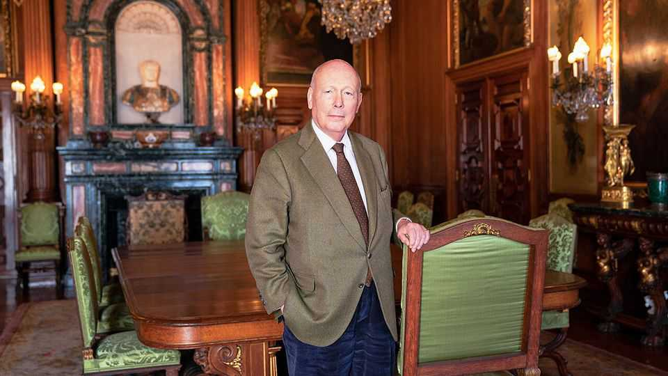
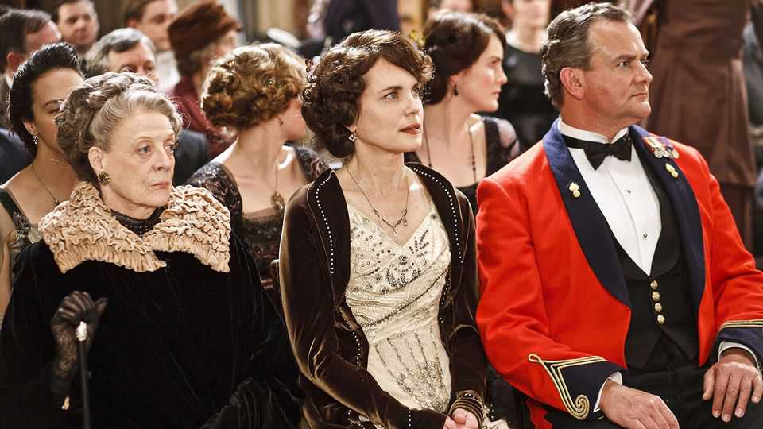

Culture | Toffs on screen
Meet the real lord of “Downton Abbey”
Julian Fellowes, the story’s creator, is Britain’s supreme chronicler of class
September 11th 2025

It is different without Maggie Smith, supreme goddess of the “Downton Abbey” cult. As the show’s dowager countess, “she was perfect,” says Julian Fellowes, its writer and creator. He drew on memories of an aunt to give her lines such as, “Bought marmalade? Dear me, I call that very feeble.” Smith died last year and so is glimpsed only in flashback in “Downton Abbey: The Grand Finale”, the new and last bit of the Downton extended universe. When Lord Fellowes goes, he muses, “This is the only partnership anyone will remember—if they remember anything.” They will. In the undeferential 21st century, asked sceptics when “Downton” first aired in 2010, who was still interested in the tiny, aloof British

aristocracy? An awful lot of people, it turns out. Chronicling the lives and loves of the noble Crawley clan from 1912 to 1930, it became a global smash hit, encompassing six gently moreish television series and now three films. Lord Fellowes became the reigning chronicler of the eternal subject of class in England.

“Only he could have done it,” says Gareth Neame, the producer with whom he dreamed up the idea. His style balances upstairs and downstairs plots, and seismic events (war, an epidemic, ruin) with everyday challenges (such as, in the new film, planning a county fair). “That’s our lives,” says Lord Fellowes, “the business of solving problems and then you die.” His intimacy with the country-pile set helped, too. Ennobled in 2011—he sits as a Conservative in the House of Lords—he is a son of the landed gentry; Downton’s patriarch (played by Hugh Bonneville) resembles his own father in never questioning his status yet striving “to do the right thing”.

By his own account a plain and timid teenager, he reinvented himself on an oil-tanker bound for South America: “I realised I could be whoever I wanted to be when I got off the boat.” A newly gregarious version of him studied at Cambridge and danced at coming-out balls. “If you have the misfortune to be born into a generation which must earn its living,” his father advised,

“you might as well do something amusing.” Lord Fellowes took him at his word and went to drama school.

Two striking tales are told of him thereafter. First, that he proposed to his wife, Emma Kitchener—a relative of Lord Kitchener, a first-world-war titan —20 minutes after they met. This is true. “A funny little man asked me to marry him,” her diary recorded. “I had the last laugh,” he chuckles, “because she did.” The other is that a stalled career was transformed by writing “Gosford Park”, a country-house film for which he won an Oscar in 2002. This is true inasmuch as his ambitions were grand.

In fact, he had acted in prime-time dramas and the West End and written for tv (and, under a pseudonym, bodice-ripping novels). Acting was a lark, but he thought himself only “a medium success”. Still, it was crucial training. Showbiz gave him an outsider’s view of high society. And since it often involved rescuing bad scripts, being a jobbing actor taught Lord Fellowes “what is sayable—and what is not”.

“Even if unearned riches and position had no moral merit,” reflects the narrator of “Snobs”, a bestselling novel published under his own name, reaching society’s apex “was still a dream that figured in plenty of people’s fantasies”. In “Downton” he indulges them, ushering you into upper-crust homes and romances. To detractors, it offers a rosy, even reactionary picture of a stratified era, in which underlings seem as content with their lot as overlords.

The overall mood is sunny, agrees Lord Fellowes; viewers “wouldn’t come back every Sunday night to be depressed”. But angst lurks amid the turrets and frocks, especially for gay characters and trammelled women. The distinctive quality, says Mr Bonneville, is that he “writes from a default position that people try to be good”. No group or class are all blackguards, Lord Fellowes insists. Nor, as some might have it, does wealth confer immunity from suffering. “This is bollocks.”

As a group, the Americans who turn up in “Downton” are more sparky and tolerant than the English. Lots of American viewers loved it, maybe because its social hierarchy is soothingly benign. Its central tensions—between passion, money and protocol—also power “The Gilded Age”, another multi-

series Fellowes hit, set in the 1880s among New York’s robber barons and their servants. Here destinies are less fixed: “Some of the downstairs people are going to end up upstairs people.”

Along with their shared interest in social change and pharaonic mansions, both “The Gilded Age” and the new “Downton” movie depict fellow scribblers. In the film a footman-turned-screenwriter winkingly claims that “Writers are the real stars of cinema.” In “The Gilded Age”, the author of a tell-all book on New York society says he aimed to show that “these golden people” are “just ordinary men and women”. He is ostracised all the same.

Lord Fellowes himself faced “some pushback” for illuminating a normally veiled world. “Do you write what the ladies say as well?” a scandalised guest at a house party once asked. The prototype for a character in “Snobs” took umbrage: “A lifetime of avoiding the newspapers—and now this!” He was eventually forgiven.

In modern Britain, poshness is not terribly conducive to popularity (“Everyone tries to persuade you that they’re working class—even if their mother is the daughter of a duke”). Neither, for that matter, is big-time success. Lord Fellowes is nevertheless a well-liked chap. A fellow Tory peer fondly describes him as “an amusing conversationalist” with “a rather magnificent wife”. A stickler for on-screen decorum—Mr Bonneville once had to reshoot a scene because his hands were in his pockets, a vulgar no-no —he is genial in the flesh. “I don’t think he’s personally judgmental at all,” says Mr Neame. His lordship declines to peg this interviewer’s class station: “I never give anyone else their rank.”

Lord Fellowes is to the posh what the naturalist Sir David Attenborough is to gorillas, if Sir David were a gorilla himself: a guide to dinner placements, shooting parties and the gap between what nabobs say and think. Yet he is wryly sceptical about the whole concept of class. It is partly natural—“Every society throws up some or other version of class”—but partly also “a confidence trick” played on the masses. His own life conforms to the system and confounds it. Combining a lucky start with hard work, risks and talent, he is that English oxymoron: a self-made toff. ■

For more on the latest books, films, TV shows, albums and controversies, sign up to Plot Twist, our weekly subscriber-only newsletter

This article was downloaded by zlibrary from [https://www.economist.com//culture/2025/09/11/meet-the-real-lord-of-downton-abbey](https://www.economist.com//culture/2025/09/11/meet-the-real-lord-of-downton-abbey)

Economic & financial indicators

Economic data, commodities and markets