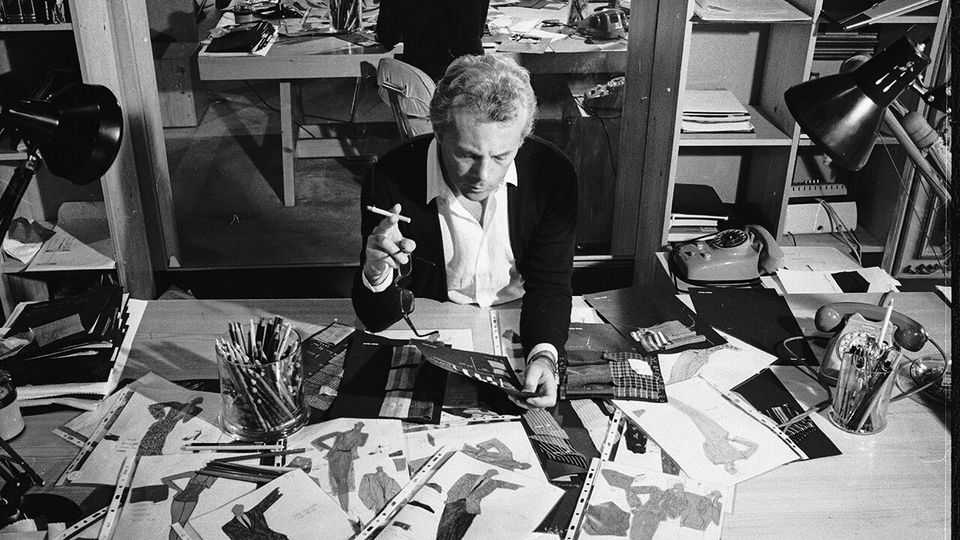

Obituary | Elegance, not extravagance
Giorgio Armani freed the forms of both men and women
The Italian master-designer of a whole lifestyle died on September 4th, aged 91
September 11th 2025

Those clear blue eyes noticed everything. In a second, in a restaurant, how the tablecloths were wrong. How a colleague’s tie, 1.5cm too long, spoiled the balance of his outfit, and how much of the angle of a woman’s glove was too much to show. That was not a matter of inches, but of millimetres. The last say on everything had to be his: on the lanterns outside his headquarters in Milan, the make-up on each of his models, the weight of branch-office writing paper. Though he made no rule about it, at work he was “Giorgio” to no one. He might be in his favourite navy T-shirt, loosely pleated blue shorts and brown loafers, but he was “Signor Armani”, the arbiter of every detail of his life.

So when faced with that classic of English tailoring, a man’s suit, he had to change it. As it was, it punished the beautiful male body, squashing it into a box. What he demanded of a suit was freedom to move: to kneel before a mannequin or a model with a mouthful of pins to dress them, to reach across a table to grab samples. So he took the stiffness out, replacing heavy wool with crepe and choosing softer colours: beige, sand, light green. He dismissed shoulder pads and snipped away the lining. The suit drooped then, looking almost louche, suggesting the body without constraining it. He lengthened the jacket, enlarged the lapels, lowered the buttons. And there stood Armani Man.

He changed the way women looked, too. His suits gave a fluid confidence without the rigidity of tight trousers and skirts, and hid bad legs. (He sympathised, because when he appraised his own body—the cute little nose, the too-big face—it was his short calf muscles that most displeased him.) These basic suit ideas came to him in the late 1970s and, having had them, he barely changed. He also loved to put women in flowing, simple evening gowns, tastefully beaded and in the colours of faded flowers. These too stayed. When designs were this good, when colours were this natural and the whole look breathed elegance, not extravagance, why chase after fleeting trends?

He was not the first Italian tailor to redesign English suits, but he was the first runaway success at it. His company, founded in 1975, chalked up $14,000 in sales in its first year; a decade later, it made $100m. By 2024 it was worth $9.3bn-11.7bn and had branched into sportswear, furnishings, hotels, clubs, chocolates and floristry. It was possible, if clients had enough money, to live an Armani lifestyle in an Armani world, where all was natural sophistication, harmony and ease.

The big four French luxury houses ached to acquire him, but he ignored them. Independence was his byword. Giorgio Armani SpA was the child he had created with his life partner, Sergio Galeotti, after Sergio persuaded him to sell his blue Volkswagen Beetle to raise capital. He had done the designing, Sergio had done the books, a perfect arrangement. After Sergio’s death from AIDS in 1985 the sole shareholder was himself. As a firm believer in astrology, he was a Cancer in every way: creative, hyper-

sensitive, introverted, and like a crab gathering everything to himself. He was Giorgio Armani, and he was not for sale.

One key to his success was simplicity. His lines were loose, comfortable and unfussy, and his more down-market range, Emporio Armani, was relatively cheap. But the chief secret of his stellar rise was cinema. As he grew up in northern Italy it was the best of entertainments, endlessly inspiring him. He would have liked to be a film director, and in a way he was: to him, life was cinema, and his clothes were the costumes. So when, in 1980, his style flew to fame on the back of Richard Gere in “American Gigolo”, it was a heady moment, and one that lasted. Stars on and off the red carpet took up his look by the limousine-load: Diane Keaton, Tom Cruise, Sean Connery, Julia Roberts, Tina Turner, Kevin Costner, his hero Martin Scorsese, and on and on. In 1983 he set up an office in Los Angeles; sometimes he gave his clothes away. No stilista had ever courted Hollywood so well.

Yet star endorsements did not go to his head. He was shy, and admitted that he had got into fashion almost by accident. There had been no sudden spark, no sacred Muse; he toyed with being a doctor, then served in the army, before wandering off to dress windows. From then, fashion slowly stole his life away. By 1964 he was designing a menswear line for Nino Cerruti. After that he set up with Sergio, and other close friends were few. Evenings in his heyday often found him (whether in his casa in Milan, his penthouse on Central Park West, his island villa in Pantelleria, or any other of the houses he collected) settling with his cats, which he also collected, and turning on the TV just to hear another voice. His absolutist ways hid a lingering insecurity about his role in the serious business, the public service, of fashion.

That was also why he worked as he did, morning and night, getting everything as perfect as possible. This was the life he had chosen for himself, wrapped tight in sartorial chains. When he woke in the mornings and leapt out of bed (where he slept in a white T-shirt), he sometimes asked himself, “My God, why don’t you stay in bed, relax, make yourself a nice breakfast?” That was impossible. He had ideas to sketch out, fabric to look at, the next show to plan. He had his and Sergio’s “child” to look after.

He also had to think of the future. That was hard. Though all films had endings, he could not imagine his company without him. It was not just a fashion house and a label; Giorgio Armani SpA was himself. The best he could do was to hope it would stay in the family, in the care of his right-hand man, his two nieces and his nephew, an organic succession with no rupture. But who would really ensure the correct buttons on the jackets, hold the fort against violent colours, insist on the size of his blue-glass flower cubes, achieve the perfect lighting for his shows? Unless he could make himself immortal, he feared no one could. ■

This article was downloaded by zlibrary from https://www.economist.com//obituary/2025/09/11/giorgio-armani-freed-the-forms-of- both-men-and-women

Table of Contents

The world this week Politics Business The weekly cartoon Leaders What if the $3trn AI investment boom goes wrong? Don’t panic about the global fertility crash Israel’s Qatarstrophic error The Kremlin’s plot to kill NATO’s credibility Nitazenes: another failure of drug prohibition Is British politics broken? Its centre is cracking Letters British agriculture is the bedrock of food and drink By Invitation AI agents are coming for your privacy, warns Meredith Whittaker A finance minister on what Europe must do to please Mario Draghi Briefing Humanity will shrink, far sooner than you think A contracting population need not be a catastrophe United States Charlie Kirk challenged liberals until the day he was murdered The ICE raid at Hyundai was a massive own goal The pitfalls of being a non-profit that is beholden to government San Francisco’s recall fever The sinister brilliance of Donald Trump’s security theatre A budget battle offers Democrats a chance to show some backbone Who’s afraid of the Democratic Socialists? The Americas Making the Americas grate again What Javier Milei’s first defeat means for his future Jair Bolsonaro has been convicted for plotting a coup Asia Japan’s new leadership struggle is far from business as usual Huge demonstrations bring down Nepal’s government

A giant “knife-fight” in the Pacific The world’s most powerful volunteers China China is ditching the dollar, fast “Dalifornication” grips China Director Fang is laughing all the way to the bank Middle East & Africa America can’t or won’t protect its friends in the Gulf What it takes to evacuate an injured child from Gaza A high-risk mega-dam in Ethiopia Ebola returns to Congo Africa’s deadly ferries Europe Putin’s dangerous drone probe is a moment of truth for NATO France gets a new prime minister Might Bosnia be about to break up? A crisis in long-term care of Europe’s elderly Italy’s coalition sends mixed messages on Ukraine and Russia Europe has an urgency deficit Britain The new battle for Britain Labour has become the party of Britain’s rich A British island infested with wallaby invaders The BBC’s best programme loses its star Fixing Britain’s broken property-tax system will take courage Rebellious tube drivers have less bargaining power than before A reshuffle and a raucous conference show the misery of power International Top Gun—without Maverick Meet the leader of Europe’s anti-Trump resistance Business Faith in God-like large language models is waning Sea Ltd, Singapore’s e-commerce king, prepares to battle TikTok From volleyball to tag, investors are piling into niche sports Can Nestlé’s third boss in little over a year turn things round? How do you pronounce Biemlfdlkk? The brands lost in translation Lachlan Murdoch, media’s newest mogul

Reviewing the annual performance review In French business, boring beats sexy Finance & economics What if the AI stockmarket blows up? Chinese trade is thriving despite America’s attacks Meet Donald Trump’s aid agency Europe’s economy at last shows signs of a recovery How grain has gone from famine to feast Why American bondholders are jumpy about inflation Can you make it to the end of this column? Science & technology A dangerous new class of synthetic opioid is spreading NASA has found a Martian rock with what may be signs of life How to build table-top fusion reactors Do hangover supplements work? Culture Dan Brown offers another silly mash-up of fact and fiction Gout Gout, a 17-year-old sprinter, may be athletics’ new mega-star America’s constitution is too hard to change Why female pop stars are lambasting mediocre men The ironic ubiquity of William Morris’s prints Meet the real lord of “Downton Abbey” Economic & financial indicators Economic data, commodities and markets Obituary Giorgio Armani freed the forms of both men and women