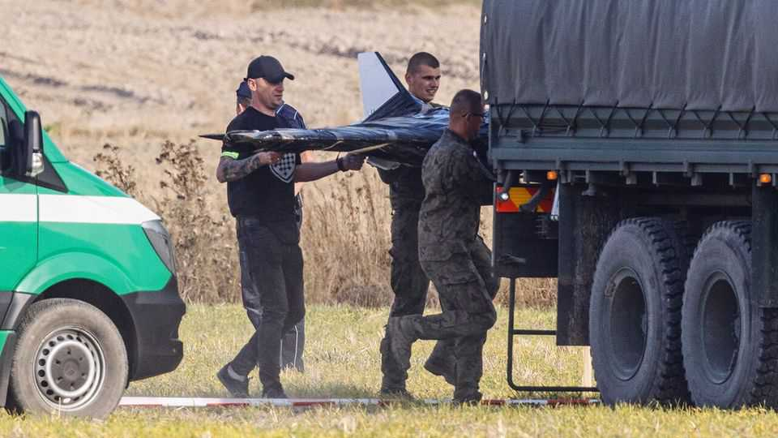
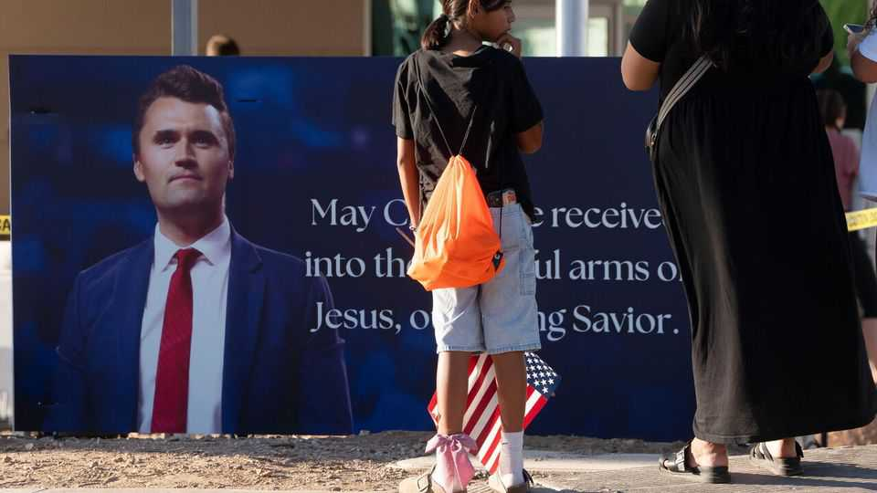

世界本周 | 政治
本周政局：北约边境擦枪、法国换相、加沙升级、亚洲政坛洗牌
战火、选票与街头抗议交织，风险在外溢，信心在走低
2025年9月11日

摘要：波兰击落入侵俄无人机，北约与俄的“擦枪”更近一步；法国总理更替、街头“封锁一切”再起，市场不给面子；中东火药味加重，加沙或迎地面行动；英国内政再遇用人风波；亚洲多国政坛震荡。总体看，地缘冲突风险外溢，财政与政治不确定性上行，市场情绪偏谨慎（不含投资建议）。

【一｜北约边境更“烫”】
波兰击落进入其领空的俄制无人机，这是迄今对北约领土最深的侵犯。荷兰提供支援。波兰总理图斯克直言，这让北约更接近与俄罗斯的“公开冲突”。此前，俄方在白俄罗斯举行“西方-扎帕德”军演，模拟攻击北约，波兰决定暂关白俄边境。图斯克还称抓获一名白俄间谍，并将驱逐一名外交官。与此同时，俄军对乌全境发起开战以来最大规模打击，导弹与无人机齐上，涵盖乌北、南、东，基辅政府主楼起火。

【二｜法国：换相难换信心】
在国民议会否决其财政缩减计划后，马克龙改任勒科尔努为总理（其为第七任）。街头爆发“封锁一切”抗议，市场并不买账：法国十年期国债收益率仍高于希腊，投资者押注新总理同样难以迅速控住财政局面。

【三｜中东焦点再聚】
以色列轰炸了卡塔尔多哈一处别墅，称哈马斯高层聚集于此；六人死亡，身份未明，哈马斯称其领导层不在其中。卡塔尔谴责为“国家恐怖主义”，美方否认事前知情。特朗普表示对此“感到非常难过”，称无助于以美目标。以军同时打击也门胡塞武装。以方命令加沙城约百万居民撤离，称“战车基甸II”地面行动将至；内塔尼亚胡称此前空袭只是夺取“最后堡垒”的序曲。

【四｜欧美内政：风波与强执法】
英国首相斯塔默再次陷入用人质疑风波，因与爱普斯坦的旧交再爆料，被迫撤换驻美大使曼德尔森；几日前，雷纳因房产涉税问题辞去工党副党魁，其曾主管住房政策。美国方面，最高法院准许移民官在洛杉矶继续大范围突击行动，暂时允许以“族裔”为“相关因素”决定盘查对象，尽管相关诉讼仍在继续。

【五｜亚洲与拉美：政坛洗牌】
日本首相石破茂在参院选举失利后请辞，执政党将于10月4日前后再选党魁，热门人选包括高市早苗与小泉进次郎。尼泊尔反腐抗议致至少19人死亡，总理奥利辞职，暴力未平，首都加德满都宵禁。泰国国会推举阿努廷为新任总理，最晚四个月内需大选；他与反对党“人民党”达成协议。阿根廷方面，总统米莱伊所属自由意志党在布省立法选举惨败，预示10月26日中期选举凶多吉少；股汇齐跌，米莱伊称将“加速”财政紧缩。

【六｜区域治安与选举速览】
非洲多地受圣战组织侵扰：刚果（金）一教堂守夜遇袭致至少50死；马里基地组织分支试图阻断燃料入巴马科，军方空袭回应；莫桑比克卡波 Delgado 省自8月来袭击致1,319人流离失所，年内累计近10万人避祸。哥伦比亚先前被地方扣押的45名士兵已无恙获释。牙买加选举结果显示工党续任，反对党议席翻番；现任总理霍尔尼斯主打降税、提最低工资与降罪案。

【小结】
如果说去年的关键词是“通胀与利率”，那么本周的关键词就是“安全与财政”。边境擦枪与中东升级让外溢风险始终在线；法英等国的财政与人事震荡，叠加亚洲与拉美的政治更替，意味着不确定性仍在抬头。对普通人而言，更直接的感受是旅行与能源的潜在扰动，以及就业市场与福利政策的摇摆。

