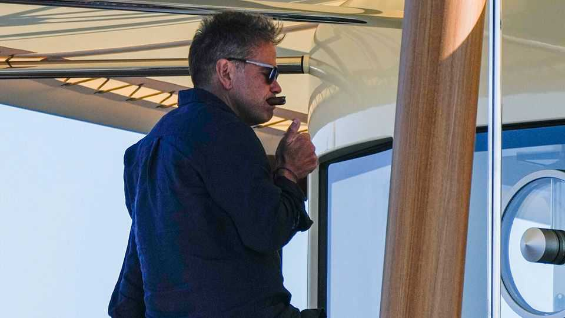
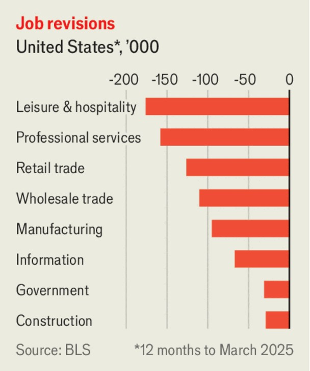

世界本周 | 商业
资本的情绪：媒体王位落定、云计算狂飙、反垄断加码
从家族交接到监管重拳，市场在惊喜与紧箍咒之间摇摆
2025年9月11日

摘要：默多克家族“接班大战”落幕，长子拉克兰确认接盘福克斯与新闻集团；甲骨文靠云合同爆表与超大单外包数据中心，股价起飞；欧委会对谷歌显示广告业务开出巨额罚单；中国出口放缓、CPI再陷通缩；美国就业被下修、联储票委去留暂稳；矿业并购做大铜版图；科企IPO、硬件上新与医药巨头裁员同台。整体结论：AI与云计算的“高流量”，与反垄断与宏观放缓的“低气压”，正在同场博弈（不含投资建议）。

【一｜媒体王位尘埃落定】
默多克家族就遗产与控制权达成和解，长子拉克兰将于父亲身故后取得对福克斯与新闻集团的控制权（覆盖电视、广播与《华尔街日报》《纽约邮报》《太阳报》《泰晤士报》等）。他已主理公司多年，这次只是“把缰绳写进合同”，延续家族的“保守派声音”。

【二｜云与AI：甲骨文的“爆表季度”】
甲骨文披露未来云合同预期收入同比激增359%，股价单季飙升三分之一，并将以一份据称高达3,000亿美元的长期合同，向OpenAI供应数据中心容量。创始人埃里森今年身家增加至3,830亿美元，逼近马斯克。

【三｜版权与合规：AI被拷问】
Anthropic就版权诉讼与作家群体达成15亿美元和解，承办法官仍严厉批评，并定于9月25日再开庭“看看我能否捏着鼻子批准”。焦点仍在“是否抓取盗版书训练模型”。

【四｜监管重拳：谷歌再遭大罚】
欧盟委员会以“自家广告技术自我优待、损害对手”为由，对谷歌罚款29.5亿欧元，并要求60天内提交补救方案，否则不排除“拆分广告业务”的极端处置。谷歌称罚款不公，将上诉。

【五｜宏观温度：外贸走弱、通缩回潮】
中国8月出口同比增4.4%，为2月以来最慢；对美出口同比骤降33%，对东南亚与欧盟分别增长22.5%与10%。同时CPI同比-0.4%，重回通缩区间。

【六｜美国就业“补作业”】
美国劳工统计局将截至3月的过去12个月新增就业下修91.1万。8月初步数据显示仅新增2.2万人。此前局长因5—6月工资单大幅下修被特朗普撤换，总统曾称数据“被操纵”。

【七｜联储席位：票委暂稳】
联邦法官裁定，在对特朗普“解职”动议的诉讼推进期间，丽莎·库克可继续担任美联储理事并在9月17日会议上对利率投票。法官认为其被指称的按揭申请问题发生于任职前，不构成“充足理由”。

【八｜资源并购：抱团做大“铜”叙事】
英美资源将与加拿大泰克资源合并，打造铜业巨头。矿业整合多年难产：英美去年拒绝BHP收购，泰克在2023年回绝嘉能可。本次新公司总部设温哥华，主上市留在伦敦，约堡、多伦多、纽约为次级上市地。

【九｜一级与二级：冷热交替】
瑞典金融科技Klarna纽交所上市首日收涨15%，市值150亿美元。苹果发布iPhone 17与更薄的iPhone Air（5.6mm，薄过三星S25 Edge），在关税扰动下仍维持与去年相近的定价。诺和诺德在减重/糖尿病赛道的高压竞争下，将裁员9,000人，并发出今年第三次利润预警；受礼来蚕食份额影响，其股价年内回撤约45%。

【小结】
一边是AI与云带来的订单“加速器”，一边是监管与需求“减速带”。家族治理、反垄断与宏观校准共同塑形新周期的波动。对企业而言，活下去靠现金流与定价权；对普通人而言，能感知到的是订阅、设备与药价的此起彼伏。

