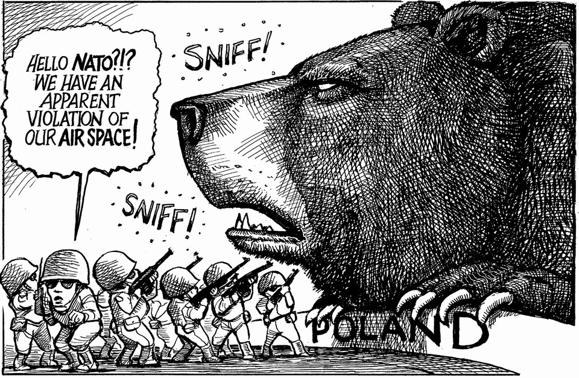

世界本周 | 每周漫画
本周漫画：普京“探底线”，北约“真心话时刻”
一幅图，点破地缘的关键问句：敢不敢、能不能、会不会
2025年9月11日

摘要：本周漫画围绕“克里姆林宫如何消解北约公信力”，衔接近期俄无人机触碰北约防线与“是否会攻击北约”的悬念。核心意思：俄方在试探边界、制造心理落差；北约则在一次次“小事”里被动应答。读图重点：它不是笑话，是对决的“心理战说明书”（不含投资建议）。

【一｜问题的打开方式】
这幅漫画把问题化整为零：俄方用低烈度手段“摸底线”，让北约在“反应—克制—再反应”的循环里暴露真正红线。

【二｜北约的难题】
如果反应太猛，升级风险上蹿；如果反应太弱，威慑力打折。漫画嘲的，正是这种“左右为难”。

【三｜读图的隐藏提示】
从语言与构图看，它不是纯调侃，而是在提醒读者：地缘冲突进入“心理消耗”阶段，舆论与态势各打一半。

【小结】
一句话：俄方在“试”、北约在“挺”，世界在“看”。漫画只是轻描，但指向沉重的现实问题。

