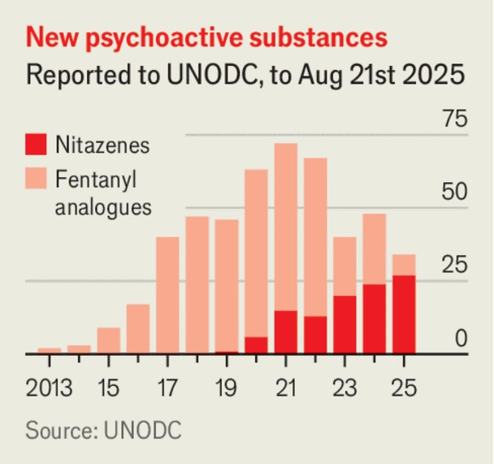

领导人 | 毒品战争的徒劳
“尼他佐”类：禁毒政策的又一次溃败
当各国围堵芬太尼，一种更凶险的合成阿片崛起
2025年9月11日

摘要：尼他佐类自2019年起快速扩散，因强效、易改构、隐蔽流通而成跨洲风险。所谓“禁令铁律”再次应验：封死一种，催生更强一种。路径修正：强化检测救治网络、信息共享与纳洛酮可及性，并为成瘾者提供更可控的合法替代品，降低黑市创新动力。

【一｜为什么是现在】
芬太尼全球围堵，中国加严监管，阿富汗罂粟种植被塔利班叫停，传统供应受挫，合成阿片的“性价比”凸显，尼他佐类顺势填空。

【二｜黑市的“研发逻辑”】
结构易改、效力超强、运输轻便，使其具备天然的监管规避与利润杠杆。

【三｜治理的重点】
提升街头样本与过量病例的快速检测；富国与贫国共享新结构情报；让纳洛酮进到使用者家属与同伴手中，提高急救存活率。

【四｜长远之策】
单纯“追着每一种新分子禁”只会逼出更危险替代。为成瘾者提供可监管的更安全阿片替代，才可能压低黑市收益与创新动机。

【小结】
禁令不等于治理。治理的目标是“降低伤害、压缩黑市”，而不是“在统计上赢”。

