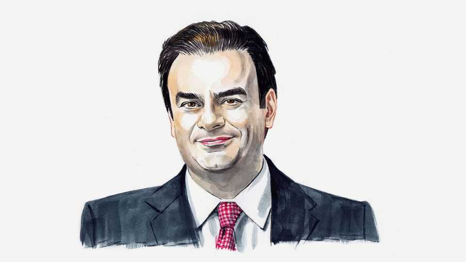

特约来稿 | 德拉吉报告一年后
一位财长眼中的“欧洲增长处方”
单一市场不够用，它还得“带动增长”
2025年9月11日

摘要：完成单一市场是关键，但不等于万事大吉。要点：拆除“看不见的关税”之外，需在战略产业（如电信）集中资源、统一规则与拍卖框架，并让公共采购从“修路思维”转向“数字与创新优先”，为 AI、网络安全、能源转型与高端制造配上敏捷规则与共投机制。

【一｜单一市场的下一步】
货服资人与人才自由流动仍受碎片化规制掣肘；平均“隐性关税”高企，先降门槛再谈规模经济。

【二｜电信是试金石】
27 套监管与频谱拍卖抬高成本、拖慢部署，错失规模；与美中对比可见，统一与战略性配置比“拍卖收入”更重要。

【三｜采购要改“方向盘”】
传统基建易走通，数字项目“久拖不决”。应改写规则以适配敏捷开发、政企协作与快速落地。

【小结】
拆栅栏之后，问题是“要建成什么样的经济”。答案只能是：更会创新、更能竞争、更快增长的欧洲。

