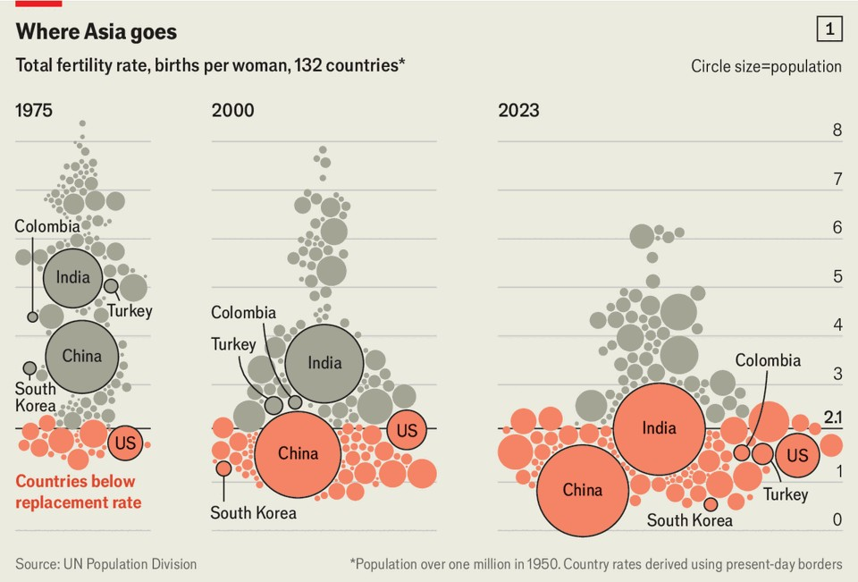
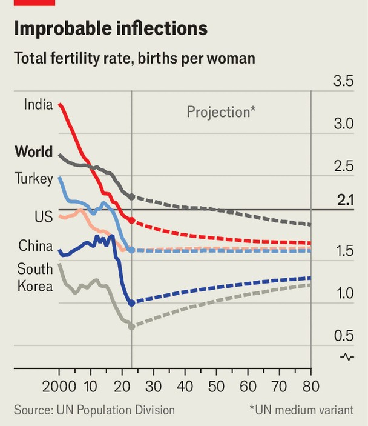

深度 | 人口塌陷
人类收缩，远比你以为的更早
人口学，总在你不经意时“偷袭”
2025年9月11日

摘要：从土耳其到哥伦比亚、从印度到中国，生育率下降比预测更快、更深。若把“反弹”假设往后挪十年，全球峰值或提前至 2060s，且更低。核心逻辑：地区间收敛、社会趋势惯性与“更替率刀锋效应”。

【一｜超预期下行】
多个国家 TFR 远低于联合国假设路径，低于 1 的“新常态”在东亚已持续多年。

【二｜假设的问题】
把“即刻企稳或回升”当默认，低估了社会变迁的惯性与地区收敛的时间差。

【三｜峰值的敏感性】
若再按近年速度下行 1—10 年，峰值年份显著前移，总量明显走低。

【小结】
与其争论“是否会收缩”，不如尽快回答“如何在收缩中保持活力”。

