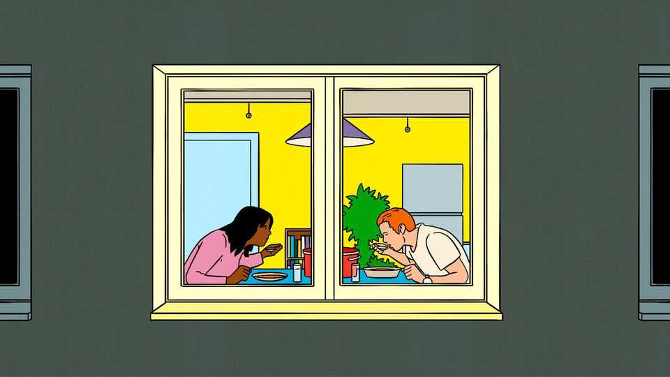
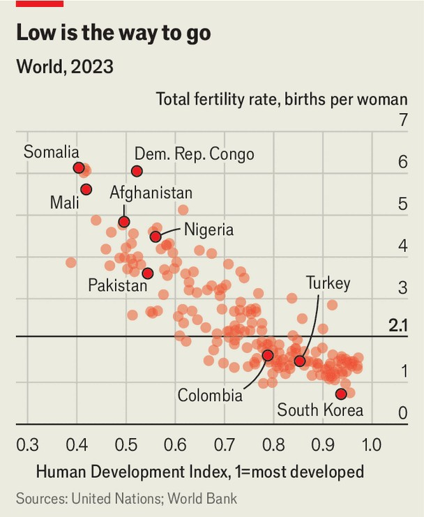

深度 | 收缩但不沉没
人口在变少，不等于世界在变坏
一份“收缩经济学”的操作清单
2025年9月11日

摘要：收缩将重塑房价、资本回报与财政分摊，但未必灾难。抓手：更高劳动参与、更晚退休、更深资本/人比、更快创新效率与更聪明的城市“瘦身”。真正风险在于：社会对年轻人的不友好，形成“越不生越不想生”。

【一｜债务与利率的配平】
增速变慢未必压垮债务，关键看利率与储蓄—投资结构的变动。

【二｜负担不只在老人】
青年期被拉长、教育成本高企同样昂贵；以“参与率×退休年龄×生产率”对冲人口结构。

【三｜创新与资本深化】
人少不等于点子少；提升研发占比与 AI 赋能可弥补数量缺口。

【小结】
与其求“逆天改命”，不如把收缩当作需精细治理的常态，先把年轻人的生育环境与成长路径修好。

