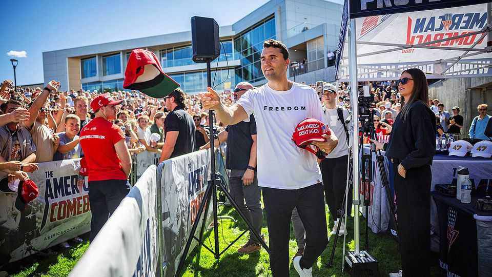

美国 | 超越辩论
查理·柯克：直到遇害那天，他都在“对着干”
一位点燃年轻选民的保守派行动者
2025年9月11日

摘要：18 岁辍学创办 TPUSA，查理·柯克把“当面交锋”当作职业与信念。他在校园被枪杀，折射出极化时代的火与险：社交媒体的声量、基层动员的力量，也有政治暴力的阴影。要降温，既需精英示范效应，也要纠正“对方更容忍暴力”的错觉。

【一｜从草根到造势】
TPUSA 以校园为阵地做组织动员与话语塑形，成为保守派吸引年轻人的枢纽。

【二｜影响与争议】
他以“强硬辩驳”著称，也收获海量追随；在 2024 年轻选民的结构性摇摆中，可能扮演了推手角色。

【三｜暴力的社会心理】
多数人反对政治暴力，但少数极端行为足以制造震撼；领导人表态与“感知对方容忍度”的偏差，会放大风险。

【小结】
当沟通中断，暴力就更容易发生。把争论留在话筒与讲台上，是更难、也更对的路。

