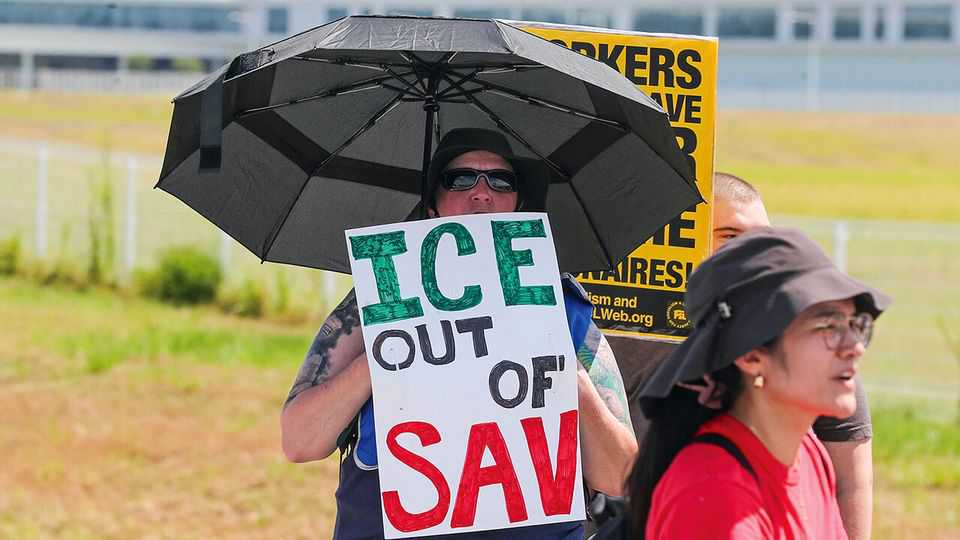

美国 | Bye-undai
现代工厂移民突袭：一脚踢到自家门牙
佐治亚花多年“招贤纳士”，一次大规模执法差点砸了牌子
2025年9月11日

摘要：联邦在佐治亚州现代电动车厂突袭抓捕475名外籍工人，多为签证不合规的韩国技术人员。尴尬的是：同一政府既高举“再工业化、引外资”大旗，又在重点项目基地上演“最大职场突袭”。后果：州郡多年招商与基建投入的信号被稀释，外企对签证与政策稳定性的担忧上升。

【一｜背景账本有多厚】
州长亲赴韩国，敲定126亿美元投资、承诺8500就业；地方为配套改规、修校、拓路、挖港，一路护航造势。

【二｜为何偏此时“重拳”】
执法目标与“制造业回流/外资落地”的叙事打架：技术安装调试期本就依赖短期外籍分包团队，签证排期拖延是老问题。

【三｜信号外溢效应】
单笔交易或不致反悔，但其他公司会更谨慎；韩方寻求更多技能签证选项，以降低建设周期不确定性。

【小结】
招商靠信心，执法要边界。在“护产业/抓执法”的拉扯里，别把长期竞争力当一次秀场。

