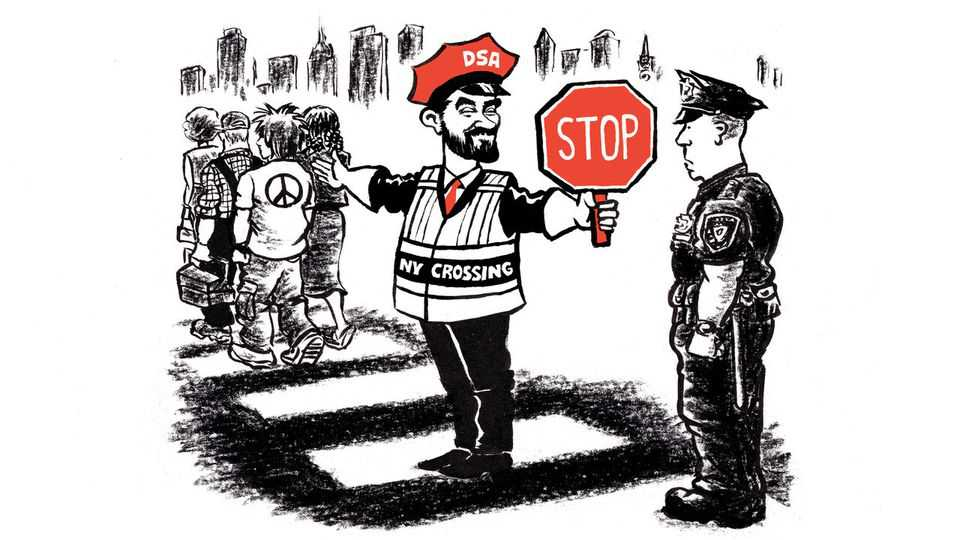

美国 | 列克星敦
谁在怕“民主社会主义者”？
他们可能是左翼的“川普式民粹”替代方案
2025年9月11日

摘要：纽约市长热门人选 Mamdani 身兼民主党与 DSA（民主社会主义者），在“向中间靠”与“保持标签”间摇摆。DSA 自身也在软化纲领，转向更“接地气”的福利与税改表述。底层趋势：年轻民主党人对“社会主义”观感正超过“资本主义”，左翼民粹的窗口正在打开。

【一｜标签与平台的更替】
从“去商品化生存”等激进表述，回调到“全民医保、税富济贫”等通俗议题，降低政治沟通门槛。

【二｜受众基础的变化】
民调显示民主党基本盘对“社会主义”的好感度上升，对本党评价却走低，留出“左翼外卡”的成长空间。

【三｜与“川普式国家资本主义”的对照】
关税、制裁、行政强干预构成右派民粹的新国家资本主义；左翼回应是“福利国家再武装”。

【四｜Mamdani 的现实考题】
从“解放巴勒斯坦”的身份政治，到“下水道社会党”的市政绩效：清洁街道比清谈更能决定去留。

【小结】
左翼能否真正“接管中间”，关键不在口号，而在交付感可被市民触摸到。

