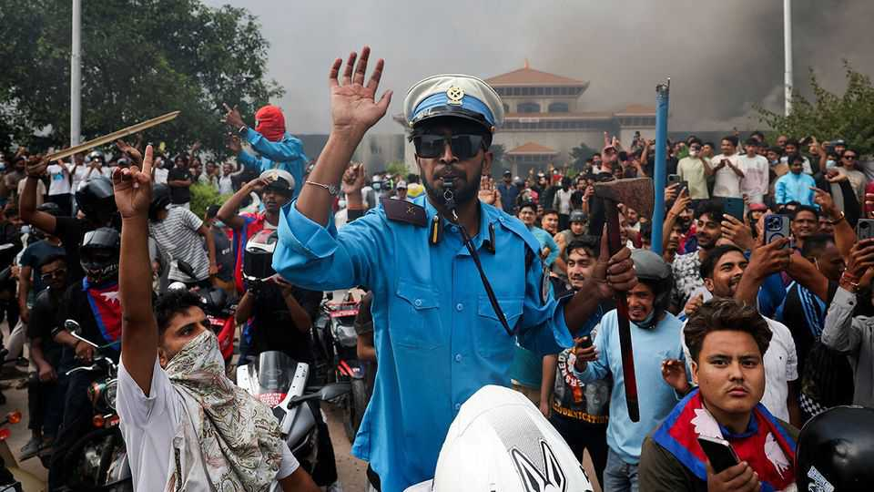

亚洲 | 亚洲人民力量
尼泊尔政府被大规模示威搞垮了
这场动荡带来了太多不确定性
2025年9月11日

摘要：尼泊尔又换政府了，但这次不一样。年轻人上街抗议腐败，结果19个人被安全部队打死，总理辞职，议会都被烧了。这事儿闹得比以往任何一次都大，背后是年轻人对政治精英的愤怒，还有社交媒体被封的导火索。现在军队接管了，但未来怎么走，谁也不知道。

尼泊尔从2008年废掉君主制到现在，已经换了14届政府。但这次在加德满都和其他城市爆发的混乱，规模前所未有。9月8日，至少19个参加反政府腐败示威的年轻人被打死，看起来是安全部队干的；第二天，总理卡德加·普拉萨德·夏尔马·奥利就辞职了。他的下台并没有立即平息抗议者的怒火，他们为这些死亡事件感到愤怒。接下来的一天，破坏活动继续。暴徒洗劫并放火烧了尼泊尔议会、政府办公室和政治家的家。据报道，一位前总理的妻子在大火中严重烧伤。政治家在街上被殴打；监狱遭到袭击，导致数千名囚犯逃跑。当军队说要介入恢复秩序时，平静才开始恢复。它宣布宵禁到9月12日，但暗示可能会持续更长时间。

这一切标志着抗议活动的迅速和暴力升级，而抗议活动在几天前才开始获得动力。这场动荡最直接的导火索是9月4日封禁了26个社交媒体网站，包括Facebook、WhatsApp和Instagram。政府说这些公司没有按照新规定向当局注册。

但那次严厉的断网（后来被撤销）只是9月8日上街抗议的尼泊尔年轻人（主要是年轻人）众多不满中的一个。人均GDP（2024年为1447美元）是周边地区最低的。工作机会短缺——超过五分之一的年轻人失业——腐败盛行。许多年轻人被迫到国外找工作：汇款占该国GDP的四分之一以上。

该国的政治阶层规模小、关系密切且享有特权。（当奥利先生在2024年成为总理时，他已经在该国最高职位上任职过三次。）在危机前的几周里，年轻的尼泊尔人一直在社交媒体上大量发帖，突出政治家、公务员，特别是他们环游世界的子女的舒适生活。这让社交媒体关闭感觉更像是被噤声。当抗议者被枪击时，愤怒是肆无忌惮的。

这场抗议运动的参与者——被称为"Z世代"运动，指的是他们的年龄——试图与很快爆发的骚乱和抢劫保持距离。至少有一些人指责毛派渗透者。9月10日，运动代表与军事领导人举行了会谈。他们一直呼吁成立一个排除大多数职业政治家的看守政府。

被提名为领导这样一个政府的一个名字是苏希拉·卡尔基，一位前首席大法官，在首都的抗议者中看到了她。当《经济学人》付印时，还没有消息说这个提议是否会被接受。该国的大政党要求参与谈判。至少有一些尼泊尔人把动乱视为呼吁恢复君主制的机会。

这场动乱将产生地区影响。印度是尼泊尔的邻国和最大贸易伙伴，长期以来一直欺负它。但近年来，其影响力受到中国的挑战，中国通过其"一带一路"基础设施倡议向尼泊尔投入资金，并对那里的藏族社区保持警惕。奥利先生被认为对中国友好。但印度无疑非常担心其家门口的不稳定。作为对危机的回应，印度总理纳伦德拉·莫迪召集了他的安全内阁，并下令关闭与尼泊尔的陆地边界。

近年来，民众起义震撼了几个南亚国家。去年，一场由学生领导的运动推翻了孟加拉国谢赫·哈西娜的政权，导致成立了一个临时政府，该政府谈到在2026年举行新的选举。三年前，斯里兰卡的起义迫使总统戈塔巴雅·拉贾帕克萨和他的兄弟马欣达总理下台。过去，尼泊尔错过了许多重置其糟糕政治的机会。该国3000万人民必须希望他们的领导人抓住这个新机会。

【一｜年轻人为什么这么愤怒】

尼泊尔的年轻人对政治精英的愤怒已经积累了很久。人均GDP只有1447美元，是周边地区最低的。工作机会少得可怜，超过五分之一的年轻人找不到工作。腐败更是无处不在，让年轻人觉得这个国家没救了。

更让人愤怒的是，这些政治家和公务员过得特别滋润，他们的子女还能环游世界。年轻人在社交媒体上大量发帖，把这些精英的舒适生活都曝光了。结果政府一怒之下，把Facebook、WhatsApp这些社交媒体全给封了，这简直就是火上浇油。

【二｜政治精英的"小圈子"问题】

尼泊尔的政治阶层就是个小圈子，关系密切，还特别有特权。奥利当总理的时候，这已经是他第四次当这个国家的最高领导人了。这种"轮流坐庄"的政治让年轻人觉得特别不公平。

而且这些政治家根本不关心普通人的死活，只顾着自己捞好处。他们的子女能环游世界，而普通年轻人连个工作都找不到，只能跑到国外去打工。汇款现在占尼泊尔GDP的四分之一以上，这说明什么？说明这个国家留不住人才。

【三｜社交媒体被封是导火索】

9月4日，政府突然封了26个社交媒体网站，包括Facebook、WhatsApp和Instagram。政府说这些公司没有按照新规定注册，但年轻人觉得这就是在噤声，不让他们说话。

这个决定特别愚蠢，因为年轻人现在主要靠社交媒体获取信息和表达意见。你把他们的嘴巴堵上，他们当然要上街抗议。结果抗议的时候还被安全部队打死19个人，这谁能忍？

【四｜军队接管，但未来不明】

现在军队接管了，宣布宵禁到9月12日，但可能会持续更长时间。抗议者要求成立一个排除大多数职业政治家的看守政府，前首席大法官苏希拉·卡尔基被提名为领导人。

但这事儿没那么简单。大政党要求参与谈判，还有一些人趁机呼吁恢复君主制。尼泊尔的政治未来还是很不确定。

【五｜地区影响不容忽视】

这场动乱对地区也有影响。印度是尼泊尔的最大贸易伙伴，长期以来一直欺负它。但中国通过"一带一路"在尼泊尔投入大量资金，对印度的地区影响力构成挑战。

现在尼泊尔乱了，印度肯定很担心。莫迪已经召集安全内阁，关闭了与尼泊尔的陆地边界。这个地区的政治格局可能会因此发生变化。

尼泊尔这次真的到了十字路口。过去16年换了14届政府，但这次不一样。年轻人的愤怒、政治精英的腐败、社交媒体的封禁，这些因素叠加在一起，爆发了前所未有的动乱。现在军队接管了，但未来怎么走，谁也不知道。这个国家3000万人民必须希望他们的领导人抓住这个机会，真正改变这个国家的政治生态。
