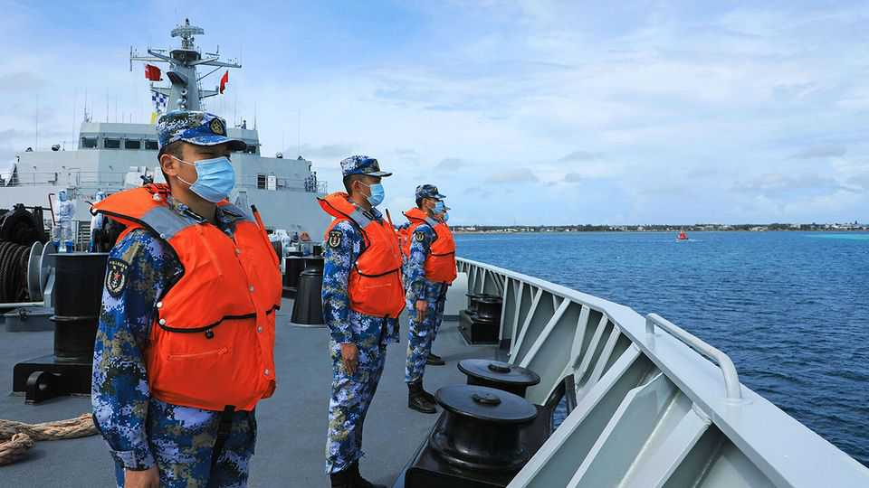

亚洲 | 水火不容
太平洋上的"大刀子战"
美国、澳大利亚和中国争夺太平洋岛国的影响力
2025年9月11日

摘要：太平洋岛国成了中美澳三方角力的新战场。中国想在这里建军事基地，美国澳大利亚拼命阻止。这场"刀子战"不仅关乎军事，还涉及经济、外交、甚至警察合作。太平洋岛国夹在中间，左右为难，但谁也不敢得罪。

1942年，瓜达尔卡纳尔岛见证了美国海军陆战队和日本士兵的肉搏战。9月10日，这个岛屿又迎来了一场地缘政治较量——太平洋岛国以及澳大利亚和新西兰的领导人齐聚所罗门群岛首都霍尼亚拉，参加年度峰会。中国明确没有被邀请，但它的外交官还是在霍尼亚拉，试图影响太平洋岛国领导人。这种咄咄逼人的外交是地区竞争的一部分，澳大利亚官员将其比作"刀子战"。中国正在太平洋寻求外交、经济和军事据点。而该地区的传统保护国——美国、澳大利亚和新西兰——正在反击。

中国已经是许多小太平洋国家的主要经济伙伴。美国官员说，中国也想在太平洋驻军。中国海军舰艇和空军飞机访问该地区的频率越来越高，表面上是为了提供援助。据说中国已经寻求在至少五个太平洋国家获得港口或机场的特权准入。在该地区拥有永久军事存在将使中国更容易对太平洋小国发号施令。如果台湾爆发冲突，这将使美国和澳大利亚的战争计划复杂化。

美国、澳大利亚和新西兰官员说，如果不是他们的努力阻止，中国已经在该地区有了基地。但悉尼智库洛伊研究所的米海·索拉说，中国获得商业设施（如港口）的准入权，这些设施在冲突中可能有用，这几乎同样令人担忧。这些地点"拥有所有的基础设施，即使前面没有牌子说'这是中国军事基地'"。

自2019年以来，中国国有企业一直在寻求租赁所罗门群岛的深水港。其中一些港口位于美国水兵在二战期间建造的跑道旁边。在一个案例中，一家中国公司告诉当地官员，拟议的港口将被中国海军使用。在基里巴斯、萨摩亚和巴布亚新几内亚，获得类似设施的努力被拒绝了。

中国影响力的另一个领域是警务。只有三个太平洋岛国有武装部队，所以警察部队之间的联合倡议是这些地方与外部世界在安全方面合作的主要方式。中国在三个太平洋国家有自己的警察，包括基里巴斯（最接近夏威夷的太平洋岛链）和瓦努阿图（最接近澳大利亚的岛国）（他们应该是在训练当地警察，以及其他任务）。2023年，中国达成协议，为在所罗门群岛举行的太平洋运动会提供安全保障。运动员在比赛结束后离开了，但中国警察还在那里。

并非所有太平洋岛国都同样容易受到中国影响。地理学家将该地区分为三个区域（见地图）。密克罗尼西亚与美国有历史和政治联系；波利尼西亚倾向于将新西兰视为地区大国；美拉尼西亚与澳大利亚关系最密切。

事实证明，美拉尼西亚国家，其中许多由"大人物"风格的庇护政治主导，对中国示好最为开放。在这个群体中，特别是所罗门群岛，中国取得了最大的进展。中国公司在那里无处不在；当地人把其中一家CCECC称为"中国中国一切中国中国"。许多所罗门群岛人声称不喜欢中国的存在。但当中国在该国的交易受到审查时，政治家和官员会跳出来为中国辩护。

澳大利亚一直在努力阻止中国在所罗门群岛的进展。它向该国提供的援助已经超过了中国。但竞争非常平衡。在霍尼亚拉这个只有一条路的城镇，你可以看到澳大利亚和中国的广告牌，都在吹嘘慷慨的合作。

最近，中国一直在试图利用其对所罗门群岛的影响力来实现一个更大的目标——在太平洋岛屿论坛（PIF）内部制造不和，这是该地区主要的政府间组织。该机构有18个太平洋国家作为成员，长期以来一直帮助促进贸易和解决争端。但中国将其视为其野心的障碍。虽然澳大利亚和新西兰是PIF的正式成员，但中国只能作为观察员参加其会议。它担心该集团达成协议，使其目标更难实现。

今年，中国要求所罗门群岛阻止台湾参加其主办的太平洋领导人峰会（台湾和中国一样，通常被允许作为观察员参加）。这有可能在继续承认台湾的三个太平洋岛国和该集团的其他国家之间造成重大分裂。分析人士说，这不仅仅是中国将台湾排除在国际事务之外的又一次努力；这是将太平洋岛屿分开的协调尝试。该集团内部的争吵增加了中国可以建立自己的竞争对手外交机构的机会，这将排除澳大利亚、新西兰和承认台湾的岛屿。中国已经每年邀请那组领导人和外交部长参加会议。

最后，所罗门群岛提出了一个妥协方案。无法违抗中国，它选择禁止所有非成员观察员参加会议——包括中国、美国和欧盟。这让很多人不高兴。但它阻止了支持台湾的国家抵制这一重大活动——这种破裂可能对该地区产生持久影响。

这只是一场小冲突。还会有更多。正如澳大利亚外交部长黄英贤所说，中国现在正在"永久竞争"中争夺对太平洋的影响力。在该地区的机场、港口和警察学院周围，预计中国官员会继续碰运气。

【一｜中国想在这里建军事基地】

中国在太平洋的野心很明显：不仅要经济影响，还要军事存在。美国官员说，中国想在这里驻军，这样就能对太平洋小国发号施令，还能在台海冲突时给美澳添麻烦。

中国已经在寻求在至少五个太平洋国家获得港口或机场的特权准入。这些地方看起来是商业设施，但一旦冲突爆发，就能变成军事基地。就像洛伊研究所的专家说的，这些地方"拥有所有的基础设施，即使前面没有牌子说'这是中国军事基地'"。

【二｜美国澳大利亚拼命阻止】

美澳新三国当然不会坐视不管。他们说，如果不是他们的努力阻止，中国已经在这里建了基地。现在他们正在拼命阻止中国获得任何可能用于军事目的的商业设施。

澳大利亚特别紧张，因为所罗门群岛离它太近了。澳大利亚一直在努力阻止中国在所罗门群岛的进展，提供的援助已经超过了中国。但竞争非常平衡，在霍尼亚拉这个只有一条路的城镇，你可以看到澳大利亚和中国的广告牌，都在吹嘘慷慨的合作。

【三｜太平洋岛国夹在中间】

太平洋岛国现在成了香饽饽，但也左右为难。美拉尼西亚国家，特别是所罗门群岛，对中国示好最为开放。中国公司在那里无处不在，当地人把其中一家CCECC称为"中国中国一切中国中国"。

但也不是所有岛国都买账。基里巴斯、萨摩亚和巴布亚新几内亚都拒绝了中国的港口租赁请求。这些国家知道，一旦让中国进来，就很难再赶出去了。

【四｜警察合作也是战场】

中国影响力的另一个领域是警务。只有三个太平洋岛国有武装部队，所以警察合作是这些地方与外部世界在安全方面合作的主要方式。中国在三个太平洋国家有自己的警察，包括基里巴斯和瓦努阿图。

这些中国警察说是来训练当地警察的，但谁知道他们到底在干什么。2023年，中国为在所罗门群岛举行的太平洋运动会提供安全保障，运动员走了，但中国警察还在那里。

【五｜太平洋岛屿论坛成了新战场】

最近，中国想利用对所罗门群岛的影响力，在太平洋岛屿论坛内部制造不和。这个论坛有18个太平洋国家，长期以来一直帮助促进贸易和解决争端。但中国把它视为障碍，因为中国只能作为观察员参加，而澳大利亚和新西兰是正式成员。

今年，中国要求所罗门群岛阻止台湾参加太平洋领导人峰会。这有可能在继续承认台湾的三个太平洋岛国和其他国家之间造成分裂。中国想通过这种方式，把太平洋岛屿分开，建立自己的外交机构。

太平洋现在成了中美澳三方角力的新战场。这场"刀子战"不仅关乎军事，还涉及经济、外交、甚至警察合作。太平洋岛国夹在中间，左右为难，但谁也不敢得罪。未来这种竞争只会越来越激烈，太平洋岛国必须小心应对，别成了大国博弈的牺牲品。
