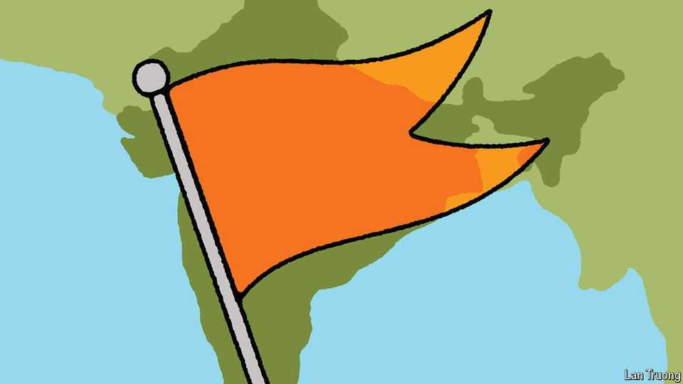

亚洲 | 榕树
世界上最强大的志愿者
印度的印度教民族主义RSS组织迎来100周年
2025年9月11日

摘要：印度教民族主义组织RSS迎来100周年，这个组织号称是世界上最大的志愿者团体，有500多万成员。它通过政治影响力改变印度，让印度教优先成为现实。虽然历史上被禁过几次，但现在借着莫迪的东风，影响力达到顶峰。不过，它的成功也带来了新的挑战。

为了纪念国民志愿服务团（RSS）成立100周年，其领导人莫汉·巴格瓦特上个月发表了一系列演讲。他回顾了这个组织的历史，该组织声称是世界上最大的志愿者团体。他为印度教优先的印度愿景进行了辩护。按照普通生日聚会的标准，这些长达数小时的讲座并不有趣。但对于一个重视纪律和痴迷于意识形态的运动来说，这似乎是一种合适的庆祝方式。RSS坚持认为其500多万成员——全部为男性——正在为印度做好事。他们定期在全国83000多个分支（shakhas）聚会，背诵祈祷文、玩游戏、进行军事训练和做慈善。他们渴望让印度成为一个严格的印度教国家——在这个国家里，少数群体，特别是穆斯林和基督徒，应该接受印度教文化的主导地位。这种被称为"印度教特性"（Hindutva）的哲学与印度的世俗宪法背道而驰，但支撑着RSS及其庞大的附属组织家族。这些包括学生俱乐部、慈善机构和一个巨大的工会。

现在，它的许多权力来自与政治的联系。印度执政的印度人民党（BJP）是RSS的意识形态产物。总理纳伦德拉·莫迪是该组织最著名的校友。莫迪先生在加入BJP之前，曾作为RSS的pracharak（工作者）工作多年。在上个月的一次演讲中，他庆祝了RSS的巨大规模。他的内阁中有几名RSS成员。该组织的干部有时充当执政党的竞选工作人员。

当RSS在1925年成立时，这种结果很难想象。它的创建者是一位名叫凯沙夫·巴利拉姆·赫格瓦尔的医生转活动家，他谈到在几个世纪（在他看来）在穆斯林和英国统治下的屈辱后恢复印度的伟大。赫格瓦尔创建了一个准军事风格的志愿者队伍。该组织的一些早期领导人公开表示对欧洲法西斯分子的钦佩。它的道路有时是崎岖的。RSS在1948年被禁止，当时一名前成员暗杀了圣雄甘地。它在1970年代再次被禁止，然后在1990年代初被禁止。

然而，即使在这些时期，它的思想也与许多印度教徒产生共鸣，特别是虔诚的人和那些渴望该组织能提供的归属感的人。在过去十年中，RSS从莫迪先生的巨大受欢迎程度中受益匪浅——正如总理从其认可中受益一样。

一定程度的实用主义也帮助该组织坚持下来。早期的RSS领导人对参与政治持谨慎态度；后来的领导人将其视为成长的方式。高级成员与他们前任的一些言论（特别是关于法西斯分子的内容）保持距离。他们开始更加强调RSS慈善工作的规模，现在包括约15万个项目。

在一些非常核心的问题上，RSS似乎也愿意妥协。虽然它声称支持家庭工业和印度自力更生，但该组织在很大程度上接受了BJP对全球资本的拥抱。今年早些时候，巴格瓦特先生支持了印度进行种姓普查的流行呼吁，尽管RSS（喜欢淡化印度教徒之间的种姓分歧）长期以来一直反对这一点。

但在一个目标上，RSS没有动摇：它希望让印度成为一个印度教优先的国家。在许多方面，这一使命看起来接近完成。一些长期珍视的目标已经实现，比如在阿约提亚被毁清真寺的废墟上建造一座寺庙（由印度最高法院批准），这引起了深刻的分歧。印度教特性已经渗透到公共生活中；甚至反对BJP的政治家也看到将自己描绘成坚定的印度教徒的优势。许多穆斯林在实践中过着二等公民的生活。

然而，在其胜利时刻，RSS似乎不安。巴格瓦特先生在他的演讲中阴郁地警告了国家统一面临的威胁。RSS出版物《组织者》刊登了关于穆斯林和其他人对印度教文化构成所谓风险的离奇故事。RSS既被信心也被偏执所推动。

RSS能保持其积累的影响力吗？答案在一定程度上取决于谁接替莫迪先生；BJP的选举命运；以及其领导人在多大程度上仍然愿意迎合该组织负责人的意愿。至少有一件事是清楚的。即使它与印度政治权力的直接联系恶化，它对印度社会的影响也不会迅速消失。

【一｜RSS是什么来头】

RSS全名叫国民志愿服务团，号称是世界上最大的志愿者团体，有500多万成员，全部为男性。他们定期在全国83000多个分支聚会，背诵祈祷文、玩游戏、进行军事训练和做慈善。

但这个组织不简单，它的目标是让印度成为一个严格的印度教国家，让穆斯林和基督徒这些少数群体接受印度教文化的主导地位。这种"印度教特性"哲学与印度的世俗宪法背道而驰，但支撑着RSS及其庞大的附属组织家族。

【二｜从边缘到中心的政治路】

RSS在1925年成立时，很难想象它会有今天的影响力。创建者赫格瓦尔是个医生转活动家，想恢复印度在穆斯林和英国统治下的屈辱后的伟大。他创建了一个准军事风格的志愿者队伍，一些早期领导人还公开表示对欧洲法西斯分子的钦佩。

历史上RSS被禁过几次：1948年因为前成员暗杀甘地，1970年代和1990年代初也被禁过。但即使在被禁期间，它的思想也与许多印度教徒产生共鸣，特别是那些渴望归属感的人。

【三｜莫迪时代的大爆发】

过去十年，RSS借着莫迪的东风，影响力达到顶峰。莫迪是RSS最著名的校友，在加入BJP之前，曾作为RSS的工作者工作多年。现在他的内阁中有几名RSS成员，该组织的干部还经常充当执政党的竞选工作人员。

RSS也从莫迪的巨大受欢迎程度中受益匪浅，而莫迪也从RSS的认可中受益。这种相互借力的关系，让RSS的影响力达到了前所未有的高度。

【四｜实用主义的妥协】

RSS能走到今天，离不开一定程度的实用主义。早期的RSS领导人对参与政治持谨慎态度，但后来的领导人将其视为成长的方式。高级成员与他们前任的一些极端言论保持距离，开始更加强调慈善工作的规模。

在一些核心问题上，RSS也愿意妥协。虽然它声称支持家庭工业和印度自力更生，但该组织在很大程度上接受了BJP对全球资本的拥抱。今年早些时候，巴格瓦特还支持了印度进行种姓普查的呼吁，尽管RSS长期以来一直反对这一点。

【五｜印度教优先的胜利与挑战】

RSS的核心目标没有动摇：让印度成为一个印度教优先的国家。现在这个目标已经接近完成。在阿约提亚被毁清真寺的废墟上建造寺庙，印度教特性渗透到公共生活中，甚至反对BJP的政治家也看到将自己描绘成坚定的印度教徒的优势。

但胜利也带来了新的挑战。RSS现在似乎不安，巴格瓦特在演讲中阴郁地警告国家统一面临的威胁，RSS出版物还刊登关于穆斯林对印度教文化构成威胁的离奇故事。RSS既被信心也被偏执所推动。

RSS能保持其影响力吗？这取决于谁接替莫迪，BJP的选举命运，以及领导人是否还愿意迎合该组织。但即使它与政治权力的直接联系恶化，它对印度社会的影响也不会迅速消失。这个组织已经深深扎根在印度社会中了。
