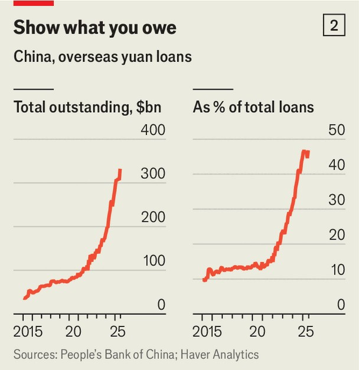

中国 | 从绿钞到红钞
中国正在快速抛弃美元
官员们认为人民币终于成熟了
2025年9月11日

摘要：中国领导人觉得机会来了。特朗普的贸易政策、财政赤字和威胁美联储独立性，让美元跌得厉害。人民币趁机上位，外国投资者蜂拥而入，很多国家也在寻找美元替代品。中国这次学聪明了，既要国际化，又要保持对资本流动的严格控制。

中国领导人感觉到了一个史诗级的机会。特朗普总统反复无常的贸易政策、巨大的财政赤字和对美联储独立性的威胁，可能会严重伤害美元。自1月以来，美元在贸易加权基础上暴跌7%，是1973年以来最糟糕的开年表现。相比之下，中国严格控制的人民币已经达到了自特朗普11月连任以来的最高水平。外国投资者蜂拥而入。许多寻找美元替代品的政府也是如此。这种强烈的兴趣并不新鲜。中国对人民币国际化的渴望也不是。该国第一次这样的推动始于2009年，当时它放松了一些资本管制。这在2015年痛苦地结束了，当时股市崩盘和货币贬值让资金争先恐后地逃离。随后出现了资本管制，结束了人民币的新兴崛起。这一次，官员们渴望确保进展是持久的，并且他们对资本流动保持更严格的控制。

中国领导人认为，全球接受的人民币可以让他们的出口商免受美元价值波动的影响，并削弱美国金融制裁的威胁。一些官员希望外国公司和投资者会忽视国家的严格控制，甚至可能将其视为资产。近年来，他们取得了令人惊讶的成果。人民币在发票和海外贷款中的份额有所增长，并且建立了令人印象深刻的非美元金融基础设施来匹配。但官员们似乎认识到，外国人现在需要更大的激励来使用人民币和投资人民币资产。

那么中国到目前为止取得了什么成就？从任何衡量标准来看，人民币都缺乏声望。尽管中国占全球经济活动的近五分之一，但其货币仅占国际支付价值的4%（相比之下，美元为50%）。人民币资产仅占全球央行外汇储备的2%（相比之下，美元资产为58%）。这种不匹配很大程度上可以归咎于中国对资金流入和流出该国的控制。许多经济学家认为，在资本管制仍然存在的情况下，人民币国际化是不可能的。

但即使在美国成为世界最大经济体之后，美元仍然需要几十年才能实现主导地位。按照这个时间尺度，中国正在取得令人惊讶的快速进展。其在国际支付中的适度份额自2022年以来翻了一番。这主要归功于国内的变化。增加人民币在中国自身贸易中的份额是重要的一步。中国超过30%的商品和服务贸易现在用自己的货币进行（相比之下，2019年为14%）。它用人民币结算了超过50%的跨境收入总额（包括资金流动），而2010年这一比例不到1%（见图表1）。

北京咨询公司Trivium China的丁尼·麦克马洪认为，政策制定者最终想要的是创造人民币进出该国的稳定循环。这应该会促进离岸人民币的使用，并改善外国人获得该货币的便利性。5月，监管机构告诉大银行，至少40%的贸易便利化贷款应该用人民币进行。为了增加循环，官员们希望鼓励贸易伙伴接受中国货币作为支付。一个主要的诱惑是向他们提供人民币负债。美联储经济学家5月发布的一项研究发现，在2022年对俄罗斯实施制裁后，中国银行将几乎所有新的海外贷款从美元转换为人民币（以前只有15%的贷款是用人民币进行的），从而使未偿还人民币债务存量增加了两倍（见图表2）。

政府正在用自己的资产负债表追求同样的策略。自开始国际化推动以来，中国已向32家央行提供了4.5万亿元（6300亿美元）的互换额度，创建了一个与IMF规模相当的全球金融安全网。这些额度中只有一小部分实际被使用。这个想法是在危机中保证各国获得人民币，让它们有信心用这种货币借贷和购买。

在这一切进行的同时，中国也整理了自己的金融管道。现在它可以通过各种方式与他人交易，而不触及美元系统。这些包括数字人民币和非银行数字支付（如通过亚洲流行的应用程序上的二维码）。最重要的是CIPS的发明，它与西方的银行消息系统SWIFT有相似之处。美国智库大西洋理事会的乔什·利普斯基说，由于中国银行可以并且确实在SWIFT之外进行交易，人民币在国际支付中的作用可能被低估了。

全球超过1700家银行已加入CIPS，自乌克兰战争前以来增长了三分之一。2024年交易量增长比以往任何时候都快，增长43%至175万亿元（24万亿美元）。用于结算人民币支付的清算银行（几乎全部由中国机构运营）已在33个市场建立。一些在今年加入，包括土耳其和毛里求斯的银行。中国6月开始与阿拉伯联合酋长国合作，以将CIPS网络扩展到北非和中东。

去年，据说有数十亿美元通过一个名为mBridge的数字货币网络进行交易，该网络由中国与其他央行共同构建。1月发言的一位美国官员说，虽然这种支付在经济上仍然微不足道，但它们"已经超过了地缘政治后果的门槛"。中国监管机构已指示银行增加对mBridge的使用。吸引力是显而易见的。8月，新疆一家因使用强迫劳动而受到制裁的实体使用mBridge向其外国股东付款。

现在怎么办？在关键领域转向内向自给自足的中国政府必须扩大外国人对金融市场的准入。今年向外国人开放的金融合约数量增加了一倍多；国内投资者的出境配额已经扩大。

未来几个月可能至关重要。对美元信任的减弱和支持性的宏观经济环境应该会促进中国的努力。股市的上涨给了外国人持有人民币资产的财务激励。利率削减和通缩已将离岸市场的借贷成本推至2%以下，这是2013年以来的最低水平。包括外国公司在内的公司今年有望发行创纪录数量的所谓"点心"人民币债券。

中国下一个安全的举措是向朋友开放其境内资本市场。7月，匈牙利发行了约50亿元人民币的所谓"熊猫债券"，这是迄今为止最大的单一主权发行。9月8日，《金融时报》报道，俄罗斯能源公司已获准发行人民币计价票据。肯尼亚可能很快将其欠中国的美元债务转换为人民币。与此同时，巴西正在考虑新的发行，巴基斯坦官员一直在北京向潜在债权人推销。

尽管有这些嗡嗡声，官员们正在采取长远观点。6月，中国央行行长潘功胜在一次重要演讲中宣布，全球金融体系正在变得"多极化"，未来美元将被迫与人民币等其他货币竞争。中国希望，这种竞争意味着该国将不得不减少对美元的依赖，并可以抵制资本流动和汇率的自由化。人民币可能仍然是一个具有中国特色的全球货币。

【一｜美元跌了，人民币上位了】

中国领导人觉得机会来了。特朗普的贸易政策反复无常，财政赤字巨大，还威胁美联储独立性，这些都可能严重伤害美元。自1月以来，美元在贸易加权基础上暴跌7%，是1973年以来最糟糕的开年表现。

相比之下，人民币趁机上位，达到了自特朗普11月连任以来的最高水平。外国投资者蜂拥而入，很多国家也在寻找美元替代品。中国这次学聪明了，既要国际化，又要保持对资本流动的严格控制。

【二｜人民币国际化的新策略】

中国领导人认为，全球接受的人民币可以让出口商免受美元价值波动的影响，还能削弱美国金融制裁的威胁。一些官员甚至希望外国公司和投资者会忽视国家的严格控制，甚至将其视为资产。

这次中国采取了新策略：既要国际化，又要保持控制。他们希望创造人民币进出该国的稳定循环，促进离岸人民币使用，让外国人更容易获得这种货币。5月，监管机构要求大银行至少40%的贸易便利化贷款用人民币进行。

【三｜数字基础设施是关键】

中国建立了自己的金融管道，现在可以通过各种方式与他人交易，而不触及美元系统。数字人民币、非银行数字支付，还有最重要的CIPS系统，都与西方的SWIFT有相似之处。

全球超过1700家银行已加入CIPS，自乌克兰战争前以来增长了三分之一。2024年交易量增长43%至175万亿元。中国还与其他央行合作构建了mBridge数字货币网络，去年有数十亿美元通过这个网络交易。

【四｜给朋友开绿灯】

中国下一个安全的举措是向朋友开放境内资本市场。匈牙利发行了50亿元人民币的"熊猫债券"，俄罗斯能源公司获准发行人民币计价票据，肯尼亚可能将其欠中国的美元债务转换为人民币。

这些措施让人民币在国际支付中的份额自2022年以来翻了一番。中国超过30%的商品和服务贸易现在用自己的货币进行，用人民币结算的跨境收入超过50%。

【五｜多极化金融体系的未来】

中国央行行长潘功胜6月宣布，全球金融体系正在变得"多极化"，未来美元将被迫与人民币等其他货币竞争。中国希望这种竞争意味着该国将不得不减少对美元的依赖，并可以抵制资本流动和汇率的自由化。

人民币可能仍然是一个具有中国特色的全球货币。虽然现在在国际支付中只占4%，在央行外汇储备中只占2%，但按照美元当年从边缘到主导的时间尺度，中国正在取得令人惊讶的快速进展。

中国这次真的学聪明了。既要人民币国际化，又要保持对资本流动的严格控制。通过数字基础设施、互换额度、熊猫债券等手段，中国正在建立一个不依赖美元的国际金融体系。虽然现在规模还不大，但趋势很明显：全球金融体系正在变得多极化，人民币正在成为美元的有力竞争者。
