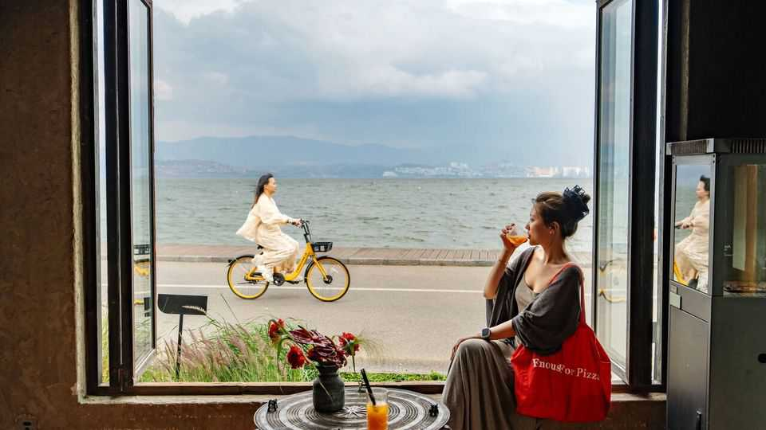

中国 | 消费文化
"大理化"席卷中国
与低收入休闲阶级同行
2025年9月11日

摘要：中国出现了一个新现象叫"大理化"，就是低收入人群开始大量旅游消费。虽然大城市的人因为房地产危机变得谨慎，但小城市和农村的人反而更愿意花钱了。这种消费降级和升级并存的现象，正在改变中国的消费格局。

中国很少有目的地像大理这样悠闲，这个西南背包客天堂被昵称为"大理福尼亚"。疲惫不堪的人会在这个湖滨古镇度过夏天。他们经常用很少的钱在这里闲逛几个月。根据餐馆老板、酒店经营者和旅游经营者的几份报告，该市的旅游区今年夏天比以往任何时候都更繁忙。一位当地商人抱怨说，太多游客只是来"白嫖"，或者蹭吃蹭喝。为什么大理这么满？被中国持续的房地产危机震惊的富裕城市居民对花钱持谨慎态度。许多人在餐饮和旅行上的花费比过去少，这种现象被称为"消费降级"。这可能部分解释了该镇繁忙的街道和拥挤的咖啡馆。但似乎还有另一个故事正在展开。这些地方充满寻找便宜货的游客的一个原因是，不那么富裕的群体今年实际上似乎比过去旅行得更多。

2025年上半年，中国游客进行了33亿次国内旅行，比去年同期增长20%。（每次乘坐飞机或火车都算作一次旅行。）这些游客的总支出激增了15%以上。这是上半年旅游支出首次超过疫情前水平。但深入挖掘每次旅行的数字，游客比一年前少花了4.3%。平均而言，中国游客现在每人只比2019年多花一点。北京咨询公司Trivium China的乔·佩塞尔认为，这可能是由于增加了更多低收入旅行者。

不同收入群体的支出在中国官方数据中很难区分。但美国银行最近消费者调查的一个发现支持了低收入家庭可能花费更多可支配收入的想法。年收入低于10万元（1.4万美元）的受访者中，约54%表示他们预计未来会增加支出，从6月的仅34%大幅跃升。这一跳跃比其他收入群体更大。

谁在花钱，在哪里花钱，对中国经济有严重影响。小城市的人通常比大城市的人面临更大的经济挑战。由于中国薄弱的社会安全网，中国人总体上比发达国家的人储蓄更多。说服他们放弃多余的储蓄可能有助于释放消费需求，并为经济提供急需的推动力。

今年中国最繁华城市的消费者情绪处于低谷。但在中国内陆较贫穷的小城市——大量人口的家园——情绪更加明亮。（近10亿中国人生活在主要大都市之外。）例如，河南省五个小城市的零售支出平均增长率在今年上半年接近8%。同期在北京为-3.8%。同样，去年居民花费大量可支配收入的城市——比如80%，而北京和上海等城市更常见的60%——往往是小城市。

经济学家说，这些是有趣的趋势。虽然穷人花费更大比例的收入并不令人惊讶，但他们的储蓄率可能以富人没有的方式下降。该国穷人的收入增长也可能更快。

小规模挥霍的一个解释是中国房地产危机的感知改善，这场危机已经持续了五年多，并导致房价暴跌。美国银行经济学家安娜·周说，8月低收入人群支出意愿的上升与中国小城市住宅物业前景的改善相关。无论原因是什么，迎合这群消费者在中国变得越来越重要。

Trivium的佩塞尔先生指出，大城市以外的地方政府近年来一直在大力推广廉价旅游选择。他们的努力似乎正在取得成效。看看中国东部沿海的江苏省。它今年推广了一个当地足球联赛，门票只卖十元一张；寻找负担得起的乐趣的游客蜂拥而至。教训很清楚。大理脾气暴躁的店主需要拥抱这些低消费群体才能蓬勃发展。

【一｜"大理化"现象火了】

中国出现了一个新现象叫"大理化"，就是低收入人群开始大量旅游消费。大理这个西南背包客天堂被昵称为"大理福尼亚"，今年夏天比以往任何时候都更繁忙。

虽然富裕城市居民因为房地产危机变得谨慎，但小城市和农村的人反而更愿意花钱了。这种消费降级和升级并存的现象，正在改变中国的消费格局。

【二｜低收入人群开始旅游了】

2025年上半年，中国游客进行了33亿次国内旅行，比去年同期增长20%。这些游客的总支出激增了15%以上，是上半年旅游支出首次超过疫情前水平。

但深入挖掘每次旅行的数字，游客比一年前少花了4.3%。平均而言，中国游客现在每人只比2019年多花一点。这可能是由于增加了更多低收入旅行者。

【三｜小城市消费更活跃】

今年中国最繁华城市的消费者情绪处于低谷，但在内陆较贫穷的小城市，情绪更加明亮。河南省五个小城市的零售支出平均增长率在今年上半年接近8%，而同期在北京为-3.8%。

去年居民花费大量可支配收入的城市，往往是小城市。这些地方的人花费80%的可支配收入，而北京和上海等城市更常见的只有60%。

【四｜房地产危机的影响】

小规模挥霍的一个解释是中国房地产危机的感知改善。这场危机已经持续了五年多，并导致房价暴跌。8月低收入人群支出意愿的上升与中国小城市住宅物业前景的改善相关。

虽然大城市的人因为房价暴跌变得谨慎，但小城市的人反而觉得机会来了。他们开始愿意花费更多的可支配收入，这对中国经济是个好消息。

【五｜地方政府在推波助澜】

大城市以外的地方政府近年来一直在大力推广廉价旅游选择。他们的努力似乎正在取得成效。江苏省今年推广了一个当地足球联赛，门票只卖十元一张，寻找负担得起的乐趣的游客蜂拥而至。

这种趋势对中国的消费格局有重要意义。虽然大城市的人因为房地产危机变得谨慎，但小城市和农村的人反而更愿意花钱了。这种消费降级和升级并存的现象，正在改变中国的消费格局。

"大理化"现象说明了一个重要趋势：虽然大城市的人因为房地产危机变得谨慎，但小城市和农村的人反而更愿意花钱了。这种消费降级和升级并存的现象，正在改变中国的消费格局。地方政府也在推波助澜，大力推广廉价旅游选择。这对中国经济来说是个好消息，说明消费需求正在从不同角度释放出来。
