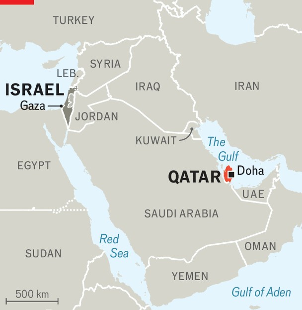

中东与非洲 | 只有战术，没有战略
美国不能或不愿保护海湾的朋友
以色列对卡塔尔的打击让特朗普尴尬，激怒了该地区
2025年9月11日

摘要：以色列用美国制造的飞机轰炸了卡塔尔，这个美国的重要伙伴。这不仅是战术失败，还会危及加沙停火谈判，让海湾国家更加担心：以色列现在是个不受约束的地区霸权，美国再也不能保证他们的安全了。

今年5月，特朗普站在卡塔尔首都多哈郊外的一个机库里，做出了承诺。他说话时身后是一排美国军队。他的左边是一架MQ-9死神无人机；右边是一架F-15战斗机。这种军事形象是为了强化总统对盟友的话。"我永远不会犹豫使用美国的力量，如果必要的话，来保卫美利坚合众国或我们的伙伴，"他说。"这是我们伟大的伙伴之一。"

9月9日，一个美国盟友用美国制造的飞机轰炸了那个伟大的伙伴。以色列空军袭击了多哈的一栋别墅，据信巴勒斯坦激进组织哈马斯的领导人正在那里会面。这似乎没有成功：虽然哈马斯的五名低级成员被杀，但领导人据说幸存了（尽管他们自那以后没有在公开场合露面）。

这不仅仅是战术失败。这次打击可能会危及加沙目前的停火谈判。它还会强化海湾许多领导人的两个新兴恐惧：不受约束的以色列现在是一个地区霸权，美国再也不能保证他们的安全。

自2023年10月7日哈马斯杀死或绑架约1400名以色列人以来，以色列政府发誓要追捕该组织的领导人。但直到现在，它都避免在卡塔尔针对他们。这个小小的酋长国不仅接待哈马斯的政治局，还接待美国中央司令部的地区总部。

打击卡塔尔的计划遭到摩萨德（以色列对外情报部门）及其将军们的反对。双方都认为这会破坏特朗普最新恢复停火谈判的尝试，并危及仍被关押在加沙的人质。内塔尼亚胡还是下令了，部分原因是9月8日耶路撒冷发生枪击事件，造成六名平民死亡后，他的政府受到批评。

这使得卡塔尔成为以色列自大屠杀以来轰炸的第六个国家。在其他地方，它可以争辩说它是在对抗真正的威胁。自10月7日以来，伊拉克、黎巴嫩、巴勒斯坦、叙利亚和也门的民兵都攻击了它；伊朗也是如此，它支持以色列的许多地区敌人。它对卡塔尔不能做这样的声明。对它的突袭不是预防性地针对迫在眉睫的威胁，甚至不是预防性地先发制人应对未来的危险。这是对主权国家领土的报复行为。

9月10日，阿拉伯联合酋长国总统穆罕默德·本·扎耶德飞往多哈会见埃米尔。沙特王储预计第二天访问。这是邻国的公开支持，这些国家不久前还与卡塔尔断绝了外交和经济关系。

这个酋长国长期以来一直是海湾合作委员会（GCC）的害群之马，这是一个由六个石油君主国组成的俱乐部。它对哈马斯等伊斯兰主义组织的支持激怒了邻国。它对半岛电视台（阿拉伯卫星新闻频道）的赞助也是如此，该频道曾经是一个自由奔放和批判性的媒体（尽管今天它更多地充当伊斯兰主义者的喉舌）。这些政策导致四个阿拉伯国家在2017年对卡塔尔实施旅行和贸易禁运（他们在2021年解除了）。

然而，他们与卡塔尔的分歧与对自己主权和安全的恐惧相比相形见绌。GCC以其平静的声誉而繁荣，但自2019年以来，沙特阿拉伯和阿联酋一直受到伊朗及其盟友的攻击。两国都对美国（他们长期保护者）的回应感到失望。至于卡塔尔，它今年已经被轰炸了两次；第一次是6月被伊朗轰炸，以报复美国对其核设施的打击。

这有助于解释为什么特朗普政府似乎如此尴尬。白宫新闻秘书卡罗琳·莱维特在打击后宣读了一份措辞谨慎的声明，暗示美国只有在进行中才了解到它（而且是从自己的军队，不是从以色列）。特朗普后来在社交媒体上发布了类似的信息，并补充承诺他的国务卿马可·鲁比奥将努力与卡塔尔敲定防务协议。他还发誓卡塔尔不会再成为目标（尽管内塔尼亚胡随后暗示了其他情况）。

以色列官员提供了不同的故事：特朗普可能对时机感到惊讶，但他知道这个计划——如果他没有给绿灯，他也没有亮红灯。华盛顿的消息来源讲述了相互矛盾的故事，但都同意特朗普很愤怒："令人尴尬，"一位前五角大楼官员说。

他们在以色列的同行也对这次行动及其结果感到愤怒。"这是一个巨大的失败。他们期望特朗普会同意这一点，但这是一个巨大的误判，"一位前间谍头子说。

近年来，美国一直试图说服海湾国家，他们可以通过与以色列结盟找到安全。阿联酋和巴林都在2020年承认了它。沙特阿拉伯在10月7日之前接近签署自己的正常化协议。美国官员敦促海湾君主加入以色列的地区防空伙伴关系。

在10月7日之后，所有这些都变得难以推销。加沙战争使以色列在阿拉伯世界非常不受欢迎，海湾统治者越来越担心以色列与伊朗及其盟友不断扩大的冲突最终会拖累他们（就像6月对卡塔尔所做的那样）。对多哈的打击只会巩固这种信念：美国和以色列现在看起来像是相反的东西，远非地区稳定的基石。

【一｜以色列轰炸了美国的朋友】

以色列用美国制造的飞机轰炸了卡塔尔，这个美国的重要伙伴。特朗普今年5月还在多哈的机库里承诺保护盟友，结果9月9日就被打脸了。

以色列空军袭击了多哈的一栋别墅，据信哈马斯的领导人正在那里会面。虽然五名低级成员被杀，但领导人据说幸存了。这不仅是战术失败，还会危及加沙停火谈判。

【二｜海湾国家开始担心了】

这次打击让海湾国家更加担心两个问题：不受约束的以色列现在是个地区霸权，美国再也不能保证他们的安全了。

9月10日，阿联酋总统穆罕默德·本·扎耶德飞往多哈会见埃米尔，沙特王储也准备访问。这是邻国的公开支持，这些国家不久前还与卡塔尔断绝了外交和经济关系。

【三｜卡塔尔成了替罪羊】

卡塔尔长期以来一直是海湾合作委员会的害群之马，因为它支持哈马斯等伊斯兰主义组织，还赞助半岛电视台。这些政策导致四个阿拉伯国家在2017年对卡塔尔实施禁运。

但现在情况变了。虽然他们与卡塔尔有分歧，但与对自己主权和安全的恐惧相比，这些分歧相形见绌。自2019年以来，沙特和阿联酋一直受到伊朗及其盟友的攻击，他们对美国的回应感到失望。

【四｜特朗普政府很尴尬】

特朗普政府似乎很尴尬。白宫新闻秘书说美国只有在进行中才了解到这次打击，而且是从自己的军队，不是从以色列。特朗普后来在社交媒体上发布了类似的信息，还承诺与卡塔尔敲定防务协议。

但以色列官员提供了不同的故事：特朗普可能对时机感到惊讶，但他知道这个计划。如果他没有给绿灯，他也没有亮红灯。华盛顿的消息来源都同意特朗普很愤怒。

【五｜地区稳定受到威胁】

近年来，美国一直试图说服海湾国家与以色列结盟找到安全。阿联酋和巴林都在2020年承认了以色列，沙特也接近签署正常化协议。

但在10月7日之后，这些都变得难以推销。加沙战争使以色列在阿拉伯世界非常不受欢迎，海湾统治者担心以色列与伊朗的冲突会拖累他们。对多哈的打击只会巩固这种信念：美国和以色列现在看起来像是地区稳定的威胁，而不是基石。

以色列轰炸卡塔尔这件事，暴露了美国在中东的尴尬处境。它既不能约束以色列，也不能保护海湾盟友。这种"只有战术，没有战略"的做法，只会让地区局势更加不稳定。海湾国家现在必须重新考虑自己的安全策略了。
