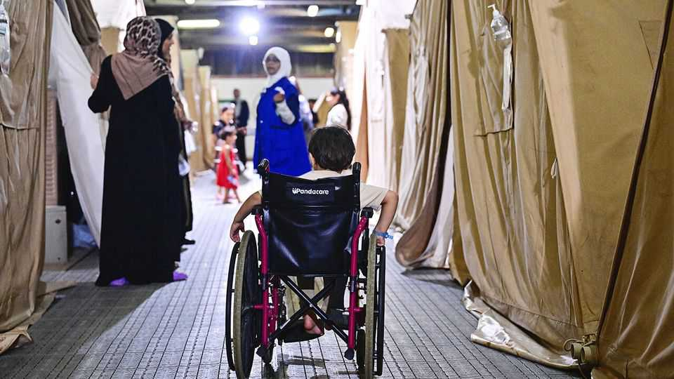

中东与非洲 | 等待帮助的漫长时间
从加沙撤离受伤儿童需要什么
物流、许可和地缘政治都拖慢了进程
2025年9月11日

摘要：从加沙撤离受伤儿童是个复杂的过程，需要护照、安全许可、旅行许可等一堆手续。西方参与度很低，只有28人去了美国，3人去了英国。大部分去了埃及、约旦和阿联酋。现在平均每月只能撤离89个病人，按这个速度需要15年才能撤离完所有等待名单上的人。

上个月，美国极右翼活动家劳拉·卢默在社交媒体上发布了几段视频，显示受伤的加沙儿童抵达美国机场。有些坐在轮椅上或失去了四肢。其他人坐在行李箱上，当欢迎人群欢呼并挥舞巴勒斯坦旗帜时，他们微笑着。与特朗普关系密切的卢默女士指责这些儿童及其同伴是"伊斯兰入侵者"。几天内，美国国务院宣布暂停来自加沙的签证；自那以后，所有巴勒斯坦人的签证都被封锁。事实上，西方参与接受加沙受伤人员的程度微乎其微。自2024年7月以来撤离的2663名患者中，超过60%去了埃及。另外30%去了约旦和阿拉伯联合酋长国。只有28人去了美国，3人去了英国：这只是联合国估计需要在国外接受医疗治疗的近16000名患者的一小部分。近一半是无法独自旅行的儿童。这意味着4176名同伴与他们一起撤离，主要是母亲或女性看护者。以色列很少向父亲发放许可证。

这是一个艰苦的过程。战前，需要在该地带外接受治疗的加沙人会向控制巴勒斯坦人行动的以色列军事当局申请24小时许可证。根据以色列活动组织"以色列人权医生"的数据，每月约有2000名加沙人离开，主要去以色列或西岸。在以色列于2023年10月7日关闭这条道路后，寻求治疗的加沙人一度可以通过拉法过境点去埃及。根据医疗援助组织无国界医生（MSF）的数据，每月约有1500人前往。当以色列在2024年5月接管拉法时，除了今年早些时候的两个月停火期间，这条道路也被关闭了。

现在那些寻求撤离的人通过另一个过境点，在凯雷姆沙洛姆，进入以色列南部，然后通过机场或约旦前往第三国。他们必须从巴勒斯坦、以色列、过境和接收国的当局获得护照、安全许可和旅行许可证。自3月停火被打破以来，平均每月允许89名患者离开。MSF的哈尼·伊斯利姆医生说，按这个速度，需要近15年才能撤离所有等待名单上的人。与此同时，自去年4月以来，MSF撤离名单上的200名患者中有19人死亡，包括12名儿童。加沙卫生部说，自去年7月以来，它统计了740人死亡，包括137名儿童，都在他们的等待名单上。

根据MSF的数据，最近几个月，以色列军事当局已经从拒绝转向批准大多数出境请求。现在的主要挑战是找到接受撤离者的国家。邻国在医疗方面紧张；其他国家面临加沙人使用公共资源的反弹。30岁的母亲阿比尔·阿拉·萨阿德在停火期间离开加沙前往埃及，六个月来一直靠捐款生活，在一个与其他五名妇女及其子女共用的医院房间里。她没有工作权，但一直在等待与她在轰炸中失去双腿的七岁儿子一起撤离到美国，他计划安装假肢。她说，他们原本计划在治疗后返回加沙，与她的丈夫和另外两个孩子团聚。现在他们被困在不确定的状态中。

HEAL Palestine是一家美国慈善机构，赞助了阿拉·萨阿德女士和卢默女士视频中的儿童，它说它为所有撤离者支付治疗费用或找到愿意免费治疗他们的医院。撤离者也签署了承诺回家的文件。虽然东道国担心加沙人在治疗后逾期居留，但加沙人担心以色列现在允许撤离是因为它随后会阻止返回。以色列说它一直鼓励和促进撤离，这取决于接收国的请求。

巴勒斯坦医疗援助的利兹·奥尔科克说，医疗撤离是"沧海一粟"。需要的是以色列停止阻止援助和轰炸医疗设施，这样加沙人就可以恢复自己的治疗。

【一｜西方参与度很低】

从加沙撤离受伤儿童是个复杂的过程，但西方参与度很低。自2024年7月以来撤离的2663名患者中，超过60%去了埃及，另外30%去了约旦和阿联酋。

只有28人去了美国，3人去了英国，这只是联合国估计需要在国外接受医疗治疗的近16000名患者的一小部分。近一半是无法独自旅行的儿童，需要4176名同伴与他们一起撤离。

【二｜手续复杂得让人头疼】

战前，需要治疗的加沙人可以向以色列军事当局申请24小时许可证。现在他们必须从巴勒斯坦、以色列、过境和接收国的当局获得护照、安全许可和旅行许可证。

自3月停火被打破以来，平均每月只能撤离89名患者。按这个速度，需要近15年才能撤离完所有等待名单上的人。这期间，已经有19名患者在等待中死亡，包括12名儿童。

【三｜等待中的人很痛苦】

30岁的母亲阿比尔·阿拉·萨阿德在停火期间离开加沙前往埃及，六个月来一直靠捐款生活，在一个与其他五名妇女及其子女共用的医院房间里。

她没有工作权，但一直在等待与她在轰炸中失去双腿的七岁儿子一起撤离到美国。他们原本计划在治疗后返回加沙，与家人团聚，但现在被困在不确定的状态中。

【四｜东道国也有顾虑】

现在的主要挑战是找到接受撤离者的国家。邻国在医疗方面紧张；其他国家面临加沙人使用公共资源的反弹。

虽然东道国担心加沙人在治疗后逾期居留，但加沙人担心以色列现在允许撤离是因为它随后会阻止返回。这种相互不信任让整个撤离过程变得更加复杂。

【五｜根本问题没解决】

医疗撤离只是"沧海一粟"，真正需要的是以色列停止阻止援助和轰炸医疗设施，这样加沙人就可以恢复自己的治疗。

现在的问题是，撤离过程太慢，手续太复杂，东道国顾虑太多。按现在的速度，需要15年才能撤离完所有等待名单上的人，这期间还会有更多人死亡。

从加沙撤离受伤儿童是个复杂的过程，需要护照、安全许可、旅行许可等一堆手续。西方参与度很低，大部分去了埃及、约旦和阿联酋。现在平均每月只能撤离89个病人，按这个速度需要15年才能撤离完所有等待名单上的人。这期间还会有更多人死亡。真正需要的是以色列停止阻止援助和轰炸医疗设施，让加沙人能够恢复自己的治疗。
