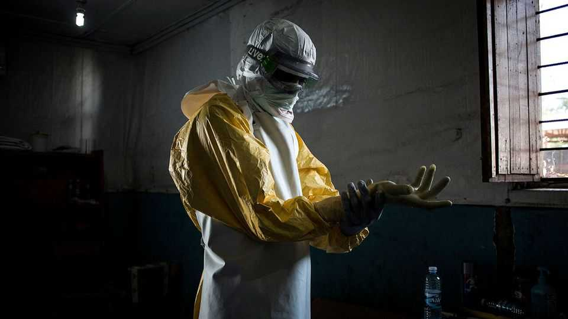

中东与非洲 | 又一次爆发
埃博拉重返刚果
专家们正在争分夺秒地控制致命病毒的传播
2025年9月11日

摘要：埃博拉又回来了，这次在刚果的卡赛省。这是自1976年发现以来第16次在刚果确认埃博拉。虽然专家们比较乐观，认为可以控制传播，但刚果的医疗系统负担过重，资金不足，而且这次没有美国帮助。埃博拉可能会再次回来，因为果蝠喜欢刚果的茂密森林。

从刚果民主共和国首都金沙萨开车运送药品到中南部省份卡赛需要近三天时间。这对最近被诊断出埃博拉的人来说是个坏消息，这是一种严重的病毒，在几天内杀死约50-90%的感染者。然而，该省远离刚果河（这个中非国家的主要动脉）的偏远位置也应该有助于控制疫情。这标志着自1976年在刚果发现埃博拉以来第16次确认埃博拉。到目前为止，联合国世界卫生组织（WHO）9月4日确认的卡赛疫情已造成16人死亡，其中4人是卫生工作者，还有数十人感染。死亡人数可能会上升，特别是因为8月25日第一次死亡和确认埃博拉是罪魁祸首之间存在滞后。由于人们可以通过接触受害者尸体感染这种疾病，快速隔离病人和安全处理死者至关重要。

目前，专家们合理地乐观认为他们可以阻止传播。除了疫情爆发地点偏远之外，还有几个原因。对死亡率的初步评估相对较低，即使在诊所建立之前，只有一半以上的已知患者死亡。在以前疫情爆发的早期阶段，几乎所有生病的人都死了。

刚果对埃博拉的经验意味着它随着每一次新的爆发改进了应对措施。除了更好的物流和医疗能力，它现在可以获得新的抗体治疗，可以逆转疾病的进展并帮助康复。与刚果其他地区不同，卡赛目前不是重大武装冲突的地点。

最后但同样重要的是，现在有一种有效的疫苗。十年前，当埃博拉在西非爆发期间杀死超过11000人时，这种疫苗还不可用，当2018年和2019年刚果有数千人死于这种疾病时，它仍处于实验阶段。现在WHO正在从金沙萨向卡赛运送2000剂疫苗，以及医疗专家、防护设备和200万美元的紧急基金。

然而，也有理由担心。尽管埃博拉护理有所改善，但刚果的医疗系统负担过重且资金不足。政府已经在努力阻止该国其他地区的猴痘和霍乱爆发。卡赛最近的隔离中心只有15张床位，几乎不足以应对大规模爆发。这也是刚果第一次不得不在没有美国帮助的情况下对抗埃博拉爆发。"我们过去真的依赖美国，"管理WHO埃博拉应对措施的流行病学家帕特里克·奥蒂姆博士说。过去，美国国际开发署过去常常帮助调查病毒，并提供移动实验室和飞机，将专家和设备运送到偏远地区。现在奥蒂姆博士和他的同事需要在其他地方找到这种支持，这需要时间。

即使当前的爆发被成功控制，埃博拉也可能会重返刚果。果蝠（病毒最可能的携带者）被其茂密的森林所吸引，这意味着埃博拉在野生动物中循环。许多刚果人依靠森林谋生，吃动物的肉或在耕作或砍伐木材时遇到它们。

希望更好的监测，以及疫苗和改进的治疗选择，将使刚果的每一次新爆发都比前一次不那么威胁。2022年的一次爆发在三个月内被控制，当时只杀死了少数人。如果运气好一点，当前的爆发不会更加致命。

【一｜埃博拉又回来了】

埃博拉又回来了，这次在刚果的卡赛省。从金沙萨开车运送药品到卡赛需要近三天时间，这对最近被诊断出埃博拉的人来说是个坏消息。

这是自1976年发现以来第16次在刚果确认埃博拉。到目前为止，卡赛疫情已造成16人死亡，其中4人是卫生工作者，还有数十人感染。死亡人数可能会上升，特别是因为8月25日第一次死亡和确认埃博拉是罪魁祸首之间存在滞后。

【二｜专家们比较乐观】

目前，专家们合理地乐观认为他们可以阻止传播。除了疫情爆发地点偏远之外，还有几个原因：对死亡率的初步评估相对较低，即使在诊所建立之前，只有一半以上的已知患者死亡。

刚果对埃博拉的经验意味着它随着每一次新的爆发改进了应对措施。除了更好的物流和医疗能力，它现在可以获得新的抗体治疗，可以逆转疾病的进展并帮助康复。卡赛目前不是重大武装冲突的地点。

【三｜现在有了有效疫苗】

最后但同样重要的是，现在有一种有效的疫苗。十年前，当埃博拉在西非爆发期间杀死超过11000人时，这种疫苗还不可用，当2018年和2019年刚果有数千人死于这种疾病时，它仍处于实验阶段。

现在WHO正在从金沙萨向卡赛运送2000剂疫苗，以及医疗专家、防护设备和200万美元的紧急基金。这比以前的应对措施有了很大改进。

【四｜但也有理由担心】

尽管埃博拉护理有所改善，但刚果的医疗系统负担过重且资金不足。政府已经在努力阻止该国其他地区的猴痘和霍乱爆发。卡赛最近的隔离中心只有15张床位，几乎不足以应对大规模爆发。

这也是刚果第一次不得不在没有美国帮助的情况下对抗埃博拉爆发。过去，美国国际开发署过去常常帮助调查病毒，并提供移动实验室和飞机。现在需要从其他地方找到这种支持，这需要时间。

【五｜埃博拉可能会再次回来】

即使当前的爆发被成功控制，埃博拉也可能会重返刚果。果蝠（病毒最可能的携带者）被其茂密的森林所吸引，这意味着埃博拉在野生动物中循环。

许多刚果人依靠森林谋生，吃动物的肉或在耕作或砍伐木材时遇到它们。这增加了人类感染的风险。希望更好的监测，以及疫苗和改进的治疗选择，将使每一次新爆发都比前一次不那么威胁。

埃博拉又回来了，这次在刚果的卡赛省。虽然专家们比较乐观，认为可以控制传播，但刚果的医疗系统负担过重，资金不足，而且这次没有美国帮助。埃博拉可能会再次回来，因为果蝠喜欢刚果的茂密森林。希望更好的监测和疫苗能让每一次新爆发都比前一次不那么威胁。
