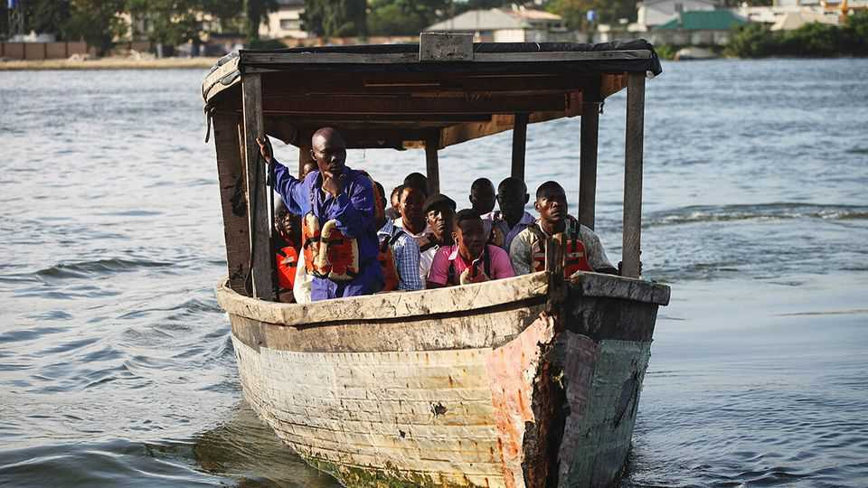

中东与非洲 | 安全第一
非洲的致命渡轮
更好的规则和执行会有帮助
2025年9月11日

摘要：9月3日葡萄牙里斯本缆车脱轨造成16人死亡，在西方国家引发了数天的新闻报道。但前一天尼日利亚北部渡轮事故造成至少60人死亡，却关注度不高。2024年有2000多人在渡轮事故中死亡，其中近四分之三发生在三个非洲国家，让非洲成为渡轮安全的世界异类。

9月3日葡萄牙首都里斯本缆车脱轨造成16人死亡，在西方国家引发了数天的新闻报道。但前一天尼日利亚北部渡轮事故造成至少60人死亡，却关注度不高。部分原因可能是这个事件令人沮丧地常规。维护统计数据的渡轮安全专家尼尔·贝尔德说，2024年有2000多人在渡轮事故中死亡。与每年在战争、疾病或道路事故中死亡的大量人数相比，这可能看起来很少。然而，近四分之三的死亡发生在仅三个非洲国家，使该大陆成为渡轮变得不那么致命的世界中的异类。

贝尔德先生说，在道路无法到达的地方使用船只可能是一种安全的旅行方式，特别是在像刚果和尼日利亚这样拥有广泛水道的国家。在富裕国家，严格的安全法规意味着每1亿乘客只有一人死亡。一些较贫穷的国家也提高了他们的水平。在过去十年中，菲律宾渡轮事故中死亡人数不到500人，而前十年超过1600人，1987年单次事件就有4385人。

但大多数非洲渡轮仍然超载、维护不善且缺乏救生设备。行业机构Interferry一直在与非洲监管机构和渡轮运营商合作改善情况。Interferry老板迈克·科里根说，最大的障碍是缺乏资源。

并非全是厄运和阴霾。在坦噶尼喀湖，一艘渡轮在坦桑尼亚和赞比亚之间安全运输乘客和干鱼、菠萝货物一个世纪，直到去年夏天被送去修理。沿航道和河岸的导航辅助设备、更好的维护和免费救生衣帮助了尼日利亚拉各斯州水道管理局，这是渡轮乘客最危险的国家之一，以低成本使渡轮更安全。如果这种做法传播开来，在非洲乘船可能很快就会比危险更令人愉快。

【一｜非洲渡轮事故频发】

9月3日葡萄牙里斯本缆车脱轨造成16人死亡，在西方国家引发了数天的新闻报道。但前一天尼日利亚北部渡轮事故造成至少60人死亡，却关注度不高。

2024年有2000多人在渡轮事故中死亡，其中近四分之三发生在仅三个非洲国家，使该大陆成为渡轮变得不那么致命的世界中的异类。这种差异很明显。

【二｜渡轮本应是安全的】

在道路无法到达的地方使用船只可能是一种安全的旅行方式，特别是在像刚果和尼日利亚这样拥有广泛水道的国家。在富裕国家，严格的安全法规意味着每1亿乘客只有一人死亡。

一些较贫穷的国家也提高了他们的水平。在过去十年中，菲律宾渡轮事故中死亡人数不到500人，而前十年超过1600人，1987年单次事件就有4385人。这说明改善是可能的。

【三｜非洲渡轮问题多多】

但大多数非洲渡轮仍然超载、维护不善且缺乏救生设备。行业机构Interferry一直在与非洲监管机构和渡轮运营商合作改善情况。

最大的障碍是缺乏资源。没有足够的资金来改善渡轮的安全标准，也没有足够的监管来确保规则得到执行。这导致了一个恶性循环。

【四｜也有成功的例子】

并非全是厄运和阴霾。在坦噶尼喀湖，一艘渡轮在坦桑尼亚和赞比亚之间安全运输乘客和干鱼、菠萝货物一个世纪，直到去年夏天被送去修理。

沿航道和河岸的导航辅助设备、更好的维护和免费救生衣帮助了尼日利亚拉各斯州水道管理局，这是渡轮乘客最危险的国家之一，以低成本使渡轮更安全。

【五｜改善是可能的】

如果这种做法传播开来，在非洲乘船可能很快就会比危险更令人愉快。关键是要有更好的规则和执行，以及足够的资源来改善安全标准。

非洲渡轮安全问题需要更多关注。虽然大多数非洲渡轮仍然超载、维护不善且缺乏救生设备，但也有成功的例子。关键是要有更好的规则和执行，以及足够的资源来改善安全标准。如果这种做法传播开来，在非洲乘船可能很快就会比危险更令人愉快。
