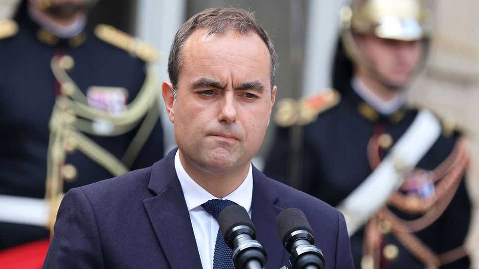

欧洲 | 巴黎的最后机会沙龙
法国有了新总理
总统马克龙的最新选择塞巴斯蒂安·勒科尔努可能需要妥协才能生存
2025年9月11日

摘要：法国政治这周变得很荒谬，议会9月8日投票推翻政府，这是九个月来第二次。这次倒霉的是中间派弗朗索瓦·贝鲁，他的少数派政府因为不受欢迎的削减赤字预算在信任投票中惨败而垮台。马克龙任命了国防部长勒科尔努为新总理，这是2022年以来的第五个。现在法国面临三重麻烦：政治不确定性、市场紧张和民众不安。

法国政治这周变得很荒谬，议会9月8日投票推翻政府，这是九个月来第二次。这次倒霉的是中间派弗朗索瓦·贝鲁，他的少数派政府因为不受欢迎的削减赤字预算在信任投票中惨败而垮台。去年12月议会也推翻了他的前任、中右翼的米歇尔·巴尼耶，也是因为预算。马克龙总统没有被吓倒，9月9日任命了亲密盟友、国防部长塞巴斯蒂安·勒科尔努为下一个选择——这是2022年以来的第五个总理。勒科尔努的任务是试图打破议会僵局的循环，这种僵局已经阻挠了几乎所有政府事务，并将国内政治变成了可悲的重复表演。

马克龙告诉他的新总理在组建政府前要广泛咨询法国的政党。他希望他制定一个2026年的预算，这次可以提前获得议会批准。9月10日上任时，勒科尔努发誓要"更认真"地与反对派合作，并承诺在实质和风格上都有"突破"。

39岁的勒科尔努（如图）是马克龙核心圈子中的不寻常人物。他是诺曼底农村航空航天技术员和医疗秘书的儿子，不是技术官僚，也没有法国建制派青睐的精英教育。作为前共和党人，他不是马克龙原始中间派企业的创始成员。当被要求描述他的政治时，一个了解勒科尔努的人称他为"戴高乐主义者"，这个词往往意味着对强大和独立国家的信念。

然而，勒科尔努赢得了总统的信任，自2017年以来在他所有的政府中任职，并成为政治洞察力的宝贵来源。勒科尔努"痴迷于政治"，另一位消息人士评论说，他说两人定期在深夜威士忌中分享观点。勒科尔努与那些他不认同观点的人交谈，不仅包括社会党人，还包括极右翼的玛丽娜·勒庞。作为宪兵队的预备役人员（向国防部报告），他一直是一位受人尊敬的国防部长，特别是因为保护了军事预算。

最好的希望是这些技能能帮助他实现马克龙前两任总理未能做到的事情：不仅在中右翼和中右翼之间，而且在中左翼之间找到共同点。在一个分为三个敌对集团的下议院中，这意味着至少要将社会党人从他们的左翼反对派集团中分离出来。

即使与他们的政党达成非侵略协议，代价也会涉及重大让步。一个可能是计划财政整顿的规模。贝鲁希望440亿欧元（510亿美元）的预算节省，将2026年的赤字控制在GDP的4.6%。社会党领袖奥利维尔·福尔希望减半。另一个可能是对超级富豪的财富税，马克龙迄今为止一直抵制这一点。福尔主张对超过1亿欧元的财富征收2%的最低年税。这样的计划会破坏马克龙支持财富创造和商业的记录。但是，一位中间派副手问，"总统有选择吗？"他很可能决定事情已经改变，现在稳定更重要。

问题是，即使勒科尔努证明是一个更熟练的谈判者，他仍然会面临同样分裂和顽固的议会。社会党人自己在577席的议会中只占66席；他需要赢得另外十几个成员，同时保持中右翼共和党人的支持。与此同时，两个极端都在为混乱而高兴。在极左翼，让-吕克·梅朗雄对福尔愿意交谈感到愤怒，希望马克龙辞职。在极右翼，勒庞女士说，通过任命勒科尔努，总统"发射了马克龙主义的最后一颗子弹"。她希望举行新的选举，她认为这将使她的政党及其朋友进入政府。

法国正面临三重麻烦时期：除了政治不确定性，它还在应对市场紧张和民众不安。法国的借贷成本已经高于希腊。9月10日，一个名为"让我们阻止一切"的无定形运动试图让国家陷入停顿。它失败了，尽管零星的封锁影响了巴黎和其他城市的一些地区，500多人被逮捕。计划在9月18日举行一天的罢工。

当马克龙在2016年发起广泛的中间派运动时，他的核心想法是将各种温和的政治家聚集在一起，建立对抗极端的堡垒。这个项目现在看起来比以往任何时候都更加脆弱。勒科尔努可能有最后一次机会让它发挥作用。

【一｜法国政治变得很荒谬】

法国政治这周变得很荒谬，议会9月8日投票推翻政府，这是九个月来第二次。这次倒霉的是中间派弗朗索瓦·贝鲁，他的少数派政府因为不受欢迎的削减赤字预算在信任投票中惨败而垮台。

去年12月议会也推翻了前总理巴尼耶，也是因为预算。马克龙没有被吓倒，9月9日任命了国防部长勒科尔努为新总理，这是2022年以来的第五个。现在法国政治变成了可悲的重复表演。

【二｜勒科尔努是个不寻常的选择】

39岁的勒科尔努是马克龙核心圈子中的不寻常人物。他是诺曼底农村航空航天技术员和医疗秘书的儿子，不是技术官僚，也没有法国建制派青睐的精英教育。

作为前共和党人，他不是马克龙原始中间派企业的创始成员。当被要求描述他的政治时，一个了解他的人称他为"戴高乐主义者"，这个词往往意味着对强大和独立国家的信念。

【三｜他赢得了总统的信任】

勒科尔努赢得了总统的信任，自2017年以来在他所有的政府中任职，并成为政治洞察力的宝贵来源。他"痴迷于政治"，与那些他不认同观点的人交谈，不仅包括社会党人，还包括极右翼的勒庞。

作为宪兵队的预备役人员，他一直是一位受人尊敬的国防部长，特别是因为保护了军事预算。马克龙希望他能打破议会僵局的循环。

【四｜需要重大让步才能生存】

勒科尔努需要在中右翼和中左翼之间找到共同点。在一个分为三个敌对集团的下议院中，这意味着至少要将社会党人从他们的左翼反对派集团中分离出来。

即使与社会党达成非侵略协议，代价也会涉及重大让步。一个可能是计划财政整顿的规模，另一个可能是对超级富豪的财富税。马克龙可能决定现在稳定更重要。

【五｜法国面临三重麻烦】

法国正面临三重麻烦时期：除了政治不确定性，它还在应对市场紧张和民众不安。法国的借贷成本已经高于希腊，民众运动试图让国家陷入停顿。

当马克龙在2016年发起广泛的中间派运动时，他的核心想法是将各种温和的政治家聚集在一起，建立对抗极端的堡垒。这个项目现在看起来比以往任何时候都更加脆弱。勒科尔努可能有最后一次机会让它发挥作用。

法国政治现在变得很荒谬，九个月来第二次推翻政府。马克龙任命了勒科尔努为新总理，希望他能打破议会僵局的循环。但法国正面临三重麻烦：政治不确定性、市场紧张和民众不安。勒科尔努可能需要重大让步才能生存，这可能是马克龙主义的最后一次机会。
