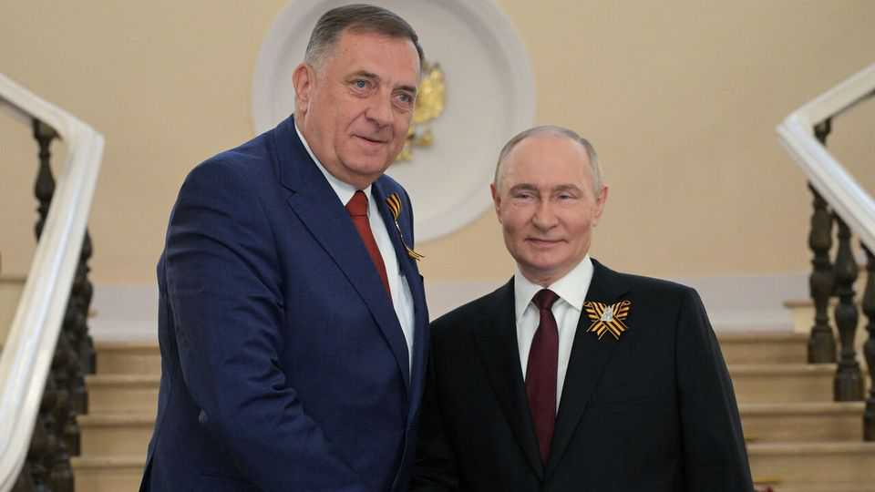
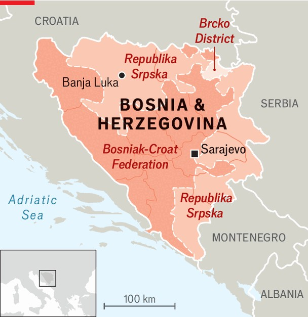

欧洲 | 警钟
波黑可能要分裂了？
公投和选举即将到来
2025年9月11日

摘要：波黑又出事了。8月6日，中央选举委员会剥夺了多迪克的总统职位，但他拒绝接受。30年来，这个国家从一个危机走向另一个危机。现在多迪克要搞公投，还去了莫斯科寻求支持。他说波黑是"被占领的"和"欧洲最后一个殖民地"。如果公投成功，可能会为独立创造条件。

波黑（波斯尼亚和黑塞哥维那，这是它的正确全名）的公民想知道什么时候总统不是总统。8月6日，该国的中央选举委员会剥夺了米洛拉德·多迪克的总统职位，他是该国塞尔维亚自治半部（称为塞族共和国）的总统，这一决定在上诉后得到维持。然而，多迪克拒绝接受这一点。在波斯尼亚战争结束30年后，这个国家从一个危机走向另一个危机。但即使按照波斯尼亚的标准，这个看起来异常严重。波黑的战后解决方案看到它由两个自治"实体"和一个弱小的中央政府组成。但是，从协议中遗留下来，还有一个外国任命的"高级代表"，如果他选择行使权力，他有很多权力。来自联合国安理会授权的欧盟主导部队的1000多名士兵也驻扎在该国以帮助安全。

其中一个实体主要是波斯尼亚克人（波斯尼亚穆斯林）和克罗地亚人的家园。另一个，塞族共和国，主要是塞尔维亚人的家园。多迪克于1998年首次掌权，长期以来一直在说他希望他的小国独立或回到1996年原始和平协议的基础之间摇摆不定，这意味着中央政府比今天拥有更少的权力。

选举委员会的行动是在多迪克因藐视（德国）高级代表克里斯蒂安·施密特的裁决而被定罪并被禁止担任公职六年之后。在俄罗斯和中国的支持下，多迪克说施密特的任命是非法的，他不承认他的权威。尽管如此，多迪克支付了罚款以避免入狱。他现在正在向宪法法院上诉，试图推翻他的定罪。他这样做是为了最终将他的案件提交给欧洲人权法院。这是讽刺的，因为最初的争议是在塞族共和国通过立法声明宪法法院不再在其国家的一半拥有管辖权之后开始的。

多迪克呼吁在10月25日举行公投，询问塞族共和国公民是否接受他被免职。已经受到美国制裁的多迪克一直在讨好特朗普政府，但到目前为止没有成功。他9月9日访问了莫斯科，寻求俄罗斯支持。他说这个国家是"被占领的"和"欧洲最后一个殖民地"。塞族共和国的反对党软弱且分裂，任何敢于在11月23日举行的新总统选举中竞选的人都会被贴上叛徒的标签。

塞族共和国首都巴尼亚卢卡的分析师米洛斯·索拉亚说，很少有塞尔维亚人会参加选举，但多迪克"非常非常可能"会赢得他的公投。然而，他警告说，这是一个"绝对不确定性"的时刻。可能发生的是，生活在塞族共和国的波斯尼亚克人和克罗地亚人会在许多塞尔维亚人不投票的情况下出来选举，选举一个被他们和西方国家承认，但不被塞族共和国大多数人承认的候选人。多迪克说，在这之后，"将为举行关于独立的最终公投创造条件。我认为这是一条不可阻挡的道路。"

根据多迪克在未来几周能在国内外获得多少支持，他将不得不决定是悄悄后退还是孤注一掷，承担分裂波黑可能带来的所有风险。

【一｜波黑又出事了】

波黑又出事了。8月6日，中央选举委员会剥夺了多迪克的总统职位，他是塞族共和国的总统，这一决定在上诉后得到维持。然而，多迪克拒绝接受这一点。

在波斯尼亚战争结束30年后，这个国家从一个危机走向另一个危机。但即使按照波斯尼亚的标准，这个看起来异常严重。波黑的战后解决方案看到它由两个自治"实体"和一个弱小的中央政府组成。

【二｜多迪克是个麻烦制造者】

多迪克于1998年首次掌权，长期以来一直在说他希望他的小国独立或回到1996年原始和平协议的基础之间摇摆不定。这意味着中央政府比今天拥有更少的权力。

选举委员会的行动是在多迪克因藐视德国高级代表施密特的裁决而被定罪并被禁止担任公职六年之后。在俄罗斯和中国的支持下，多迪克说施密特的任命是非法的，他不承认他的权威。

【三｜他要搞公投了】

多迪克呼吁在10月25日举行公投，询问塞族共和国公民是否接受他被免职。已经受到美国制裁的多迪克一直在讨好特朗普政府，但到目前为止没有成功。他9月9日访问了莫斯科，寻求俄罗斯支持。

他说这个国家是"被占领的"和"欧洲最后一个殖民地"。塞族共和国的反对党软弱且分裂，任何敢于在11月23日举行的新总统选举中竞选的人都会被贴上叛徒的标签。

【四｜公投可能会成功】

分析师索拉亚说，很少有塞尔维亚人会参加选举，但多迪克"非常非常可能"会赢得他的公投。然而，他警告说，这是一个"绝对不确定性"的时刻。

可能发生的是，生活在塞族共和国的波斯尼亚克人和克罗地亚人会在许多塞尔维亚人不投票的情况下出来选举，选举一个被他们和西方国家承认，但不被塞族共和国大多数人承认的候选人。

【五｜独立之路不可阻挡？】

多迪克说，在这之后，"将为举行关于独立的最终公投创造条件。我认为这是一条不可阻挡的道路。"根据多迪克在未来几周能在国内外获得多少支持，他将不得不决定是悄悄后退还是孤注一掷。

分裂波黑可能带来所有风险，包括与欧盟的关系、国际承认、以及可能的内战。但多迪克似乎已经下定决心要走这条路了。

波黑可能要分裂了。多迪克被剥夺总统职位后拒绝接受，现在要搞公投，还去了莫斯科寻求支持。他说波黑是"被占领的"和"欧洲最后一个殖民地"。如果公投成功，可能会为独立创造条件。但分裂波黑可能带来所有风险，包括与欧盟的关系、国际承认、以及可能的内战。
