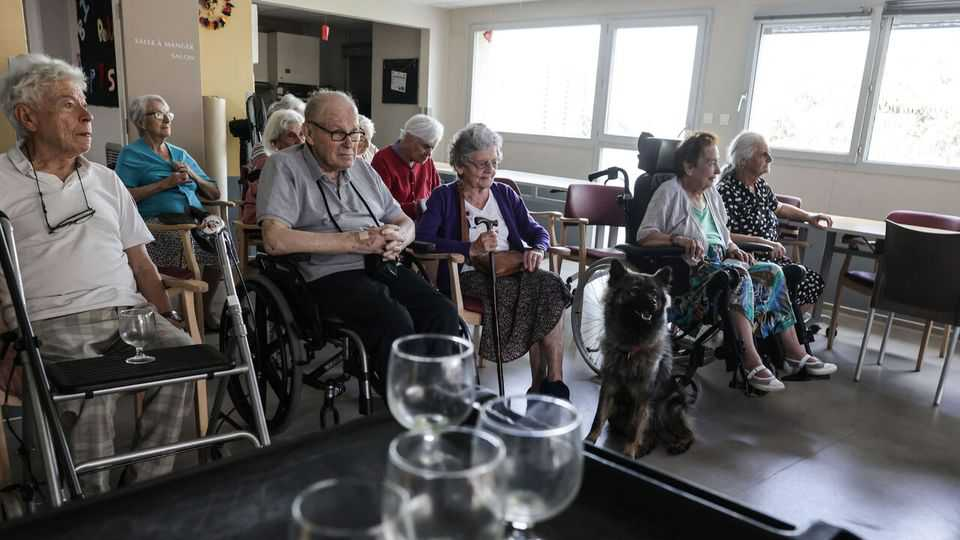

欧洲 | 老钱
欧洲老年人长期护理的危机
忽视的成本是巨大的
2025年9月11日

摘要：欧洲人口老龄化很快，到2050年6%的欧盟人口将超过85岁，是现在的两倍多。但长期护理服务跟不上，劳动力供应在减少，护理人员工资低、负担重、人手不足。政治家们担心增加支出会破坏预算，但不投资的成本更大。现在需要的是预防性护理和"就地养老"。

在下萨克森州小城巴德莱尔的一栋漂亮的六层建筑里，吉娜·雷耶每天花七个小时洗脏手、用勺子喂食和安抚脾气。雷耶女士不是在处理难缠的幼儿。她照顾患有晚期痴呆症的人，她说他们"回到像孩子一样"。有些人不愿意遵循指示；其他人反应激烈。大约每两个病人有一名工作人员，但雷耶女士说这还不够。

欧洲人口正在快速老龄化。该大陆的中位年龄是43岁，而全球中位数是31岁。到2050年，6%的欧盟人口将超过85岁，是当前份额的两倍多。像德国这样的西欧国家比大多数国家富裕。正是在南欧和东欧，人口最老，年轻人离开最快。在欧洲最老的国家意大利，中位年龄是49岁；仅在2021年，其25-34岁的大学毕业生中就有2.8%移民。根据布鲁塞尔智库Bruegel的数据，在希腊、立陶宛和拉脱维亚等同样"老"的国家，工作年龄人口将从2023年到2050年减少20%。

长期护理（LTC）服务的需求将因此激增，这是一个术语，指的是为那些无法自己进行日常活动的人（如老年人或残疾人）提供的支持。在德国，79%的LTC服务已经提供给65岁以上的人。欧盟研究中心估计，有LTC需求的50岁以上人口将从2020年的1970万增加到2050年的2710万。

虽然大多数欧洲国家的公共医疗支出很高，但用于LTC的份额各不相同。2022年，瑞典、荷兰和挪威将其健康预算的四分之一以上用于LTC。相比之下，很少有南欧和东欧国家花费超过10%。

劳动力供应正在减少。LTC工人占瑞典总劳动力的7%，但在罗马尼亚、塞浦路斯和希腊不到1%。在保加利亚，服务几乎不存在。保加利亚阿尔茨海默病民间社会协会的佐尔尼察·卡拉吉奥佐娃指出，十年来没有关于痴呆症诊断的官方统计数据。她说，大学的医学学位甚至不提供老年学专业。

护理人员发现自己工资低、负担重、人手不足。"我们想在未来做更多预防性工作，"斯洛文尼亚社区护士国家协调员马丁娜·霍瓦特坚持说。但自新冠疫情以来，血液检测、伤口护理和导管更换责任已从医生转移到她的护士，使提供预防性护理变得更加困难。

政治家们经常认为在老年人护理上花费更多会破坏他们已经紧张的预算。但不这样做也有相当大的成本。非正式护理人员需要减少工作时间或完全辞职，他们在家庭中的工作不会为国家养老金或私人储蓄做出贡献。欧洲卫生系统和政策观察站的研究员乔纳森·西勒斯认为，现在支出不足会在以后创造更多问题："通过现在不投资，你基本上在惩罚另一代人。"

在预防性护理上更慷慨地支出也会让老年公民在经济中保持活跃更长时间。北欧和西欧国家越来越多采用的"就地养老"方法旨在让老年人在家中待更长时间。LTC工人可以做家务、烹饪和洗衣，同时鼓励病人在可能的地方独立。购物、育儿或志愿服务等日常活动让他们在经济和社会中保持活跃。移动练习比去医院便宜。

一些国家已经在LTC支出方面咬紧牙关。7月，斯洛文尼亚实施了强制LTC缴费，占工资的1%（或不再工作的人的净养老金），或自雇人员收入的2%。意大利在1月对其福利计划进行了更改。80岁以上患有严重疾病且无法自给自足的人将获得每月1380欧元（1600美元）的总津贴来支付LTC费用。这些津贴的目的是减少使用住宅护理院并减轻公共系统的负担。

欧洲为世界其他地区提供了早期警告信号。在未来30年中，随着预期寿命的上升，拉丁美洲和加勒比地区的老年人数将增加一倍以上，在非洲预计将增加两倍以上。与欧洲相比，这两个地区的公共医疗支出都很低，很少有国家开始考虑LTC。如果他们想减轻老龄化的财政压力，他们应该开始早期投资。

对欧洲来说，转向能够跟上需求的LTC系统将是一场疯狂的争夺。但随着投票人口老龄化，这是必不可少的。其他国家不应该等太久。老年最终会悄悄降临到他们所有人身上。

【一｜欧洲人口老龄化很快】

欧洲人口正在快速老龄化。该大陆的中位年龄是43岁，而全球中位数是31岁。到2050年，6%的欧盟人口将超过85岁，是当前份额的两倍多。

在南欧和东欧，人口最老，年轻人离开最快。在欧洲最老的国家意大利，中位年龄是49岁；仅在2021年，其25-34岁的大学毕业生中就有2.8%移民。这种趋势还在加速。

【二｜长期护理需求激增】

长期护理服务的需求将因此激增。在德国，79%的LTC服务已经提供给65岁以上的人。欧盟研究中心估计，有LTC需求的50岁以上人口将从2020年的1970万增加到2050年的2710万。

虽然大多数欧洲国家的公共医疗支出很高，但用于LTC的份额各不相同。瑞典、荷兰和挪威将其健康预算的四分之一以上用于LTC，但很少有南欧和东欧国家花费超过10%。

【三｜劳动力供应在减少】

劳动力供应正在减少。LTC工人占瑞典总劳动力的7%，但在罗马尼亚、塞浦路斯和希腊不到1%。在保加利亚，服务几乎不存在，十年来没有关于痴呆症诊断的官方统计数据。

护理人员发现自己工资低、负担重、人手不足。自新冠疫情以来，血液检测、伤口护理等责任已从医生转移到护士，使提供预防性护理变得更加困难。

【四｜不投资的成本更大】

政治家们经常认为在老年人护理上花费更多会破坏预算。但不这样做也有相当大的成本。非正式护理人员需要减少工作时间或完全辞职，他们在家庭中的工作不会为国家养老金或私人储蓄做出贡献。

现在支出不足会在以后创造更多问题："通过现在不投资，你基本上在惩罚另一代人。"预防性护理比治疗性护理便宜得多。

【五｜需要"就地养老"】

在预防性护理上更慷慨地支出会让老年公民在经济中保持活跃更长时间。"就地养老"方法旨在让老年人在家中待更长时间，LTC工人可以做家务、烹饪和洗衣。

购物、育儿或志愿服务等日常活动让他们在经济和社会中保持活跃。移动练习比去医院便宜。一些国家已经开始行动，斯洛文尼亚实施了强制LTC缴费，意大利为80岁以上严重疾病患者提供津贴。

欧洲老年人长期护理的危机正在加剧。人口老龄化很快，但长期护理服务跟不上，劳动力供应在减少，护理人员工资低、负担重。政治家们担心增加支出会破坏预算，但不投资的成本更大。现在需要的是预防性护理和"就地养老"，让老年人在家中待更长时间，保持活跃。其他国家也不应该等太久，老年最终会悄悄降临到所有人身上。
