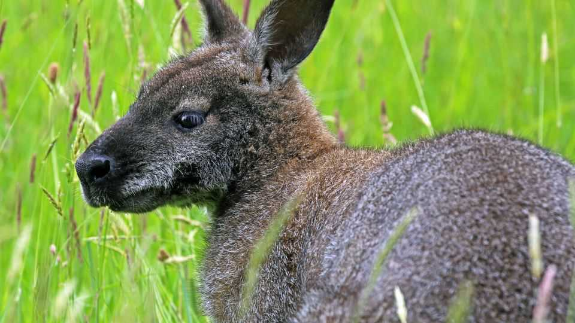
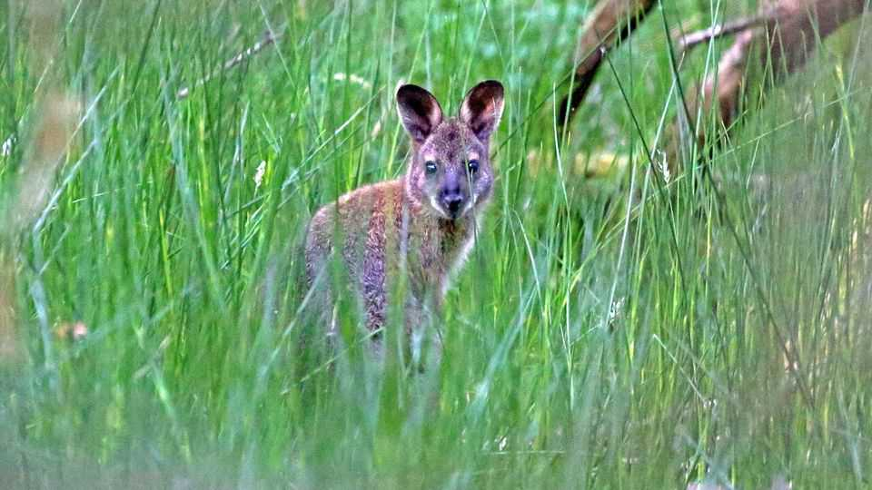

英国 | 暴民统治
英国岛屿被袋鼠入侵者占领
环保主义者问是否该杀了它们
2025年9月11日

摘要：马恩岛被袋鼠占领了。这些红颈袋鼠自1960年代从野生动物园逃出来后就在这里生活，现在有大约1000只。它们对当地生态构成威胁，啃食原生植被，破坏围栏，还可能有健康问题。环保主义者问是否该杀了它们，但捕杀、围栏或绝育都有问题。

如果你在马恩岛的巴拉夫库拉（一个苔藓湿地）周围寻找袋鼠，你几乎肯定会找到它们。它们会谨慎地朝你的方向看，只有当你踩到树枝或靠得太近时才会跳开。一群野生的红颈袋鼠，以其独特的锈色毛皮斑块命名，自1960年代以来就生活在这个岛上，当时几只从野生动物园逃了出来。一些环保主义者觉得是时候干预了。这些原产于澳大利亚的有袋动物已经很好地适应了马恩岛的温带气候。无人机调查显示，岛上生活着大约1000只野生袋鼠，远超过之前估计的最多200只。随着时间的推移，它们已经成为该岛身份的一部分。马恩岛博物馆的玻璃柜中展示着一只填充袋鼠。

虽然可爱，但这个"暴民"（袋鼠的集体名称）对马恩岛的生态构成威胁。"岛屿生态系统总是脆弱的，"慈善机构马恩野生动物信托基金的首席执行官格雷厄姆·梅克皮斯-沃恩说。袋鼠啃食原生植被，剥去蕨类植物和野花，并干扰当地野生动物。它们在漫游时也破坏围栏，导致牲畜逃跑。

袋鼠的福利也是一个问题。明尼苏达大学兽医病理学教授、马恩岛常客阿尔诺·温施曼说，这个种群，只来自几只动物，可能遭受"遗传瓶颈"。它们容易因近亲繁殖而出现健康并发症。温施曼博士和马恩野生动物信托基金进行的一项试点研究表明，一些袋鼠患有由寄生虫感染引起的视觉障碍。农民担心它们可能将疾病传染给牲畜。

管理这个暴民的选项包括捕杀、将它们围在特定区域或绝育。所有这些都是有问题的。捕杀是有争议的。

围栏通常不起作用，因为袋鼠是熟练的逃脱艺术家。绝育需要岛上通常不具备的专业技能。

"我个人认为袋鼠在马恩岛没有位置，"马恩国家遗产自然历史策展人劳拉·麦科伊说。她认为该岛应该向澳大利亚和新西兰学习，它们在教育人们生态学和支持原生生物群方面"非常有效"。在新西兰，袋鼠被视为害虫，已经进行了捕杀。

虽然马恩岛的暴民几乎肯定是英国最大的，但它不是唯一的。也许最著名的是在峰区，在二战期间从私人动物园逃出后存活了几十年。虽然这个群体可能在2008年左右灭绝，但它在当地人的想象中挥之不去：今年夏天该地区开放了一条袋鼠雕塑小径。近年来在德文郡、奇尔特恩山、康沃尔、诺丁汉郡和苏格兰的因奇康纳汉都发现了袋鼠。

南威尔士大学的生物学家安东尼·卡拉瓦吉认为，气候变暖将使英国在未来几年成为袋鼠更有利的栖息地。"英国自然的动态正在迅速变化，"他说。"袋鼠只是其中的一部分。"

【一｜马恩岛被袋鼠占领了】

马恩岛被袋鼠占领了。这些红颈袋鼠自1960年代从野生动物园逃出来后就在这里生活，现在有大约1000只，远超过之前估计的最多200只。

它们已经很好地适应了马恩岛的温带气候，成为该岛身份的一部分。马恩岛博物馆的玻璃柜中展示着一只填充袋鼠，说明它们已经成为当地文化的一部分。

【二｜对生态构成威胁】

虽然可爱，但这个"暴民"对马恩岛的生态构成威胁。岛屿生态系统总是脆弱的，袋鼠啃食原生植被，剥去蕨类植物和野花，并干扰当地野生动物。

它们在漫游时也破坏围栏，导致牲畜逃跑。农民担心它们可能将疾病传染给牲畜，这对当地农业构成威胁。

【三｜健康问题也很严重】

袋鼠的福利也是一个问题。这个种群，只来自几只动物，可能遭受"遗传瓶颈"，容易因近亲繁殖而出现健康并发症。

一些袋鼠患有由寄生虫感染引起的视觉障碍。农民担心它们可能将疾病传染给牲畜，这对当地农业构成威胁。

【四｜管理选项都有问题】

管理这个暴民的选项包括捕杀、将它们围在特定区域或绝育。所有这些都是有问题的。捕杀是有争议的，围栏通常不起作用，绝育需要岛上通常不具备的专业技能。

环保主义者问是否该杀了它们，但捕杀、围栏或绝育都有问题。需要找到更好的解决方案。

【五｜英国其他地方也有袋鼠】

虽然马恩岛的暴民几乎肯定是英国最大的，但它不是唯一的。也许最著名的是在峰区，在二战期间从私人动物园逃出后存活了几十年。

近年来在德文郡、奇尔特恩山、康沃尔、诺丁汉郡和苏格兰的因奇康纳汉都发现了袋鼠。气候变暖将使英国在未来几年成为袋鼠更有利的栖息地。

马恩岛被袋鼠占领了。这些红颈袋鼠对当地生态构成威胁，啃食原生植被，破坏围栏，还可能有健康问题。环保主义者问是否该杀了它们，但捕杀、围栏或绝育都有问题。英国其他地方也有袋鼠，气候变暖将使英国在未来几年成为袋鼠更有利的栖息地。
