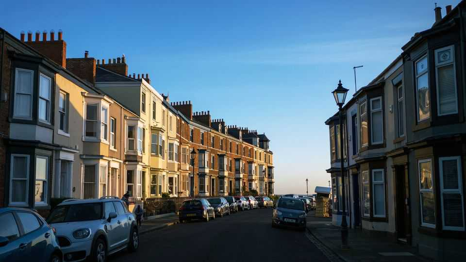
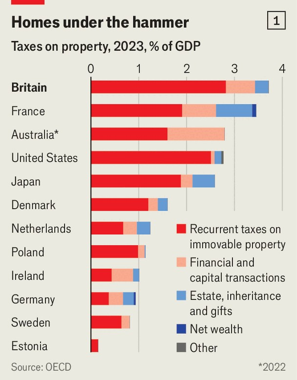

英国 | 家庭真相
修复英国破碎的房产税系统需要勇气
工党政府不太可能这样做
2025年9月11日

摘要：英国政客处理房产税就像玩扫雷游戏，一步走错就完蛋。前副首相雷纳因为少交印花税辞职了，现在轮到财政大臣里夫斯了。她需要找到180-280亿英镑的税收增加或支出削减。英国房产税系统需要修复，但工党政府不太可能这样做。

对英国政客来说，处理房产税就像玩扫雷游戏，这是1990年代的游戏，一步走错就意味着游戏结束。英国前副首相安吉拉·雷纳成为9月5日的最新受害者，在透露她少交了第二套房的印花税（一种交易税）后辞职。下一个要玩的是财政大臣雷切尔·里夫斯，她正在为11月的预算做准备。这次地雷不是道德失误，而是政府政策选择。里夫斯必须找到180-280亿英镑（240-380亿美元）的年度税收增加或支出削减来满足她的财政规则，咨询公司Capital Economics估计。据说她正在考虑额外的房产税，包括对人们主要住房的资本利得税和全国性的房产价值比例税，这将取代市政税。

其中一些提议显然是爆炸性的——糟糕的经济学，更糟糕的政治。其他是伪装得更好的地雷：经济上可取的，早就应该的，但容易在部分选民中引发愤怒。对财政大臣来说，政治上最安全的方法是什么都不做。但英国的房产税系统需要修复。

英国征收的房产税相对于GDP是经合组织国家中最高的（见图表1）。这本身不是问题。假设系统设计良好，政府专注于房产征税是有意义的。因为土地供应是固定的，对土地征税不应该减少消费或生产（与对销售和收入征税不同）。土地也是不可移动的，意味着房产税避免了更广泛的财富税带来的逃离风险。

不幸的是，英国房产税设计得不好。相反，它们扭曲了住房市场，对最有价值的住房征税不足。考虑市政税，这是一种年度征税，在2024-25年筹集了410亿英镑来资助社会护理和垃圾收集等地方服务。收费因地方当局而异，房屋根据1991年的市场价值分配到八个等级之一，从A到H。

即使在那个时候，这个系统也偏向更富有的房主；H级房屋的价值是A级的八倍多，但只支付三倍的税。H级是一个巨大的类别，从大型但中产阶级的房屋（按今天的价值价值150万英镑或更多）到白金汉宫的皇家住所，这意味着豪宅征税不足。自1991年以来，分化的房价和地方议会的不平等财务状况使情况变得更糟（见图表2）。今天哈特尔浦两居室公寓的业主每年支付的市政税（C级，2218英镑）比威斯敏斯特十居室豪宅的人（H级，2034英镑）更多。

如果市政税不公平，印花税——每当房屋易手时支付——是抑制增长的。虽然它在2024-25年筹集了150亿英镑，但在100万英镑的房屋上超过4万英镑，它使搬家变得非常昂贵，导致交易减少。因为人们经常搬家从事更高薪的工作，抑制这种搬家意味着生产力较低的工人，损害增长。

一个拙劣的修复会恶化这些问题。考虑对价值超过150万英镑的房屋征收资本利得税（目前对主要住所不征收）的提议。面对销售时的大额税单，年长的房主更不可能缩小规模。考虑到销售减少可能带来的印花税损失，尚不清楚此举是否会增加收入。

更明智的做法是完全废除市政税和主要住房的沉重印花税，用年度征税取代它们，按房产最新价值的百分比计算。一下子，以前的问题就会消失。在印花税缺席的情况下，交易会激增。市政税的不公平会被更昂贵房屋的更高账单取代。政治光谱上的智库都支持这种方法；像美国和丹麦这样的地方有这种税的版本。

诚然，当专家们团结一致时，政客们应该谨慎。这种改革有两个主要障碍。第一个是失败者的愤怒。智库财政研究所（IFS）的研究表明，用单一比例房产税取代市政税会有更多的赢家而不是失败者，1000万家庭每年获得超过200英镑。然而，最富有的10%的人会看到他们的账单平均每年增加750英镑。这些失败者会不成比例地是年长的和南方的，会比沉默的获胜多数更响亮。

第二个问题是筹集额外现金的困难。尽管有很多失败者，IFS的提议是收入中性的。使这种变化可接受可能需要引入昂贵的保障措施，比如推迟纳税直到房屋出售。如果财政大臣实际上想在这个议会期间筹集资金，它需要更高的税率，这会产生更多的失败者。无论经济学多么合理，这种政治痛苦和无财政收益的混合不太可能吸引一个挣扎的政客。

然而，即使里夫斯在预算雷区中倾向于谨慎行事，她也可以做小的改变。引入新的市政税等级，对最昂贵的房产征收更高的税率，每年可以筹集数亿英镑，可以用来削减印花税。这样的变化在很大程度上是表面上的，但至少会表明政府致力于使系统更公平和更有利于增长。不过，在某个时候，政客们需要找到修复系统的勇气。当他们这样做时，专家们会等待。

【一｜英国政客处理房产税就像玩扫雷】

英国政客处理房产税就像玩扫雷游戏，一步走错就完蛋。前副首相雷纳因为少交印花税辞职了，现在轮到财政大臣里夫斯了。

她需要找到180-280亿英镑的税收增加或支出削减来满足财政规则。据说她正在考虑额外的房产税，包括对人们主要住房的资本利得税和全国性的房产价值比例税。

【二｜英国房产税系统需要修复】

英国征收的房产税相对于GDP是经合组织国家中最高的。这本身不是问题，假设系统设计良好的话。因为土地供应是固定的，对土地征税不应该减少消费或生产。

不幸的是，英国房产税设计得不好。它们扭曲了住房市场，对最有价值的住房征税不足。市政税系统偏向更富有的房主，H级房屋的价值是A级的八倍多，但只支付三倍的税。

【三｜市政税不公平，印花税抑制增长】

市政税不公平，印花税抑制增长。今天哈特尔浦两居室公寓的业主每年支付的市政税比威斯敏斯特十居室豪宅的人更多。

印花税使搬家变得非常昂贵，导致交易减少。因为人们经常搬家从事更高薪的工作，抑制这种搬家意味着生产力较低的工人，损害增长。

【四｜修复需要勇气】

更明智的做法是完全废除市政税和主要住房的沉重印花税，用年度征税取代它们，按房产最新价值的百分比计算。这样以前的问题就会消失。

但有两个主要障碍：失败者的愤怒和筹集额外现金的困难。最富有的10%的人会看到他们的账单平均每年增加750英镑，这些失败者会比沉默的获胜多数更响亮。

【五｜工党政府不太可能这样做】

即使里夫斯倾向于谨慎行事，她也可以做小的改变。引入新的市政税等级，对最昂贵的房产征收更高的税率，每年可以筹集数亿英镑。

但工党政府不太可能这样做。在某个时候，政客们需要找到修复系统的勇气。当他们这样做时，专家们会等待。

修复英国破碎的房产税系统需要勇气。英国政客处理房产税就像玩扫雷游戏，一步走错就完蛋。市政税不公平，印花税抑制增长，但修复需要勇气。工党政府不太可能这样做，因为失败者的愤怒和筹集额外现金的困难。在某个时候，政客们需要找到修复系统的勇气。
