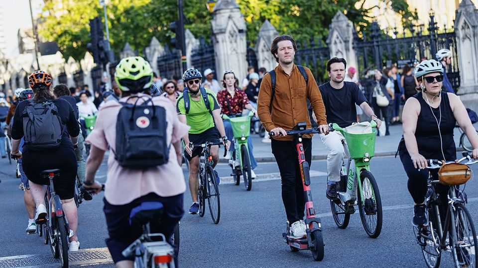

英国 | 伦敦罢工
叛逆的地铁司机议价能力不如以前
寻租遇到路线规划
2025年9月11日

摘要：伦敦地铁司机五天罢工，让城市街道充满了自行车。在繁忙的十字路口，骑行者形成了长长的队伍：许多人第一次骑车上班，其他人骑车往返于仍然开放的地面车站。电动自行车租赁公司Lime报告周一使用量增加了58%。工会想要更高的工资，但城市变得更容易骑车可能意味着工会的议价能力不如以前了。

伦敦地铁司机的五天罢工让城市街道充满了自行车。在繁忙的十字路口，骑行者形成了长长的队伍：许多人第一次骑车上班，其他人骑车往返于仍然开放的地面车站。电动自行车租赁公司Lime报告周一使用量增加了58%。代表交通工人的RMT工会说它想要司机更高的工资，他们的起薪6.8万英镑（9.2万美元）是教师的两倍多。但城市变得更容易骑车可能意味着一个曾经能够让首都陷入停顿的工会现在议价能力不如以前了。

【一｜地铁司机罢工了】

伦敦地铁司机五天罢工，让城市街道充满了自行车。在繁忙的十字路口，骑行者形成了长长的队伍：许多人第一次骑车上班，其他人骑车往返于仍然开放的地面车站。

电动自行车租赁公司Lime报告周一使用量增加了58%。这说明罢工确实影响了交通，但人们找到了替代方案。

【二｜工会想要更高的工资】

代表交通工人的RMT工会说它想要司机更高的工资，他们的起薪6.8万英镑（9.2万美元）是教师的两倍多。

这个工资水平确实很高，但工会认为司机应该得到更多。他们想要更高的工资来补偿他们的工作。

【三｜城市变得更容易骑车了】

但城市变得更容易骑车可能意味着一个曾经能够让首都陷入停顿的工会现在议价能力不如以前了。

人们找到了替代方案，骑车上班变得更容易了。这削弱了工会的议价能力，因为他们不能再让城市陷入停顿了。

【四｜寻租遇到路线规划】

寻租遇到路线规划。工会想要更高的工资，但城市变得更容易骑车了。

人们找到了替代方案，骑车上班变得更容易了。这削弱了工会的议价能力，因为他们不能再让城市陷入停顿了。

【五｜工会的议价能力不如以前了】

工会的议价能力不如以前了。城市变得更容易骑车，人们找到了替代方案。

罢工不再能让城市陷入停顿，因为人们可以骑车上班。这削弱了工会的议价能力，因为他们不能再让城市陷入停顿了。

叛逆的地铁司机议价能力不如以前了。伦敦地铁司机五天罢工，让城市街道充满了自行车。人们找到了替代方案，骑车上班变得更容易了。这削弱了工会的议价能力，因为他们不能再让城市陷入停顿了。寻租遇到路线规划，工会的议价能力不如以前了。
