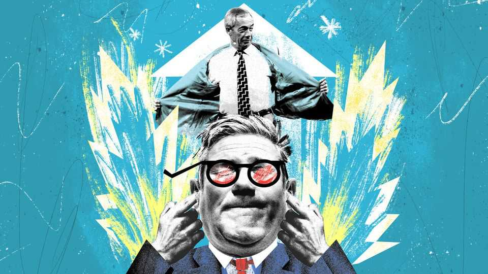

英国 | 白芝浩
改组和喧闹的会议显示了权力的痛苦
当什么都不重要时会发生什么？
2025年9月11日

摘要：改革英国党会议和工党内阁改组形成了鲜明对比。在政府中，一切都重要；在反对派中，什么都不重要。改革党可以贪婪、可以犯错，但工党必须小心谨慎。改革党认为自己正在走向更大的职位，但傲慢已经在内部滋生。当什么都不重要时，直到它重要为止。

改革英国党会议在9月5日于伯明翰开始，展示了在政府和反对派之间的区别。"你免受财富税吗？"一个标志在代表们上方若隐若现，旁边是奈杰尔·法拉奇拿着金币的咧嘴笑照片。这是由Direct Bullion（"奈杰尔·法拉奇推荐"）支付的，这是一家黄金交易商，与改革党领导人的关系在过去一年为法拉奇先生赚取了约28万英镑（38万美元）。大约150公里外的唐宁街，基尔·斯塔默爵士在副首相安吉拉·雷纳因少交4万英镑印花税（一种财富税）而辞职后改组了他的内阁。结果是一次大规模的改组，一半的内阁成员换了工作。在政府中，一切都重要。在反对派中，什么都不重要。如果有任何东西证明了政治的这个简单规则，那就是改革党傲慢的会议和工党最后一刻的改组的碰撞。

花了关于雷纳女士税收的一周头条新闻，真相才出来。虽然法拉奇先生很高兴在伯明翰宣传降低税单的方法，但他不太愿意解释他在克拉顿的一所房子里支付了多少印花税，他声称自己拥有，但实际上是由他的伴侣购买的。（"你怎么敢！"当记者问他是否想澄清事情时，法拉奇先生真正愤怒地回答道。）

尽管如此，政府中的罪过在反对派中被忽视。彻底的贪婪一直是工党部长的一个方面。他们对免费赠品的渴望玷污了他们执政的头几个月。工党部长会做任何事情来保持权力，除了放弃萨布丽娜·卡彭特的免费座位。改革党因为贪婪而很少受到谴责。因此，在Direct Bullion展台几码远的地方，法拉奇先生开始提供签名的改革足球衫（建议零售价39.99英镑）和与领导人的合影，每次100英镑。

斯塔默爵士内阁的新成员已经被派去乞求被工党政府第一年激怒的企业的宽恕。新的商业大臣彼得·凯尔本周前往美国，提醒投资者不要忽视英国。在野时，工党保持了亲商业的声誉；执政时，它几乎立即通过提高雇主税收而失去了它。

来自改革党的类似威胁，到目前为止，被愉快地忽视了。在伯明翰，任何改革政府中可能的财政大臣理查德·泰斯在发胶的云中出现了，警告那些投资可再生能源技术的人不要这样做——无论是长期被憎恨的风力涡轮机还是新近被鄙视的电池。对于观众中可能错过他信息的任何游说者，他通过撕碎一张纸来演示他会如何处理这样的合同。

在反对派中交朋友也更直接。新的外交大臣伊维特·库珀有任务与唐纳德·特朗普的政府保持友好关系。法拉奇先生和他的政党走了一条捷径。改革党领导人通过邀请一位名叫阿西姆·马尔霍特拉的反疫苗怪人（小罗伯特·肯尼迪的最爱，特朗普的卫生部长）在会议上发言来讨好白宫。马尔霍特拉博士警告一个喘息的会议厅，新冠疫苗可能给王室成员带来了癌症。这保证了一些糟糕的头条新闻（即使是最亲改革党的报纸也会对查尔斯国王健康的这种建议感到恶心）。但为了从特朗普土地获得更多恩惠，这是值得的。

工党有一位新的司法大臣大卫·拉米，前外交大臣。英国的监狱满了。积压的法院意味着人们等待审判多年。改革党能求助于谁来修复它？用主持人的话说，如何"英国最受欢迎的政治犯"。露西·康诺利，一位来自北安普顿的42岁母亲，因在回应南港三名儿童谋杀案时发推文"现在大规模驱逐，放火烧掉所有装满混蛋的该死的酒店，我不管"而被判31个月监禁。周六，她穿着一套亮粉色西装出现在舞台上，在她十个月的监狱访问后提供帮助改革党。"她不是完全令人难以置信吗？"改革党会议主持人问道。

监狱可能是一个噩梦，但与英国不断增长的福利预算相比，它们什么都不是。帕特·麦克法登，前斯塔默爵士的部长级修复者，必须彻底改革它。工党试图从残疾福利中移除50亿英镑（GDP的0.2%），但失败了，引发了反抗。麦克法登先生必须在没有任何尖叫的情况下进行储蓄。李·安德森，改革党直言不讳的福利发言人，有一个更容易的工作。安德森先生没有详细说明改革党如何削减英国的福利预算，而是承诺"奖励工人，而不是逃避者"。观众欢呼。

"纪律！"法拉奇先生喊道，在舞台上同一个地方结束会议，前一天改革党大林肯郡市长安德烈娅·詹金斯女爵士穿着亮片裤装出现，唱着她写的一首歌，名为"失眠症"。2026年英格兰各地（包括伦敦）将举行地方选举，苏格兰和威尔士将举行全国选举。改革党有望表现良好。

该党认为它正在走向更大的职位，并开始提前庆祝。周五晚上，像"唐宁街噩梦"这样的头版开始落地，就在伯明翰国际机场外，杰克逊五兄弟中仍然活着的三名成员中的两名开始为拿着电话的中年改革党成员演奏"怪罪布吉"。如果明天举行选举，改革党可能会赢得多数。对于一个在2024年初几乎不存在的政党来说，这是一个了不起的成就。傲慢已经在改革党内部滋生。有一天，英国人可能会注意到领导它的人的类型。这发生在该党进入政府之后还是之前是问题。什么都不重要；直到它重要为止。

【一｜政府和反对派的区别】

改革英国党会议和工党内阁改组形成了鲜明对比。在政府中，一切都重要；在反对派中，什么都不重要。

改革党可以贪婪、可以犯错，但工党必须小心谨慎。如果有任何东西证明了政治的这个简单规则，那就是改革党傲慢的会议和工党最后一刻的改组的碰撞。

【二｜改革党可以贪婪】

改革党可以贪婪、可以犯错，但工党必须小心谨慎。法拉奇先生可以宣传降低税单的方法，但工党部长必须小心谨慎。

改革党因为贪婪而很少受到谴责。法拉奇先生开始提供签名的改革足球衫和与领导人的合影，每次100英镑。这在工党中是不可想象的。

【三｜工党必须小心谨慎】

工党部长会做任何事情来保持权力，除了放弃免费赠品。新的商业大臣彼得·凯尔本周前往美国，提醒投资者不要忽视英国。

在野时，工党保持了亲商业的声誉；执政时，它几乎立即通过提高雇主税收而失去了它。工党必须小心谨慎，因为一切都重要。

【四｜改革党认为自己正在走向更大的职位】

改革党认为自己正在走向更大的职位，并开始提前庆祝。如果明天举行选举，改革党可能会赢得多数。

对于一个在2024年初几乎不存在的政党来说，这是一个了不起的成就。但傲慢已经在改革党内部滋生。有一天，英国人可能会注意到领导它的人的类型。

【五｜当什么都不重要时】

当什么都不重要时，直到它重要为止。在反对派中，什么都不重要；在政府中，一切都重要。

改革党可以贪婪、可以犯错，但工党必须小心谨慎。当什么都不重要时，直到它重要为止。

改组和喧闹的会议显示了权力的痛苦。改革党会议和工党内阁改组形成了鲜明对比。在政府中，一切都重要；在反对派中，什么都不重要。改革党可以贪婪、可以犯错，但工党必须小心谨慎。改革党认为自己正在走向更大的职位，但傲慢已经在内部滋生。当什么都不重要时，直到它重要为止。
