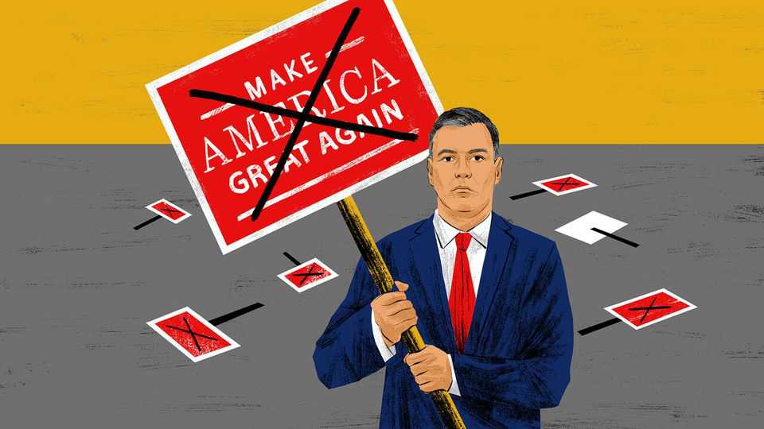

国际 | 电报
欧洲“反特朗普”旗手是谁
桑切斯的孤独：唱反调，代价不小
2025年9月11日

摘要：西班牙首相桑切斯把“对抗特朗普”当作价值宣示：顶住5%军费目标、呼吁用关税反击、推进欧盟数字法。他代言了国内民意，却换来现实中的“被边缘化”。站着把话说完不难，难的是：谁跟你站在一起。

【一｜被“冷落”的那一天】

8月18日，白宫乌克兰峰会名单里没有西班牙——却有芬兰。对一个欧盟第四大经济体、坚定挺乌的国家，面子上确实难堪。原因很直白：特朗普不喜欢桑切斯。

【二｜价值观“硬杠”的清单】

- 贸易：要求欧盟反击“无理关税”，把关税收入回流给受创企业。
- 平台：在达沃斯点名美社媒巨头与科技富豪“侵蚀民主”，督促欧盟用《数字服务法》管控仇恨与虚假。
- 军费：在北约峰会上公开否决“5%”秀肌肉，转而承诺2.1%（已较过去大幅提高）。
- 外交：拉美之行与卢拉同台，点名“寡头+极右”编织“仇恨与谎言”的国际网络。

【三｜为什么“有理没势”】

民调站在他这边：西班牙对特朗普反感度高于对习近平的观感；全球多国对美国好感下降。但“公理不等于公关”：

- 布鲁塞尔与诸都未因其高调而给更多话语权；
- 拉美除巴西外多数政府不愿为“挑衅美国”买单；
- 欧洲右转、拉美右转，都在压缩他的话语空间。

【四｜国内政治的影子】

“反特朗普”是真心，但也是维系左翼联盟的“最小公约数”。在军费上“顶格对冲”，部分是因为联盟左翼拒绝再加钱；对外强硬，能在国内加分，但在对外议程上换不到筹码。

【五｜该怎么“有效对抗”】

- 做强自己：先把防务能力补齐（尤其西班牙），才有底气谈价值。
- 保持沟通：与华府保持“可用渠道”，避免把自己变成他国也不愿靠近的“风险资产”。
- 结盟而非独行：价值对抗要有跨党派与跨区域的伙伴网络。

西班牙有权坚持多边主义、反霸凌；但“一个人的抵抗”换不来结构性影响力。对抗要有效，关键不在嗓门，而在队形。
