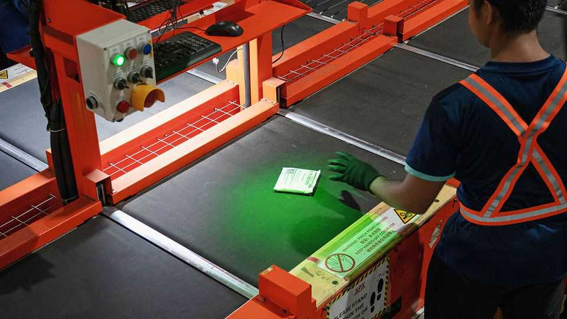

商业 | 乘风破浪
东南亚电商之王Sea，迎战TikTok
电商正向社交媒体迁徙
2025年9月11日

摘要：靠Shopee、Garena与Monee三驾马车，Sea股价自2024年初已翻4倍、净利首次破十亿美元。但社交电商来势汹汹，TikTok Shop把“刷短视频=逛街”变成现实。Shopee靠本地化与物流跑赢一程，下一程要拼“内容化吸睛”。

【一｜三条腿，跑出东南亚一哥】

- 电商：Shopee（自建物流SPX，成本/时效领先）
- 游戏：Garena（《Free Fire》日活过亿）
- 金融：Monee（70亿美元贷款资产）
Sea已与星展DBS争“市值一哥”，2023年扭亏后利润步步走高。

【二｜先烧再省，Shopee扭亏】

疫情期两年资本开支近20亿美元，换来物流能力跃升；2022年转入降本，电商增速未断、亏损收窄，近三季经营盈利连续为正。

【三｜为什么能与“中系宿敌”硬刚】

- 物流到家：更快更便宜，用户心智更稳；
- 本地化深入：比字节系、阿里系“总部拍脑袋”更贴地；
- 份额稳：握住东南亚近半市场，还在巴西扩张。
但电商利润仍薄，“take rate”抬升遇到天花板。

【四｜真正的威胁：社交电商】

社交电商已占东南亚线上零售约1/5。TikTok Shop有2/3交易来自视频/直播，印尼最猛。2025年上半年，除新加坡外五大经济体GMV同比翻倍。

【五｜Shopee的还手】

2019年已上线Shopee Live，去年牵手YouTube。但与“内容原生”的TikTok比，Sea要打的是“注意力之战”。

【六｜结语】

这场仗不只是“送得更快更便宜”，而是“谁更会抓眼球”。电商往社交迁徙，Shopee要把供应链优势，转成直播内容与达人生态的留量优势。
