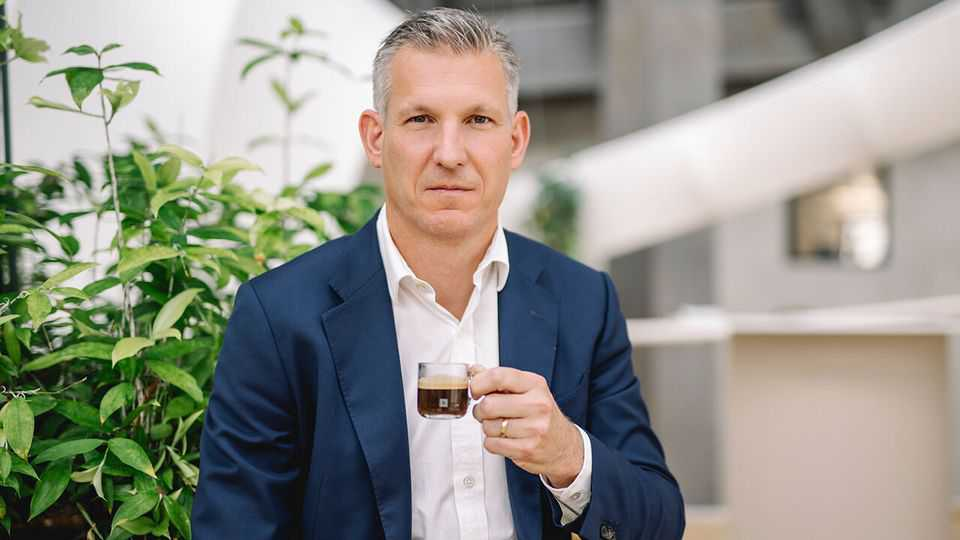

商业 | 新厨上灶
雀巢一年三任CEO，还能扭转吗？
全球最大食品公司，从“甜”到“苦”
2025年9月11日

摘要：丑闻叠加、通胀侵蚀、提价降本后销量下滑——雀巢跌下“稳健白马”。新CEO纳夫拉蒂尔（前Nespresso负责人）接锅：瘦身资产、提振创新与销量、修复士气与投资者信心。口号别再是“Forward to basics”。

【一｜从稳健到折腾】

- 施耐德时代先扬后抑：健康品并购、出售护肤与低效水/冰淇淋资产，疫情中发挥稳；
- 俄乌战争后“价格高企+供应链乱+加息+消费走弱”叠加，提价换来的是销量下滑与本土竞争加剧，股价自2022年高点回撤三成。

【二｜丑闻拖后腿】

- 毒披萨、婴配与贫国“糖负担”、俄业务、Perrier禁用工艺等事件，重伤品牌与治理口碑。

【三｜“回归基本盘”没等来反转】

- 弗雷舍短命任期主打回归强项：奶粉、冷冻、到家咖啡、宠粮，但尚未落地即因“办公室恋情未披露”翻车。

【四｜新官上任“三把火”】

- 继续瘦身：出售剩余水业务（3%营收）、部分维生素、Gerber、Illuma与部分糖果（如徐福记）等非核心；
- 量先于价：先把销量拉回来，再谈提价；
- 创新与组织：补足产品力，提气团队士气。

【五｜投资者的期待】

这是在施耐德“外来气”与弗雷舍“守成气”之间的瑞士式折中。真正的考题：如何在“成本高位+可可涨价+新兴市场本土化突围”的三重压力下，带回增长的确定性。

雀巢的复盘像一堂“定价权的代价”课：提价可以救一时利润，但救不了长期份额。新CEO的关键词，应该是“产品力+组织力”，而不是“口号力”。
