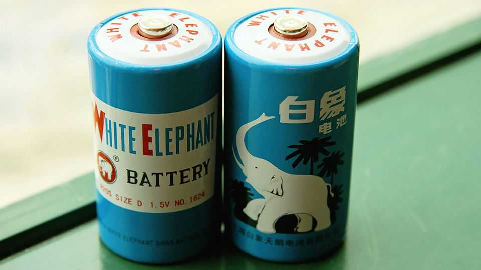

商业 | 品牌翻车学
Biemlfdlkk怎么读？“出海改名学”的坑
中国企业加速全球化，名字先得过关
2025年9月11日

摘要：出海不是先讲故事，而是先把名字说清楚。好念、好写、好记、无负面联想，这是起点。海底捞、泡泡玛特、Shein做对了；蜜雪、白象、正泰、Youngor就难讲——更别提“海伦·凯勒”“Adolph”这类文化雷区。

【一｜名字就是入口】

- Biemlfdlkk太拗口，出海前改成更可读的Biemlofen；
- 海底捞海外门店直接用“Hi”简化识别；
- 泡泡玛特在欧美毫无违和；Shein把中文音从英文倒推，统一心智。

【二｜常见翻车点】

- 音译拖后腿：蜜雪冰城海外仍用“Mixue”，门槛太高；
- 旧名难回头：白象、正泰等早期命名在海外语境“别扭”；
- 生造“洋名”变谜语：如Youngor。

【三｜文化误判更致命】

- 借符号翻车：把“海伦·凯勒”用作墨镜品牌；
- 伪德系审美：Adolph在中国可冒充德味，到德国卖不动。

【四｜反向案例也很多】

- 西方品牌入华也踩坑：标致（Peugeot）普通话还行，粤语里却不体面。

【五｜实操建议】

- 原则：好读/好写/好记/无歧义/可注册；
- 路径：先做目标语言定性定量测试，再做小范围A/B；
- 策略：能意译就不要音译；必要时双品牌运作（本地化名+母品牌背书）。

名字不是Logo，它是产品出海的第一道“海关”。别让第一步就把自己卡住了。
