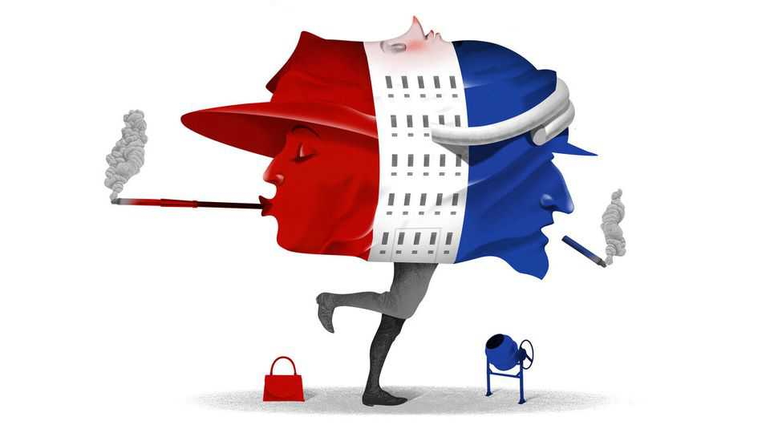

商业 | 熊彼特
在法国商界，“无聊”胜“性感”
避开光鲜，看见确定性
2025年9月11日

摘要：法国政治再陷不稳、资本市场“蔫”着，连LVMH与爱马仕都回撤。但把目光从“高光行业”挪开，你会看到：叛逆期过后的“老问题户”、中小盘与“灰头土脸”的工程/公用事业，正在跑赢。

【一｜高光暗淡的当口】

- 二次倒阁、社媒号召“封锁一切”，GDP增长乏力；
- CAC 40过去一年垫底；奢侈双雄市值自2月中旬蒸发约2000亿欧。

【二｜三类“无聊赢家”】

- 老问题户的反转：达能/法兴/Orange自2020年初算起曾几乎零回报，今年以来股价+15%/+100%/+40%；
- 中小盘：更贴欧盟内需、受全球冲击小，MSCI法国小盘指数年内+15%，跑赢CAC 40；
- 工程与公用事业：Engie/Veolia利润翻倍，Vinci利润率西方同业居前，施耐德/罗格朗销售增速压过多数对手。

【三｜为什么是它们】

- 去“全球化冲击”敞口小、受益于欧盟脱碳与基建周期；
- 管理层从“讲故事”回归“现金流与成本”。

【四｜高光也有火种】

- AI：巴黎的Mistral获ASML 13亿欧投资；
- 航空：空客“圈着波音飞”；
- 广告：法国系依旧“老江湖”。

【五｜结论】

法国市场的确定性，在“无聊资产”里：现金流稳、资本纪律强、受外部冲击小。对投资者而言，“无聊就是新黑色”。
