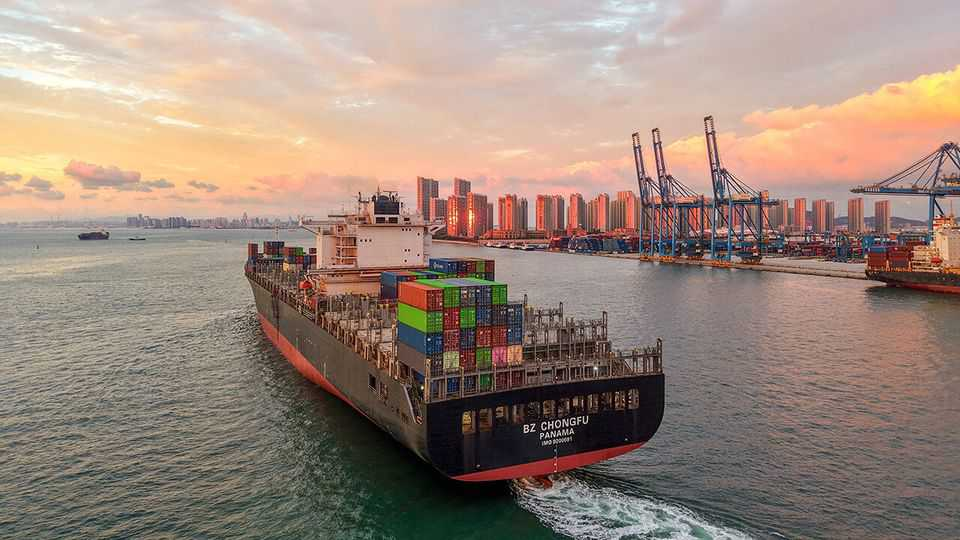

财经 | 徒劳的堡垒
美国猛攻之下，中国贸易仍在扩张
世界其它地方，愿意“被占便宜”
2025年9月11日

摘要：对美出口下滑，但中国总出口在涨：非洲、东盟、欧洲接盘。共建“一带一路”加速，工程与金融铺路，“前店后厂”在东南亚固化。北美筑墙，墙外在买单。

【一｜对美掉队，总盘在涨】

- 近三个月对美出口同比-25%，美国份额降至10%；
- 同期总出口+6%：非洲+1/3、东盟+1/5、欧洲+近1/10；欧洲吸纳中国商品的份额现超美国六成以上。

【二｜“一带一路”加速当发动机】

- 2025年上半年新增合同与投资破纪录，非洲工程合同>300亿美元、同比5倍；
- 尼日利亚、埃及等以基建设备带动进口；货币互换、人民币融资逐步铺开。

【三｜供应链“外迁不脱钩”】

- 对泰、越出口同比+25%，机电类+40%+；
- 为满足原产地规则，中国企业在印、马、越落地产能，减少“转运”争议，反而固化在东盟产业链中的地位。

【四｜北美的例外与代价】

- 墨西哥对华进口同比-6%，并宣布对中国产品加征关税以安抚华府；
- “北美堡垒”不等于增长自信，历史上筑墙多源于焦虑。

【五｜结语】

贸易从来是“有路就有货”——北美设限，全球南方与欧洲在重塑通道。数据已经说明：墙越厚，外面越热闹。
