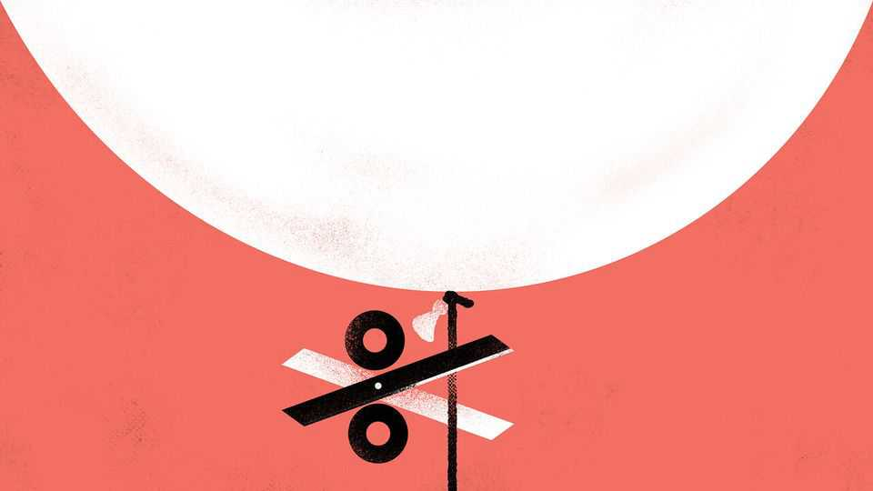

财经 | 巴顿木
为什么美国债券持有人对通胀心惊肉跳
美联储在“剪刀差”中降息
2025年9月11日

摘要：就业走弱逼降息，核心通胀仍顽固在目标之上；降多了怕再点燃通胀，降少了怕就业失速。股市新高、金价新高、长债发抖——市场在押注“通胀与收益率的两难”。

【一｜表面顺人愿，内里是两难】

- 鲍威尔暗示降息在即，9月会议市场押注25或50bp；
- 就业放缓与“稳定物价”目标相冲突：核心PCE>2%，预期抬头。

【二｜债市的两条担忧】

- 财政赤字~GDP的7%，一加码就易推升通胀；
- 若为就业优先强降息，或固化高通胀，侵蚀票息与本金购买力。

【三｜尾部风险在抬升】

- 债务太大，放任通胀“温水煮债务”的诱惑上升；
- 预期自我实现：怕抛的人先抛，收益率无序上行的概率增。

【四｜非常规工具的“幻影”】

- 半数基金经理预期下任主席会再启QE或“收益率曲线控制”；
- 高通胀下压收益率=玩火。

【五｜给投资者】

- 别只看短期宽松，定价要盯“长期通胀×赤字路径×央行独立性”的联立方程；
- 市场可以自证预言——在担心中先行动的人，往往决定了结果。
