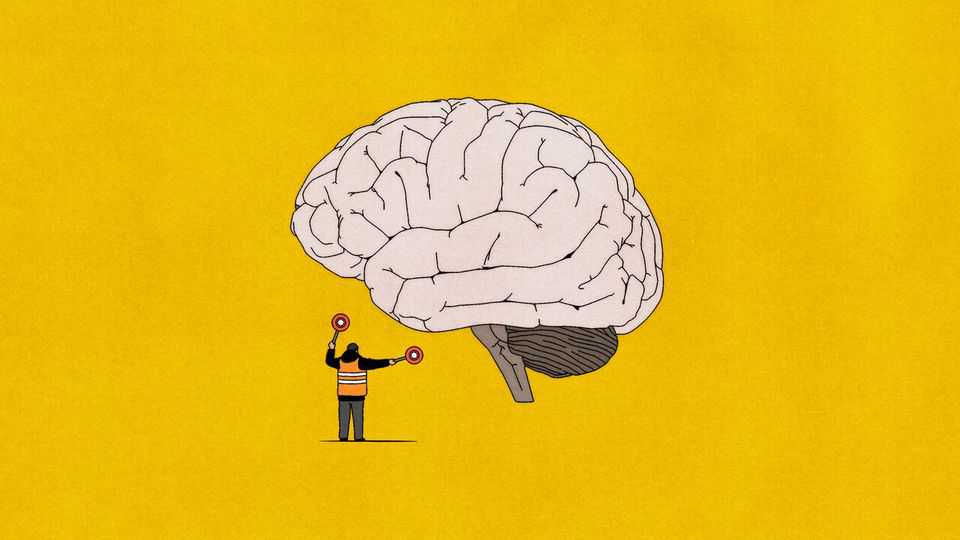

财经 | 自由兑换
你能读到这篇专栏的最后吗？
注意力，正在被经济学“正名”
2025年9月11日

摘要：短视频“脑腐”不是笑话，它是“偷时间”。把注意力当稀缺资源，能把行为经济学与理性人模型接起来：信息太多→理性忽略→偏好近似优化。问题在于，注意力既可自上而下分配，也常被环境劫持。

【一｜稀缺的注意力，解释很多少见怪不怪】

- 价格左位偏见：$2.99≈$2，而非$3；
- 宏观“缓调”而非“瞬调”：理性忽略让人只吸收一部分新信息。

【二｜前辈与模型】

- 西蒙的“有限理性”：信息越多，注意力越贫；
- 西姆斯的“理性忽略”：优化者也只能处理有限信息量。

【三｜定义与度量的难题】

- 注意力=对信息处理任务的稀缺、可竞争的心智资源的选择性分配；
- 但它既可能是“看这儿”，也可能是“别走神”——聚合成单一概念会丢细节。

【四｜被环境“劫持”的注意力】

- 自上而下：人选择如何用注意力；
- 自下而上：环境与情绪（疼痛、饥饿、无聊）强行拉走注意力；
- 算法是“完美的分心机”。

【五｜怎么办】

- 社会规范：图书馆式的“专注场”；
- 监管：或许将来会有；
- 眼下：读文章时，把手机放远。

注意力如果是资源，就需要产权与边界。现在的互联网，偷它太容易了。
