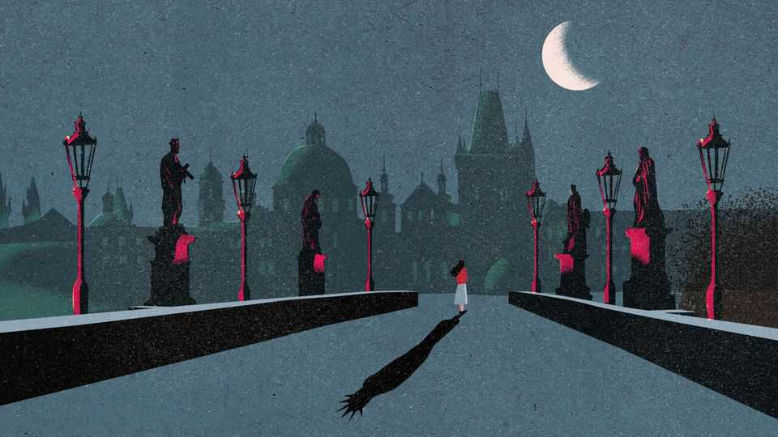

文化 | 兰登回来了
丹·布朗又来了一锅“真相+胡扯”的乱炖
尽管讲解生硬，《秘密中的秘密》仍是一路狂飙
2025年9月11日

摘要：丹·布朗还是那个丹·布朗：FACT堆叠、文笔“微妙”、地图式导览、阴谋论拼盘。但它跑得顺、信息密、会把你拖进搜索框。“不好看”这件事，本身就是它的看点。

【一｜配方没变】

- “事实”+“幻想”混剪，阴谋论当调味料；
- 大量景点/文物/拉丁梗的“导游式”讲解；
- 真与假，需要读者边读边查。

【二｜这回讲什么】

- 兰登与“心灵科学家”恋人布拉格布拉格，在布拉格城“讲玄学”；
- 意识将迎来“范式转换”的宏大设定，用一句台词交代完毕；
- 节奏依旧：追逐、谜题、缩写雨（CIA、ESP、WTF）。

【三｜为什么仍好卖】

- 它把读者“想懂但没空懂”的东西讲清了一点：艺术、神学、历史小梗；
- 自学者的热情与“笨重的认真”，反而有点可爱。

【四｜别太当真】

- 它既借用阴谋论，也制造阴谋论；
- 当它写“世界将经历海量意识变革”，你可以当个段子看。

评价会很两极，但它依然会被读，甚至被改编。兰登的魅力，不在优雅，在效率。
