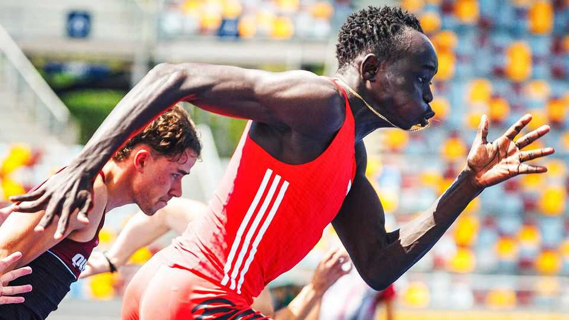

文化 | 地表最快少年
17岁的Gout Gout，田径的新超级新星？
200米，他同龄时已快过博尔特
2025年9月11日

摘要：澳大利亚天才短跑Gout Gout成年组首秀，他的200米20.02，16岁时就刷新全国纪录，跑姿挺拔、弹性惊人，被博尔特称“像年轻的我”。团队降温：世锦赛先享受过程，真正的目标是2028洛杉矶与2032布里斯班。

【一｜有多快】

- 16岁跑20.04，史上同龄第一、澳洲全国纪录；
- 今年提升到20.02，爆红赛场与社媒。

【二｜他与众不同】

- 挺拔跑姿、像在“跃过”跑道；

- 跑能的“弹簧”来自异常强壮的跟腱。

【三｜与博尔特的对照】

- 博尔特16岁200米比他慢0.1秒；
- 本人也说“他像年轻的我”。

【四｜别急着封神】

- 仍在兼顾学业，仅跑200米；
- 合同已来（阿迪达斯签约）、关注已至，但团队刻意控节奏。

【五｜更大的舞台】

- 2028洛杉矶、2032布里斯班（他的家乡），都是黄金窗口；
- 田径需要新故事，他可能就是那个故事。

少年冲刺，运动重生——这是体育的浪漫。
