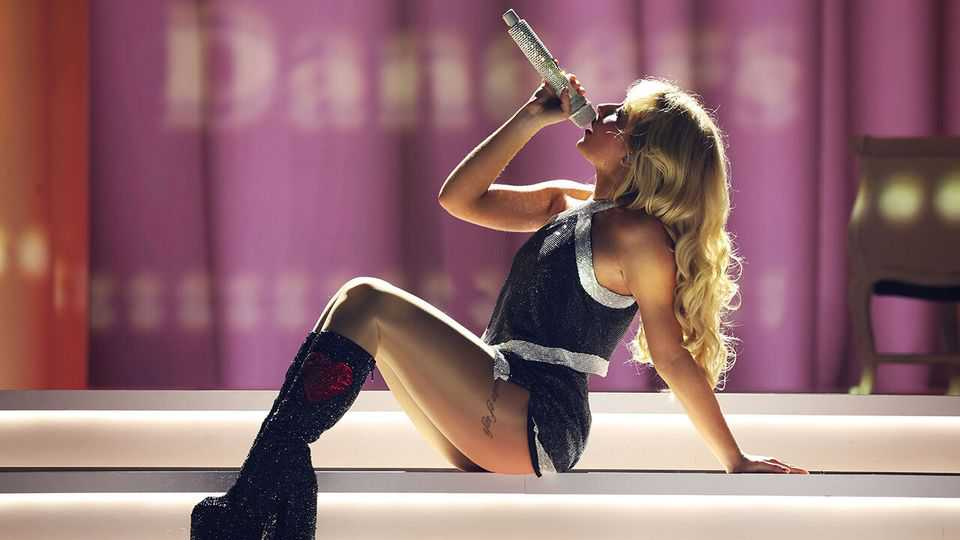

文化 | 厌男歌词潮
为何女流行歌手集体“吐槽平庸男”
这股风，或许折射了男女年轻人之间的鸿沟
2025年9月11日

摘要：从萨布丽娜·卡彭特到杜娃·黎波，女歌手把朗朗上口的旋律与对“差劲男友”的控诉打了个包：不跳舞、不提问、只顾自恋、不会爱人、连IKEA椅子都装不好。歌词的“吐槽学”背后，是现实的配平：女性受教育与经济地位普遍上升、择偶更挑；而在许多指标上，年轻男女的观念正分叉。音乐，先发出嘲讽的哨音。

【一｜歌词里的“平庸男”】

- 《Manchild》里，情人“蠢、慢、无用”；
- 《Sugar Talking》讥其“词汇很大，脑袋很小”；
- 《Slim Pickins》嫌他连 there / their / they’re 都分不清；
- 查佩尔·罗恩抱怨“他不跳舞、也不问问题”；
- 佩莉唱“他需要的不是恋爱，是治疗”；
- 杜娃·黎波直言“别让我教你如何爱我”。

【二｜这并非凭空冒出来】

- 自60年代末“自传式写作”兴起，歌词远离“普世主题”，走向“私人告白”；
- 厌恶自恋与不忠的“他”，成为反复吟唱的对象；
- 从卡莉·西蒙到碧昂丝、泰勒·斯威夫特、桃莉·芭顿、凯莉·安德伍德，谱写了“坏男孩学”。

【三｜社会变量：女性更“可选择”】

- 受教育与经济独立提升→择偶门槛提高；
- 2023年美国25-54岁女性35%单身（1990年为29%），女性本科与研究生毕业比例更高（近六成大学毕业生为女性）；
- 多数女性不愿“下嫁”，现实就会变成“好货稀缺”。

【四｜男方的回声】

- 男歌手也有反击，如摩根·沃伦的《I’m the Problem》问：“我这么糟，你为何久留？”

【五｜解读：音乐在表达“期望差”】

- 家务分担、情感表达、关系投入的“期望差”，被浓缩进流行金句；
- 吐槽不是仇恨，而是“边唱边立规矩”。

结语：当现实中的男女“不同步”，流行乐常先捕捉到节拍差。听得见抱怨，更要听见理由。
