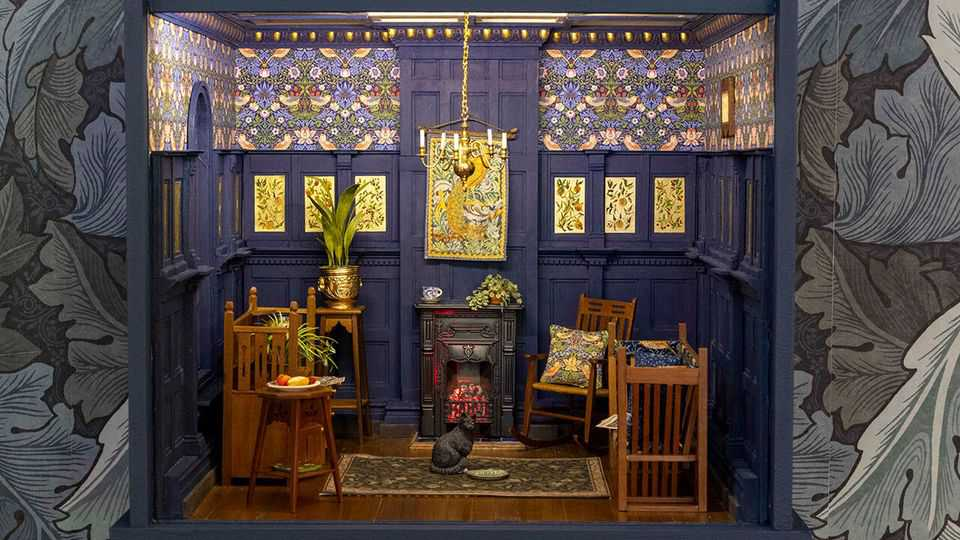

文化 | 草莓盗遍天下
威廉·莫里斯的印花，为何“讽刺式”无处不在
一场展览与一批新作，再次证明它的长青
2025年9月11日

摘要：莫里斯讨厌“机器复制”，却在世后一百多年被世界以机器的效率复制。伦敦威廉·莫里斯美术馆的新展“莫里斯热”，用硬币、猫摆件、潜艇座椅来呈现这种“泛在”。他共同创办的公司在2025财年营收达1800万英镑。就算你叫不出《草莓盗》或《金百合》，你也多半见过它们。

【一｜“反量产者”的流行】

- 受中世纪艺术与文学影响，莫里斯主张“手工+天然染料”；
- 他曾在1851年的万国工业博览会上拒绝入场；
- 现实却很讽刺：早期客户是王室与贵族。

【二｜为何耐看】

- 设计的对称性与重复感天然悦目；
- 流动的纹样与熟悉的母题，降低了“视觉学习成本”。

【三｜当AI也会“仿莫里斯”】

- 展览里有九张“1934年V&A百年展”的海报，其实是AI伪作；
- 网上充斥“莫里斯风”拼贴，他本人大概会痛斥之；
- 但这恰恰说明其风格“可被无限推演”。

【四｜新作从旧稿里长出来】

- Morris & Co 基于1999年购入的草图档案，推出26款“新作”；
- 由当代艺术家补完，视为“补全莫里斯作品谱系”，而非“二创”。

结语：当一种美学成为公共语言，它就会被复制、被误读、被戏仿、也被再创造。莫里斯，已经进入了这个循环。
