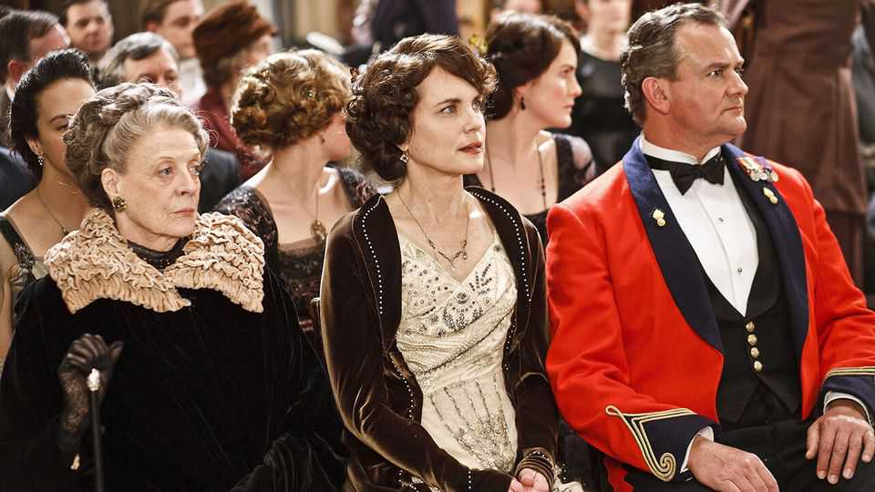

文化 | 屏幕上的贵族
真正的“唐顿”勋爵：朱利安·费罗斯
他是当代英国“阶级叙事”的头号记录者
2025年9月11日

摘要：《唐顿庄园：大结局》里，玛吉·史密斯只余闪回；而费罗斯仍在讲好听的“阶级故事”：楼上与楼下、激情与礼法、战争与流感、县集与小烦恼。他既是贵族圈的“内部人”，又有文娱产业的“旁观眼”，能把严肃的主题写得温暖而可连追。

【一｜为什么只有他能写】

- 他与制片加雷斯·尼姆共同孵化《唐顿》；
- 风格是“宏大叙事+日常烦恼”的配平：战争与流感对照县集筹备；
- 既懂“楼上”，也怜“楼下”。

【二｜从胆怯少年到“自造贵族”】

- 少年怯懦，赴南美油轮途中重塑自我；
- 剑桥就读、出入舞会，转入戏剧学校；
- 父亲箴言：“若不得不谋生，不如做点有趣的。”

【三｜两则传闻，皆真】

- 与艾玛·基奇纳相遇20分钟求婚；
- 《高斯福德庄园》一战成名并获奥斯卡，但其前已在舞台与电视写作耕耘。

【四｜创作方法：写得可说】

- 当过演员，常“救场”台词，因而知道什么“说得出口”；
- 小说《势利鬼》里也承认：人们仍幻想抵达“金字塔顶”。

【五｜不是粉饰，也非审判】

- 他承认基调明朗：观众周日不愿被抑郁；

- 但他笔下仍有焦虑：同性之困、女性之困；
- 他相信多数人“尽力行善”，阶级不是非黑即白。

【六｜英美的“阶级错位”】

- 《镀金时代》把矛盾移至纽约劫掠男爵与仆人间；
- 命运更可流动：楼下可上楼上。

【七｜写贵族，也被贵族“审视”】

- 他照亮了常被遮蔽的世界，难免遭到当事人的不适；
- 但他最终被接纳：他写的是“努力体面的人”。

结语：费罗斯像“贵族界的阿滕伯勒”——既观察，又入戏。若说《唐顿》甜，甜在他把虚荣与善意、秩序与情感，写成了现代人的通俗史。
