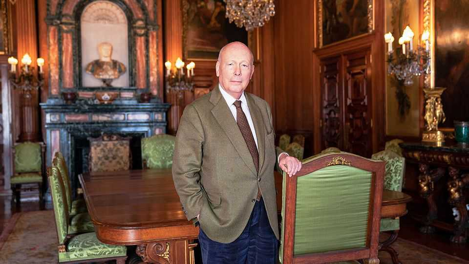

文化 | 屏幕上的贵族
真正的“唐顿”勋爵：朱利安·费罗斯
他是当代英国“阶级叙事”的头号记录者
2025年9月11日

【导言｜宏大与日常的并置】
《唐顿庄园：大结局》中，玛吉·史密斯仅以闪回形式现身，但朱利安·费罗斯的叙述并未谢幕。他持续书写英国社会的阶层图景：在“楼上”与“楼下”的结构中，情感与礼法相互牵扯；在战争与流感的时代背景下，县集筹备等日常细务折射出秩序的维持与人心的试探。费罗斯兼具“内部人的经验”与“行业观察的冷静”，善于以细节托举主题，使叙事不至于空悬，也不沦为教条。

【一｜创作者何以独特】
他与制片人加雷斯·尼姆共同孕育《唐顿》。其独特处，在于有意识地让宏大叙事与日常烦恼并置：以战争、流感等历史事件映照县集筹备等生活事务，使叙事获得张力与层次。宏大因此可感，日常也有了纵深。他写“楼上”的体面与责任，也写“楼下”的尊严与算计；两端相互观照，但彼此并不被简化。

【二｜从怯懦少年到“自造贵族”】
少年时期的怯懦，在一次赴南美的油轮旅途中被重新塑形。其后，他入读剑桥、活跃于舞会场域，并转入戏剧学校，逐步完成从旁观到入场的转换。父亲的话——“若不得不谋生，不如做点有趣的”——为其职业选择定下调门：既要谋生，也要谋趣。由此，他在创作中始终坚持“可看、可说、可感”：对白要自然，情节须服膺人物与时代的逻辑。

【三｜两则传闻与长年耕耘】
二十分钟求婚艾玛·基奇纳，《高斯福德庄园》一举成名并摘得奥斯卡——这两则常被反复提及的“传奇”，并非夸饰。然而，真正支撑转折的，是他在舞台与电视写作上的长期劳作：对白的抑扬顿挫、场面的开合张弛，由此打磨而成。成名不是偶然的闪光，而是厚积之后的必然。

【四｜让台词“说得出口”】
曾为演员、常在现场“救场”的经历，使他明白“什么话能自然地被人说出”。其对白顺畅而有分寸，人物阶层的差异体现在词汇、语调与节奏之中。小说《势利鬼》直言，人们仍幻想抵达“金字塔顶端”。在其剧作里，欲望得以呈现，却不被草率审判；人性承认其混杂，而非被定格为非黑即白。

【五｜明朗基调与隐在的焦虑】
他坦承作品基调偏明朗——观众在周日晚间并不希望被抑郁裹挟。然而明朗并不等于粉饰：同性身份的困境、女性于礼法与欲望间的挣扎，均被纳入叙述。其核心立场是：多数人在各自位置上“尽力行善”。阶层于是成为制度与性情交错的人间，而非简单的敌我对置。

【六｜英美之别：流动与稳固】
在《镀金时代》中，他将张力转向纽约：劫掠男爵与仆人之间的角力更为显露。相较英国社会层级的稳固与迟缓，美国社会的纵向流动更为活跃，“楼下”的人得以“上楼”。他在两种制度气候之间往复观照，以结构比较强调人物命运的可变与不可测。

【七｜被注视的注视者】
他照亮一个常被帷幕遮蔽的世界，因而难免遭到当事人审视与挑剔；但最终，他仍在相当范围内被接纳。理由简单：他所描摹的不是完美的楷模，而是在不完美世界里努力体面的普通人。体面不是无瑕，而是克制、守礼与善意的实践。

【结语｜体面史与现代人的情感教育】
若把自然纪录片里的阿滕伯勒挪入贵族世界，或可得到费罗斯的侧影：既观察，又入戏；既留白，也点睛。《唐顿》的“甜味”并非糖衣，而是将虚荣与善意、秩序与情感并置呈现，使宏大主题在日常里落地，日常细节在历史中被看见。叙事因此不空悬，人物也不被轻易定论。
