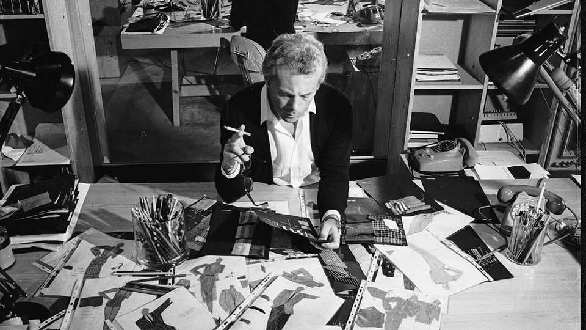

讣告 | 优雅，而非奢夸
乔治·阿玛尼：解放男女的“形”
这位意大利“生活方式”宗师于9月4日逝世，享年91岁
2025年9月11日

摘要：他把西装“从盒子里救出来”，去垫肩、去里衬、软面料、低饱和，让身体自由呼吸；他也给女性套装以“流动的自信”。公司从1975年创业，到2024年估值90-117亿美元，延展出运动、酒店、家居与巧克力。好莱坞是他崛起的加速器，但他始终保持内向与克制，把“阿玛尼世界”的每一毫米管到极致。

【一｜细节之神】

- 从桌布的垂坠到领带的长度，从模特妆容到纸张克重，他都要定；
- 在办公室，没人敢直呼其名——他是“阿玛尼先生”。

【二｜男装革命：让身体自由】

- 经典英式套装“惩罚身体”，他选择解放：
- 用绉纱替重羊毛、柔色替深色，拉长衣长、放大翻领、降低扣位；
- 西装“塌”下来，显出一点浪漫与松弛。

【三｜女装语言：优雅流动】

- 套装带来不板滞的自信，长裙在“褪色花色”的范围里克制而华美；
- 既遮掩腿形，又不牺牲气场。

【四｜事业逻辑：独立与简单】

- 与伴侣塞尔吉奥·加莱奥蒂共同创业，后者1985年因艾滋病去世；
- 公司坚持独立不卖身，“巨头们”都买不走他；
- 成功的关键是“简单”：松、舒、克制；Emporio 把价格拉近大众。

【五｜电影赐予“全球声量”】

- 1980年《美国舞男》让他的风格一夜成名；
- 从基顿到克鲁斯、从康纳利到朱莉娅·罗伯茨，红毯与片场都是他的T台；
- 他在洛杉矶设办公室，主动把衣服“送进”银幕。

【六｜内心的羞怯与自律】

- 他不迷信“天启”；从行医梦、当兵到橱窗设计，才“误入”时装；
- 夜以继日，只为把按钮、灯光与色彩调到“毫米级正确”。

【七｜之后怎么办】

- 独立带来自由，也带来传承之难；
- 他希望“家族式”延续，但谁能守住那毫米之差？
