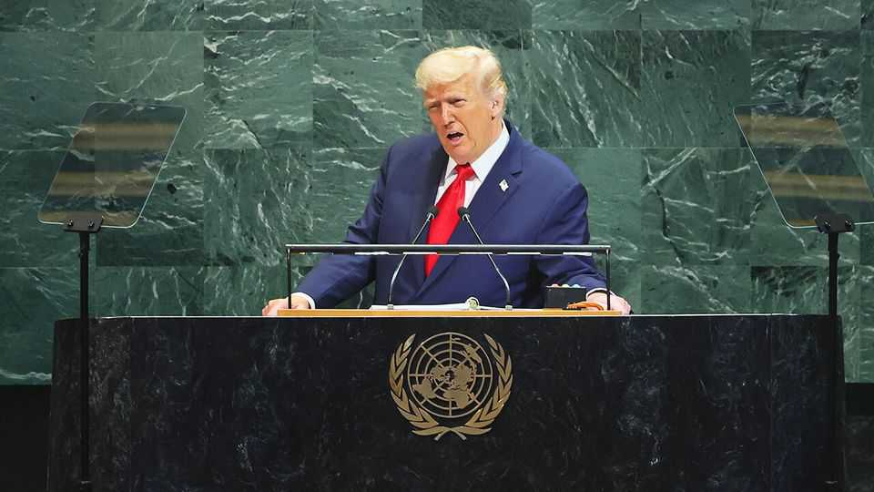
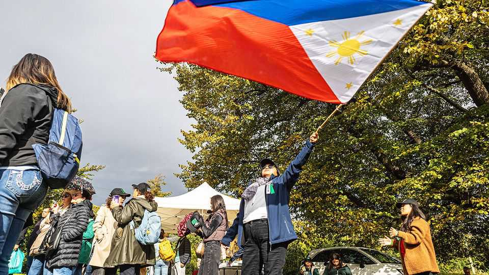

The world this week
Politics
September 25th 2025

Donald Trump used his first speech to the UN General Assembly since winning re-election last November to lambast the organisation’s record on solving conflicts. With an eye on his desire for a Nobel peace prize, the president said, rather dubiously, that he had been more effective in reaching peace deals than the UN. “Your countries are going to hell,” he told the delegates. He also admonished countries such as Australia, Britain, Canada and France for officially recognising Palestine as a state, criticising them for rewarding terrorists. Israel said the formal recognition would embolden Hamas. After a meeting at the UN with Volodymyr Zelensky, Mr Trump suggested that Ukraine could win back all the territory that has been seized by Russia, on the face of it an astonishing reversal of his hitherto position, which had emphasised accepting Russia’s claims. However, Mr Trump wants Ukraine

to rely on “the support of the European Union” for its war aims, not America.

Mark Rutte, NATO’s secretary-general, said the alliance had responded well to Russia’s latest infringement on its boundaries. NATO aircraft were scrambled to counter three Russian MiG-31 fighter jets that entered Estonian airspace for 12 minutes. Russian drones recently infringed Polish and Romanian airspace. NATO promised to defend itself “in accordance with international law”. Poland’s foreign minister was blunter, telling Russia not to “whine” if one of its aircraft is shot down.

In Denmark a number of drone sightings forced Copenhagen’s airport to close. Denmark’s prime minister, Mette Frederiksen, said she could not rule out Russian involvement. Drones were later spotted at four regional airports. Oslo’s airport also had to shut down, though no link has been established with the Copenhagen incident. The incursions came soon after a ransomware attack caused chaos to check-in systems at several European airports, including Heathrow.

Police in Moldova arrested 74 people for allegedly trying to stir up disorder and violence ahead of a parliamentary election on September 28th. Maia Sandu, the president, accused Russia of instigating the plot, though pro- Russian parties claimed the arrests were an attempt to intimidate them ahead of a vote in which they are expected to do well.

Ahmed al-Sharaa, Syria’s interim president, addressed the UN General Assembly, the first Syrian head of state to do so since 1967. Mr Sharaa’s Islamist armed group was removed from America’s list of terrorist organisations in July. In his speech the Syrian leader called for the lifting of sanctions, “so that they no longer shackle the Syrian people”.

JNIM, the most prominent jihadist network in the Sahel, stepped up a campaign of economic sabotage in Mali. The group has sought to strangle the supply of fuel to the capital, Bamako, and impose blockades on two cities in the country’s west. Militants apparently belonging to JNIM, which is aligned with al-Qaeda, reportedly set up checkpoints on main roads and set fire to fuel tankers and public vehicles coming from neighbouring Mauritania and Senegal.

People in Guinea voted for a new constitution in a referendum. Mamady Doumbouya, the head of the military junta, is now cleared to run for the country’s presidency, despite pledging not to do so when the army ousted the long-time president, Alpha Condé, in 2021. Critics called it a farce. Provisional results showed that over 90% of the electorate voted yes in a high turnout. Opposition parties were barred from campaigning.

The official results of Malawi’s presidential election declared Peter Mutharika as the winner. Mr Mutharika returns to the office he held from 2014 to 2020. Lazarus Chakwera, the incumbent, conceded defeat fter a campaign that centred on the high cost of living. He said he was committed to a peaceful transfer of power to his arch-rival.

A sniper opened fire at an immigration-detention centre in Dallas, killing at least one detainee before killing himself. Officials and politicians suggested that the gunman was targeting law enforcement.

Around 100,000 people packed a stadium in Glendale, Arizona, for a memorial service to Charlie Kirk, a Christian conservative activist who was shot dead at a college event in Utah. Mr Trump spoke at the memorial, which was attended by cabinet secretaries, senators, representatives and conservative media luminaries. The president alluded to a “spiritual reawakening” in America.

A federal judge dismissed Mr Trump’s $15bn defamation lawsuit against the New York Times, just a few days after it was filed. The judge said Mr Trump’s document was too long and full of statements that did not pertain to the case. A legal complaint is “not a protected platform to rage against an adversary”, the judge said.

A delegation from America’s House of Representatives paid a visit to China, the first official trip by congressmen in six years. The bipartisan group met Dong Jun, China’s defence minister, and discussed trade in critical minerals with government officials.

Facing another run on its currency and with debt payments to the IMF due, Argentina was thrown a lifeline by America, which is willing to support the country’s struggling economy. Mr Trump, who thinks of Javier Milei,

Argentina’s libertarian president, as an ally, said this would not involve a bail-out. Several options are being considered, such as America directly buying Argentina’s dollar-denominated bonds.

In Brazil protests took place against a proposed amnesty for Jair Bolsonaro, the former president who has been sentenced to 27 years’ detention for plotting a coup. His allies in congress are attempting to fast-track a bill that could save him from jail. Meanwhile, prosecutors charged Eduardo Bolsonaro, a congressman, for trying to influence the case against his father. He described the charges as absurd.

The International Criminal Court, which sits in The Hague, revealed its charges against Rodrigo Duterte for crimes against humanity. Mr Duterte waged an extrajudicial war against drug gangs during his presidency of the Philippines from 2016 to 2022, and before that during his three years as mayor of Davao city. Mr Duterte was taken into custody in March, and re- elected as mayor of Davao in May while he was in detention.

Amid all the high-minded speechifying at the UN assembly, Mongolia’s president used part of his address to praise the historical contribution of the world’s 60m horses. Khurelsukh Ukhnaa lauded our trusty steeds for being “integral to human livelihoods, culture and civilisations”, as he promoted his

initiative for a UN World Horse Day. There are more horses than people in Mongolia, which is renowned for its equine culture.

This article was downloaded by zlibrary from [https://www.economist.com//the-world-this-week/2025/09/25/politics](https://www.economist.com//the-world-this-week/2025/09/25/politics)