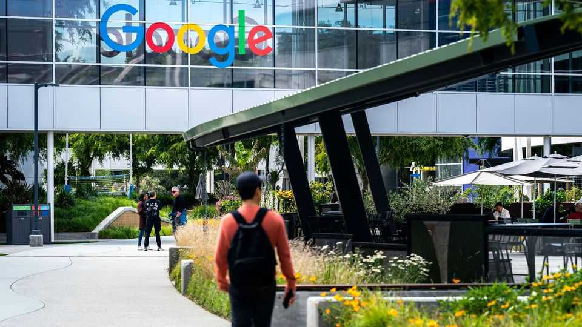
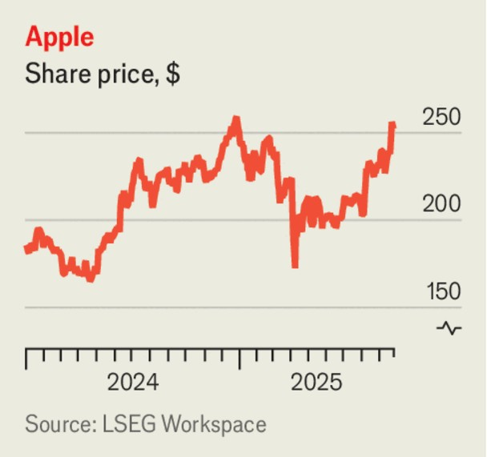

The world this week
Business
September 25th 2025

Tech firms scrambled to respond to Donald Trump’s proposal to charge $100,000 for H-1B visas. Large tech companies use the visas to employ foreign graduates; an H-1B currently costs around $2,500. The initial confusion about whether the change would apply to existing visa holders was cleared up by the White House, which said it would not. Amazon, Microsoft and others had told staff on an H-1B not to leave America in case they couldn’t re-enter. Indian nationals account for 75% of the visas. Although many in Silicon Valley support the programme, Mr Trump claims it undercuts American workers. The bullish mood surrounding artificial intelligence reached new heights when Nvidia announced that it planned to invest up to $100bn in OpenAI in order to expand data-centre capacity. Under the deal, which could be the biggest-ever investment in a private company if the $100bn is fully

committed to, OpenAI will buy as many as 5m of Nvidia’s graphic processing units to increase its capacity to ten gigawatts (GW). The pair described the agreement as “the biggest AI infrastructure deployment in history”. Nvidia also dug into its deep pockets to declare that it was taking a $5bn stake in Intel.

Following the announcement, OpenAI said it would open five new data centres in America in partnership with Oracle and SoftBank under the Stargate project, increasing Stargate’s planned capacity to nearly 7GW and taking investment in the project to $400bn. The full $500bn, 10GW commitment should be reached by the end of the year, according to OpenAI, ahead of schedule.

Stockmarkets rose following the news about Nvidia and OpenAI. Investors were also pleased by Micron’s earnings; the chipmaker’s revenue grew by 46% in its latest quarter, year on year.

Alibaba’s share price reached a four-year high in Hong Kong after it also outlined a partnership with Nvidia and forecast more investment in AI infrastructure. The company already offers cloud services in numerous countries, including America, and is expanding to Brazil, France and the Netherlands this year. Hong Kong’s Hang Seng TECH Index of the city’s 30 leading tech companies has risen by 40% in 2025, compared with a 17% increase in the NASDAQ Composite.

Although it is lagging behind in the AI race, Apple’s focus on its core products is paying off. Its stock jumped following the release in shops of its latest devices, including the iPhone Air, erasing its recent losses and turning positive for the year. Demand is reported to be strong for the new products.

The contours took shape of a deal orchestrated by Mr Trump to allow TikTok to continue operating in America. American investors will buy a majority share in TikTok’s American business, helping ByteDance, its Chinese owner, to divest it. Oracle will oversee the app’s algorithms and data security. Separately, Oracle announced that Safra Catz was stepping down as chief executive after 11 years in the job. The CEO’s role will now be shared between Clay Magouyrk, who headed Oracle’s cloud division, and Mike Sicilia, who led its applications and AI unit.

Pfizer made an audacious attempt to enter the market for weight-loss drugs by agreeing to buy Metsera in a deal that could be worth up to $7.3bn. It is the biggest acquisition yet by an established pharmaceutical company of a weight-loss business; Metsera’s experimental treatments are said to be promising.

Porsche’s stock struggled to recover from the hammering it took when it announced a delay to its roll-out of electric vehicles and issued another

profit warning. Volkswagen, the luxury carmaker’s parent company, said it would take a €5.1bn ($6bn) hit to operating profit this year as a result. Porsche blamed “market conditions”. Its new range of SUVs, which it had planned to be fully electric, will now be offered as petrol-engine and plug-in hybrid vehicles.

A judge granted a temporary injunction against the Trump administration’s order to stop work on the Revolution Wind project off the coast of New England. The ruling is a huge relief for Orsted, the developer of the project, which has had to shore up its finances by selling new shares to stockholders at a discounted price. Mr Trump described renewable energy as a “joke” during his speech at the UN this week.

Michelob Ultra is now America’s bestselling beer brand, according to Anheuser-Busch, which brews it, citing figures from Circana, a market- research firm. Modelo Especial, brewed in Mexico by Constellation Brands, held the title for two years. Earlier this year Constellation noted a slide in sales among its Hispanic customers, who account for half of Modelo’s revenues.

This article was downloaded by zlibrary from [https://www.economist.com//the-world-this-week/2025/09/25/business](https://www.economist.com//the-world-this-week/2025/09/25/business)