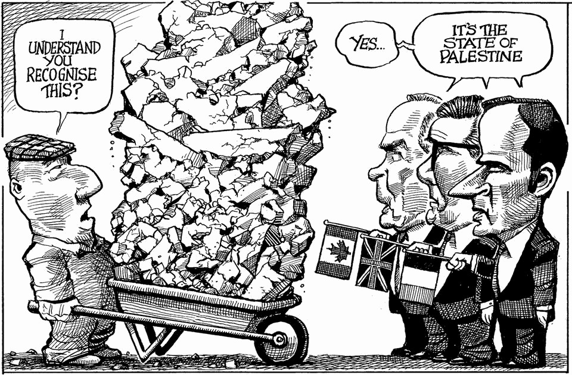

The world this week
The weekly cartoon
September 25th 2025

Dig deeper into the subject of this week’s cartoon: Leader: How Israel is losing AmericaBriefing (1): America is falling out of love with IsraelBriefing (2): Israelis do not like to think about estrangement from America The editorial cartoon appears weekly in The Economist. You can see last week’s here. This article was downloaded by zlibrary from https://www.economist.com//the-world-this-week/2025/09/25/the-weekly-cartoon

Leaders

Donald Trump is trying to silence his critics. He will fail The desperate search for superstar talent Fixing the rot in Ukraine The deadly allure of a bad deal with North Korea How to stop AI’s “lethal trifecta” Britain is slowly going bust