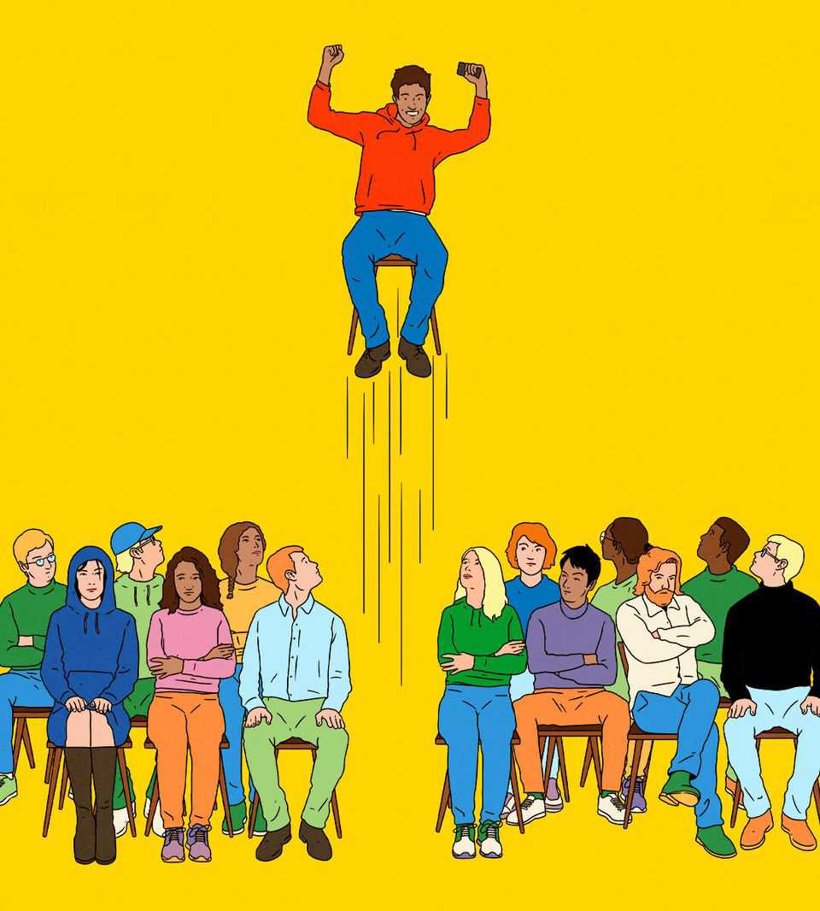

Leaders | How to spot a genius
The desperate search for superstar talent
Too much potential goes to waste
September 25th 2025

THIS IS A tale of squandered wealth and the vast, needless waste of human potential. The secret of economic success is innovation and the secret of innovation is the brilliance, creativity and drive of the most talented few. But even as governments throw money at schemes to boost their economies, including chipmaking factories and rare-earth mines, brainpower is going unloved. And the waste is getting worse. You need only look at the red-hot market for grey cells to understand how commercial and economic success is increasingly being powered by the individual rather than the firm. In the race to dominate artificial intelligence (AI), America’s tech giants are assembling small teams of crack data scientists. On Wall Street a race for top talent is under way, with hedge funds nabbing hotshot traders for vast sums. Scientific breakthroughs tend to

be the work of a small elite: the leading 1% of researchers generate over a fifth of citations. In China scientists returning from spells in the West are being feted as national heroes.

The rewards for superstars are growing. The best surgeons and concert pianists have long commanded the highest fees and the patronage of the wealthy. Today, however, the superstar effect is on steroids. Some programmers in their 20s command seven-, eight- or even nine-figure salaries. The number of artists on Spotify taking home more than $10m a year has grown three times as much since 2017 as the number earning above $100,000. Lawyers’ fees used to be shared out; increasingly the big money is going to the top earners at the best law firms, who massively outperform partners at their second-tier rivals.

Some of this reflects the exuberance of America’s financial markets: flush with capital, firms are able to spend even more on talent. But something deeper is afoot. Vast computing resources turbocharge the capacity of the wonkiest hedge-fund brains to devise and carry out trades, helping them turn their talents into even greater profits. Ultra-cheap digital distribution creates bigger markets for individual creators. And the size of the potential rewards for winning the race in AI turns even the most extravagant individual salary into a rounding error.

As AI spreads from discovery to exploitation, a similar effect could ripple through the rest of the economy. Studies of investors and entrepreneurs suggest that the technology will extend the dominance of the best performers, who can use it to do better still. AI agents could strip out layers of the business-process workers needed to run today’s firms, making it easier still for bright sparks to set up companies with ever-smaller collections of clever people.

This is a boon to superstars born with talent and blessed with good fortune. But it is also a vital source of wealth for everyone else. The world is ageing rapidly. If the economy is to keep growing meaningfully as the number of workers stops rising, the pace of innovation will need to stay high. Talent will become even more vital as the engine of progress. If superintelligent AI is to come to the rescue, it will require ingenious people, not merely chips and electricity.

The trouble is that, although the world’s reservoir of talent is vast, too few people are achieving their potential. Today scientific innovation is concentrated among Westerners, many of them from well-off backgrounds. Talent often goes unidentified; even when it is found, early promise is not always realised, because of the financial and logistical hurdles of going to university or moving to another country.

The result is a tragic waste of human gifts in both rich countries and poor. By one estimate, students in poorer countries who fare as well in maths contests as their richer peers go on to publish less research, and are half as likely to earn a doctorate from a leading university. Another study suggests that if America’s class, gender and race gaps in invention were closed, the number of innovators in the country would quadruple.

Far from eliminating this waste, politicians are neglecting it. One failure is immigration. Firms and universities should be able to fish in the global pool of talent. Without such a chance for themselves and their families, the superstar bosses of four of America’s “Magnificent Seven” tech firms would not be in their jobs today. One estimate reckons that easing immigration by removing financial barriers for especially bright students would raise the scientific output of future cohorts by as much as 50%. But special immigration programmes are often half-hearted and bureaucratic—because immigration is unpopular.

What of the search for genius at home? Contests and scouting programmes are surprisingly good at spotting early promise. Gold-medal winners at international maths Olympiads are 50 times more likely to go on to win a big science prize than undergraduates at MIT; half the founders of OpenAI cut their teeth in the contest. But most countries are not systematic about talent. The rich have all the advantages; everyone else relies on individual drive and a dose of luck.

America is an example of what to avoid. Built on immigration, with a culture of meritocracy and top-ranking universities, it should win the tussle for talent. An obsession with diversity, equity and inclusion in the early 2020s stalled programmes for gifted students. Donald Trump is adding to the missteps. His administration has just announced drastically higher fees for the H-1B visa programme, through which many researchers and techies

enter America. And a vindictive crackdown on Harvard and other elite universities has jeopardised funding for research and the scope to take foreign students.

America’s errors are a chance for other countries to catch up. China is introducing a visa scheme for young foreign scientists and technologists. Britain may ditch visa fees for skilled arrivals altogether. France hopes to attract foreign researchers who move. That is fine so far as it goes, but it is half-hearted. Talent is waiting to be tapped. The gains would be immense. When will the world wake up? ■

For subscribers only: to see how we design each week’s cover, sign up to our weekly Cover Story newsletter.

This article was downloaded by zlibrary from https://www.economist.com//leaders/2025/09/25/the-desperate-search-for-superstar- talent