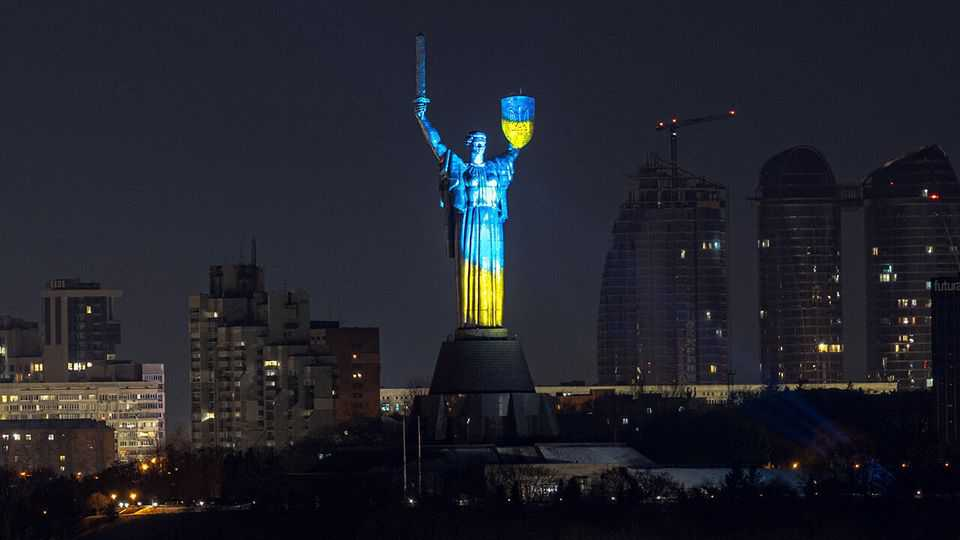

Leaders | Volodymyr Zelensky
Fixing the rot in Ukraine
Things are going wrong away from the front line. Europe needs to help
September 25th 2025

EVERY TIME Volodymyr Zelensky meets Donald Trump, Ukraine’s friends hold their breath. Will America’s president be Ukraine’s supporter or its scold? After the two men saw each other in New York on September 23rd, Mr Trump appeared to embrace a remarkable shift, urging Ukraine to recapture all the territory it has lost to Russia and Europe to shoot down errant Russian aircraft. That was taken as support. More likely, he is washing his hands of the war. If so, Ukraine and its European allies will have to resist Russia alone. That would be a lot better than the acquiescence to Russia which Mr Trump once seemed to contemplate. It is a fantasy to think that Ukraine could recover the fifth of its original area that Russia occupies, even with

European help. However, if the White House is not hostile, America will apparently continue to supply intelligence and allow Ukraine to buy its weaponry—so long as the Europeans foot the bill. If so, Ukraine should be able to hold the line. The dream of a prosperous, secure and democratic life in the four-fifths will remain. That would amount to a kind of victory.

Unfortunately, even this outcome is getting harder to secure. As we report from Kyiv, Ukraine is running out of soldiers. Its economy is hamstrung by manpower shortages and constant bombardment. And, under the strain, its democratic politics is showing signs of fraying. The first two are not under its control. The third is where action is required even now while the fighting continues.

Mr Zelensky’s administration has become less tolerant of criticism, harrying hostile media and using lawfare against its political opponents. In July it tried to rein in two independent anti-corruption agencies that were getting too close to those in power. Ukrainians exhibit rising discontent with Mr Zelensky’s style of government, including his reliance on a coterie of advisers and his tolerance of corruption when it suits him.

Europe has a vital, if paradoxical role to play. It must now sharply step up its level of assistance, as America retreats from leadership. As Ukraine’s principal paymaster, it will have more leverage over the government in Kyiv, and it must use this to prevent democratic backsliding. It has already shown it can do so by backing demonstrations inside Ukraine against Mr Zelensky’s attack on the anti-corruption agencies.

However, there are limits. Like a megabank, Ukraine is too big to fail. The consequences for Europe of a Ukraine in chaos—for instance if war- weariness or a lack of equipment triggers military or economic collapse— are frightening to contemplate. Imagine a huge country on NATO’s borders bitter and betrayed, awash with weapons and angry ex-soldiers, and under Vladimir Putin’s thumb.

For Europe to threaten to cut off Ukraine would be empty. Instead it must coax and cajole, appealing to Mr Zelensky’s patriotism and legacy. It can use incentives to strengthen its arguments, including access to the EU’s single

market, investment in Ukraine’s defence industry and the removal of obstacles on the path to EU membership.

A vital question is elections. Ukraine remains under martial law, which under the constitution prevents them from being held. But Mr Zelensky’s five-year term as president expired in May last year, and there is a growing need for Ukrainians to have their say. In the absence of a ceasefire—and there is still no sign of one—holding an election will be legally and practically difficult, but not impossible. There could be no better way of signalling that Ukraine can cope with America’s dwindling interest than an act of democratic renewal. ■

Subscribers to The Economist can sign up to our Opinion newsletter, which brings together the best of our leaders, columns, guest essays and reader correspondence.

This article was downloaded by zlibrary from [https://www.economist.com//leaders/2025/09/24/fixing-the-rot-in-ukraine](https://www.economist.com//leaders/2025/09/24/fixing-the-rot-in-ukraine)