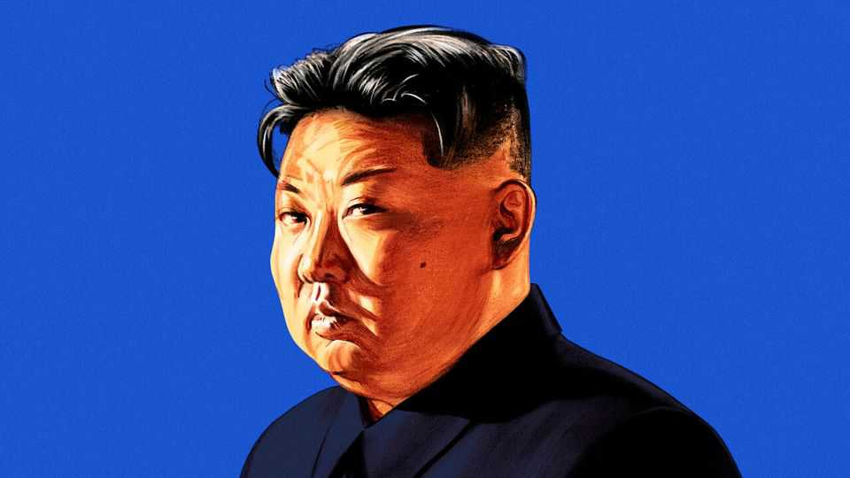

Leaders | Asia’s nastiest regime
The deadly allure of a bad deal with North Korea
Donald Trump may be tempted to sell out America’s allies
September 25th 2025

When Barack Obama left the White House, he told Donald Trump that one of the most dangerous problems in his in-tray would be North Korea. In his first term, Mr Trump initially threatened nuclear war with the isolated dictatorship and then held a series of summits with its ruler, Kim Jong Un. The theatrics generated headlines but no progress. Now Mr Trump wants a second act, hoping to reduce the threat North Korea poses to America and perhaps even to broker a formal end to the Korean war, frozen by armistice for 70 years. Mr Kim says he would meet again, but on his own terms. Those terms are sure to be worse than during the first round.

Since then, North Korea has become more dangerous. Its arsenal has grown in size and sophistication, with intercontinental ballistic missiles (ICBMs) that could reach Mar-a-Lago. The fact that its possession of such weapons no longer surprises anyone makes them no less deadly. Mr Kim has also tightened his chokehold on North Korea’s society and economy. Teenagers now risk the firing squad just for watching South Korean TV dramas. The outside world is also becoming more favourable for Mr Kim. He has exploited the war in Ukraine to forge a battlefield partnership with Russia. That has made China anxious not to lose its role as North Korea’s main patron.

American policy towards North Korea has long been split between two camps. Hardliners favour stronger deterrence, tighter sanctions and patiently waiting for the Kim dynasty to be overthrown. Advocates of engagement counter that outreach and sunshine might induce the Kims to mellow. Neither approach has worked. Sanctions only ever had a slim chance of making the regime give up weapons it sees as the best guarantor of its own survival. They are even less likely to work now. In the past both China and Russia helped press North Korea to relinquish its nukes. Now, neither does.

A different kind of pressure might be more effective. Mr Kim fears information; anything that shows his subjects how much worse life in North Korea is than in the democratic, capitalist South. The West could do more to flood North Korea with such content, from K-pop videos to soap operas.

In the meantime, some ask whether the world should not simply accept that North Korea is a nuclear power, negotiate with it and try to coexist. This path poses grave risks. North Korea signed the Nuclear Non-Proliferation Treaty in 1985, vowing not to build a bomb in exchange for help with civilian nuclear power. Recognising its nuclear arsenal without penalties would encourage others to take the same path; the weakened global non- proliferation system might finally collapse.

Mr Kim will never swap his nukes for cash. He may, however, agree to a different bargain—one that Mr Trump might be tempted to accept. North Korea could halt its ICBM programme, allowing Mr Trump to proclaim that he has Made America Safe Again. America and North Korea could conclude a peace treaty to formally end the Korean war. Mr Trump could then draw

down American forces from South Korea, as he has long suggested he wants to, handing Mr Kim a huge prize. South Korea and Japan would still face threats from North Korea’s missiles, and might race to develop nukes of their own. Mr Trump might not care. He has yet to criticise Pakistan’s nuclear deal with Saudi Arabia.

This would be a dreadful outcome for the world. Little suggests that Mr Kim seeks peaceful coexistence. He is more likely to pocket any concessions and continue making trouble. The clearest evidence of his malevolence is the brutal way he treats his subjects. As Andrei Sakharov, a Soviet dissident, once put it, a country that does not respect the rights of its own people will not respect the rights of its neighbours. With such a regime, a careless deal is worse than no deal at all. ■

Subscribers to The Economist can sign up to our Opinion newsletter, which brings together the best of our leaders, columns, guest essays and reader correspondence.

This article was downloaded by zlibrary from https://www.economist.com//leaders/2025/09/25/the-deadly-allure-of-a-bad-deal-with- north-korea