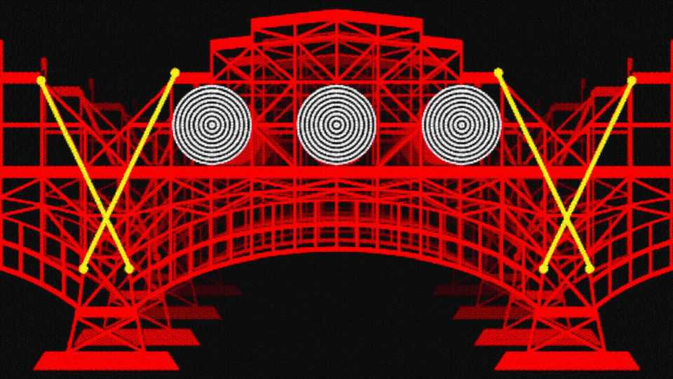

Leaders | Crossing the bridge
How to stop AI’s “lethal trifecta”
Coders need to start thinking like mechanical engineers
September 25th 2025

LARGE LANGUAGE MODELS (LLMs), a trendy way of building artificial intelligence, have an inherent security problem: they cannot separate code from data. As a result, they are at risk of a type of attack called a prompt injection, in which they are tricked into following commands they should not. Sometimes the result is merely embarrassing, as when a customer-help agent is persuaded to talk like a pirate. On other occasions, it is far more damaging. The worst effects of this flaw are reserved for those who create what is known as the “lethal trifecta”. If a company, eager to offer a powerful ai assistant to its employees, gives an LLM access to untrusted data, the ability to read valuable secrets and the ability to communicate with the outside

world at the same time, then trouble is sure to follow. And avoiding this is not just a matter for AI engineers. Ordinary users, too, need to learn how to use AI safely, because installing the wrong combination of apps can generate the trifecta accidentally.

Better AI engineering is, though, the first line of defence. And that means AI engineers need to start thinking like engineers, who build things like bridges and therefore know that shoddy work costs lives.

The great works of Victorian England were erected by engineers who could not be sure of the properties of the materials they were using. In particular, whether by incompetence or malfeasance, the iron of the period was often not up to snuff. As a consequence, engineers erred on the side of caution, overbuilding to incorporate redundancy into their creations. The result was a series of centuries-spanning masterpieces.

AI-security providers do not think like this. Conventional coding is a deterministic practice. Security vulnerabilities are seen as errors to be fixed, and when fixed, they go away. AI engineers, inculcated in this way of thinking from their schooldays, therefore often act as if problems can be solved just with more training data and more astute system prompts.

These do, indeed, reduce risk. The cleverest frontier models are better at spotting and refusing malicious requests than their older or smaller cousins. But they cannot eliminate risk altogether. Unlike most software, LLMs are probabilistic. Their output is driven by random selection from likely responses. A deterministic approach to safety is thus inadequate. A better way forward is to copy engineers in the physical world and learn to work with, rather than against, capricious systems that can never be guaranteed to function as they should. That means becoming happier dealing with unpredictability by introducing safety margins, risk tolerance and error rates.

Overbuilding in the AI age might, for instance, mean using a more powerful model than is needed for the task at hand, to reduce the risk it will be tricked into doing something inappropriate. It might mean imposing limits on the number of queries LLMs can take from external sources, calibrated to the risk of damage from a malicious query. And mechanical engineering

emphasises failing safely. If an AI system must have access to secrets, then avoid handing it the keys to the kingdom.

In the physical world, bridges have weight limits—even if they are not always stated clearly to drivers. And, importantly, these are well within the actual tolerances that calculations suggest a bridge will bear. The time has now come for the virtual world of AI systems to be similarly equipped. ■

Subscribers to The Economist can sign up to our Opinion newsletter, which brings together the best of our leaders, columns, guest essays and reader correspondence.

This article was downloaded by zlibrary from [https://www.economist.com//leaders/2025/09/25/how-to-stop-ais-lethal-trifecta](https://www.economist.com//leaders/2025/09/25/how-to-stop-ais-lethal-trifecta)